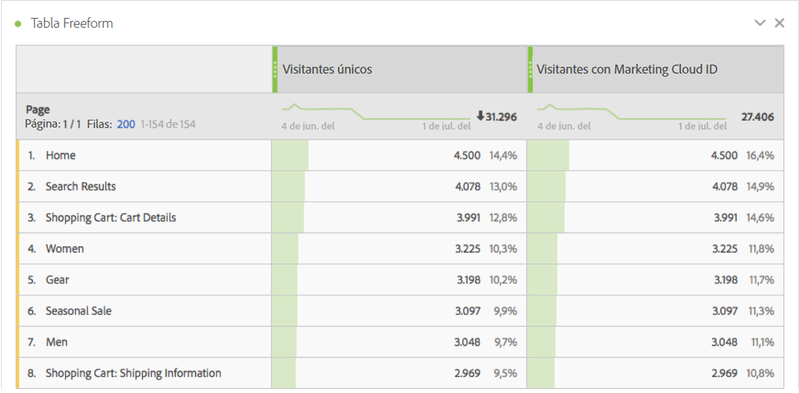
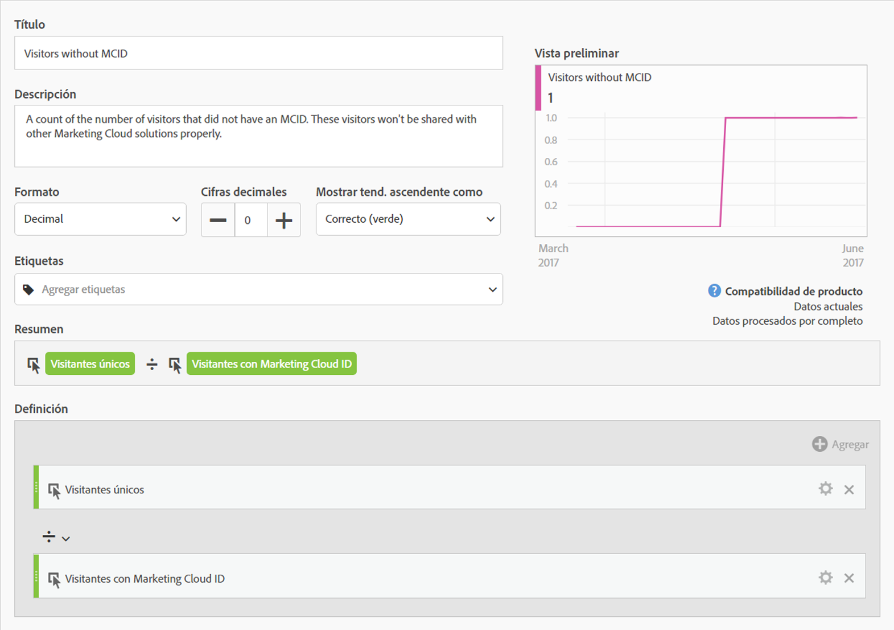
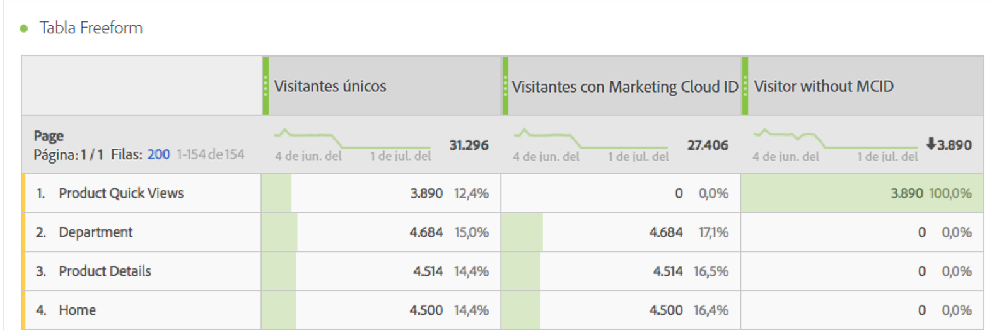

# Visitantes con Experience Cloud ID

La [métrica](overview.md) &quot;Visitantes con Experience Cloud ID&quot; muestra el número de visitantes únicos identificados por Adobe mediante el [servicio de Experience Cloud ID](https://experienceleague.adobe.com/docs/id-service/using/home.html?lang=es). Esta dimensión es útil para compararla con la métrica [Visitantes únicos](unique-visitors.md) a fin de asegurarse de que la mayoría de los visitantes del sitio utilice el servicio de ID. Si una gran parte de los visitantes no utiliza las cookies del servicio de ID, puede indicar un problema en la implementación.

>[!NOTE]
>
>Esta métrica es especialmente importante para la depuración si utiliza varios servicios de Experience Cloud, como Adobe Target o Adobe Audience Manager. Los segmentos compartidos entre productos de Experience Cloud no incluyen visitantes sin un Experience Cloud ID.

## Cálculo de esta métrica

Esta métrica se basa en la métrica [visitantes únicos](unique-visitors.md), excepto que solo incluye personas identificadas mediante la `mid`cadena de consulta (basada en la cookie [`s_ecid`](https://experienceleague.adobe.com/docs/core-services/interface/ec-cookies/cookies-analytics.html?lang=es)).

## Depuración de la configuración de Experience Cloud ID

La métrica “Visitantes con Experience Cloud ID” puede resultar útil para solucionar problemas de integraciones de Experience Cloud o identificar áreas del sitio que no tienen implementado el servicio de ID.

Arrastre los “Visitantes con Experience Cloud ID” en paralelo con los visitantes únicos para compararlos:

En este ejemplo, observe que cada página tiene el mismo número de visitantes únicos y de visitantes con un Experience Cloud ID. Sin embargo, el número total de visitantes únicos es mayor que el número total de visitantes con Experience Cloud ID. Puede crear una [métrica calculada](../calculated-metrics/cm-overview.md) para averiguar qué páginas no están configurando el servicio de ID. Puede utilizar la siguiente definición:

Al añadir la métrica calculada al informe, puede ordenar el informe Páginas de manera que aparezcan las páginas con el mayor número de visitantes sin un MCID:

Tenga en cuenta que el elemento de dimensión “Vistas rápidas del producto” no se implementa correctamente con el servicio de identidad. Puede trabajar con los equipos adecuados dentro de su organización para actualizar estas páginas lo antes posible. Puede crear un informe similar con cualquier tipo de dimensión, como el [tipo de explorador](../dimensions/browser-type.md), la [sección del sitio](../dimensions/site-section.md) o cualquier [eVar](../dimensions/evar.md).
