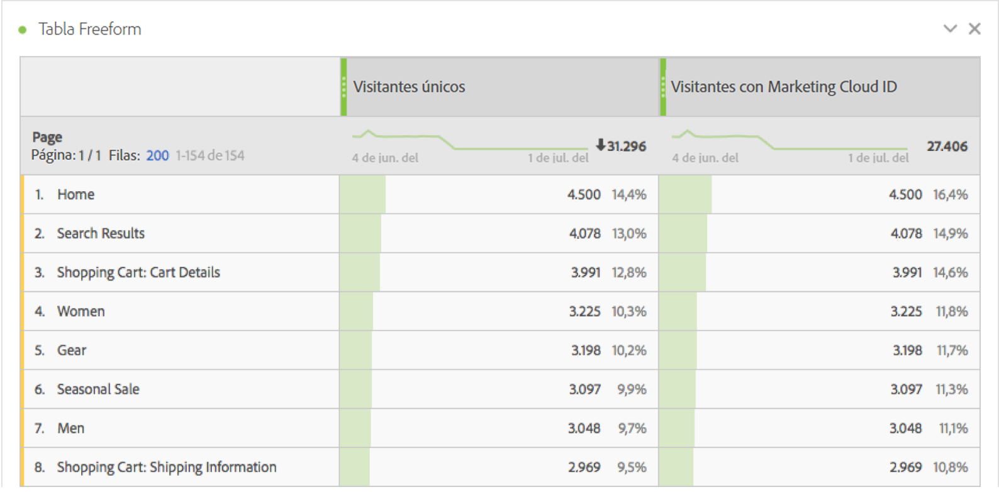
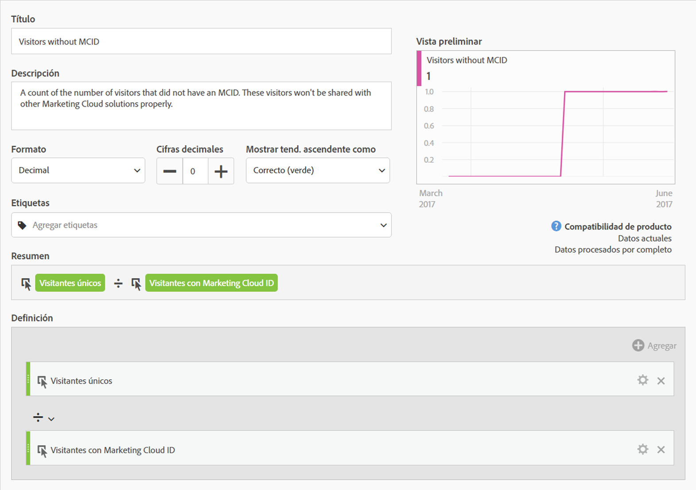
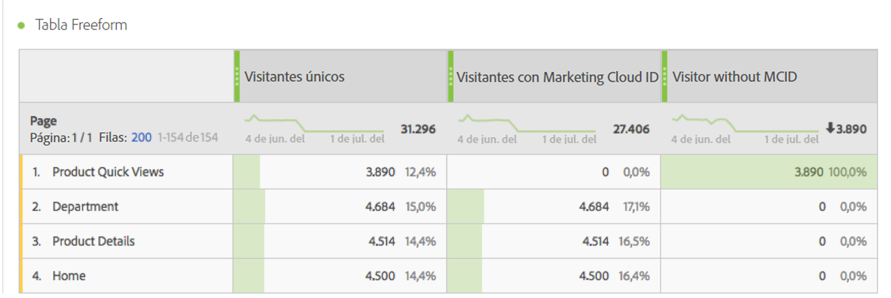

# Visitantes con Experience Cloud ID

La [métrica](overview.md) de &#39;[!UICONTROL Visitantes con Experience Cloud ID]&#39; muestra el número de visitantes únicos identificados por Adobe con un ECID (mediante el [Servicio de ID de visitante](https://experienceleague.adobe.com/es/docs/id-service/using/home) o el [Servicio de identidad de Experience Platform](https://experienceleague.adobe.com/es/docs/experience-platform/identity/home)). Esta métrica es útil para compararla con la métrica [Visitantes únicos](unique-visitors.md) a fin de asegurarse de que la mayoría de los visitantes del sitio use un ECID. Si una gran parte de los visitantes no utiliza este identificador, puede indicar un problema en la implementación.

>[!NOTE]
>
>Esta métrica es especialmente importante para la depuración si utiliza varios servicios empresariales de CX, como Adobe Target o Adobe Audience Manager. Los segmentos compartidos entre productos de CX Enterprise no incluyen visitantes sin un ECID.

## Cálculo de esta métrica

Esta métrica se basa en la métrica [visitantes únicos](unique-visitors.md), excepto que solo incluye personas identificadas mediante la `mid`cadena de consulta (basada en la cookie [`s_ecid`](https://experienceleague.adobe.com/en/docs/core-services/interface/data-collection/cookies/analytics)).

## Depurar la configuración de ECID

La métrica &quot;[!UICONTROL Visitantes con Experience Cloud ID]&quot; puede resultar útil para solucionar problemas de integraciones empresariales de CX o identificar áreas del sitio que no tienen implementado el servicio de ID de visitante o el servicio de identidad de Experience Platform.

Arrastre los &#39;[!UICONTROL visitantes con Experience Cloud ID]&#39; en paralelo con los visitantes únicos para compararlos:

En este ejemplo, observe que cada página tiene el mismo número de &#39;[!UICONTROL visitantes únicos]&#39; que &#39;[!UICONTROL visitantes con Experience Cloud ID]&#39;. Sin embargo, el número total de &#39;[!UICONTROL visitantes únicos]&#39; es mayor que el número total de &#39;[!UICONTROL visitantes con Experience Cloud ID]&#39;. Puede crear una [métrica calculada](../calculated-metrics/cm-overview.md) para averiguar qué páginas no están usando un ECID con la siguiente definición:

Al agregar la métrica calculada al informe, puede ordenar el informe Páginas de modo que aparezcan las páginas con el mayor número de visitantes sin un ECID:

Tenga en cuenta que el elemento de dimensión &quot;Vistas rápidas del producto&quot; no se implementa correctamente con un ECID. Puede trabajar con los equipos adecuados dentro de su organización para actualizar estas páginas lo antes posible. Puede crear un informe similar con cualquier tipo de dimensión, como el [tipo de explorador](../dimensions/browser-type.md), la [sección del sitio](../dimensions/site-section.md) o cualquier [eVar](../dimensions/evar.md).
