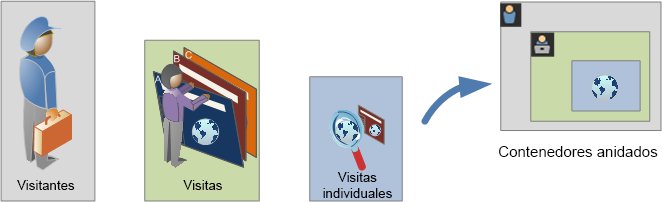
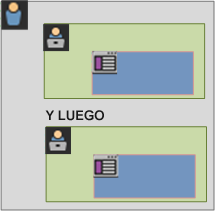
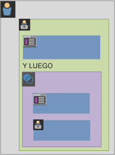
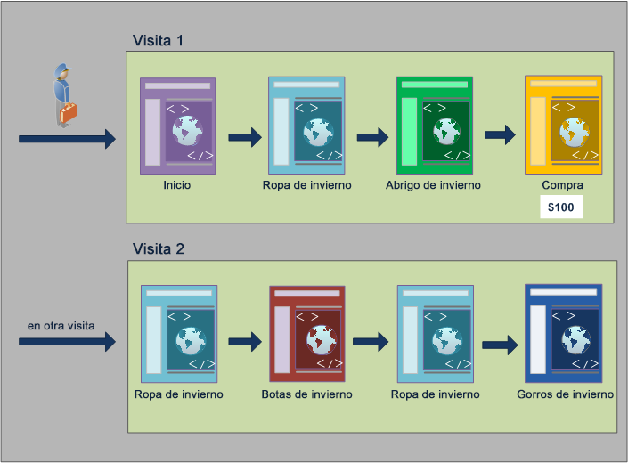
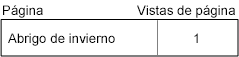
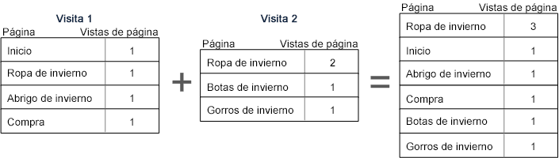
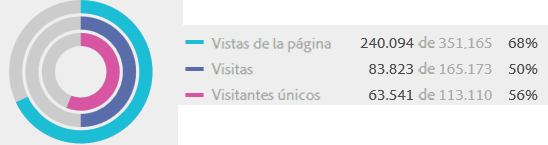
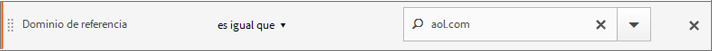
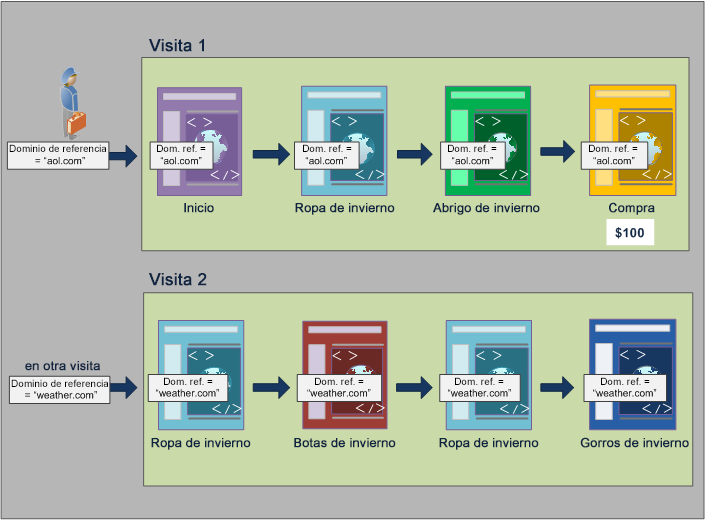
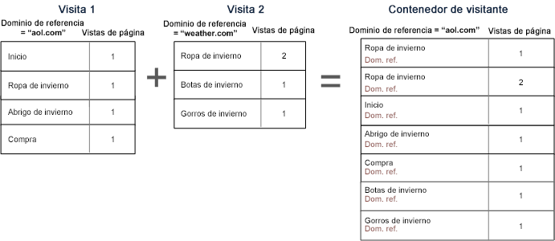

# Contenedores de segmentos

Un segmento establece las condiciones necesarias para filtrar a un visitante en función de sus atributos o de las interacciones con su sitio. Para establecer las condiciones en un segmento, debe fijar las reglas que filtran a los visitantes según sus características de visitante y/o rasgos de navegación. Si desea desglosar todavía más los datos de los visitantes, puede filtrar basándose en las visitas específicas y/o las visitas individuales de cada visitante para ver una página. El Generador de segmentos proporciona una sencilla arquitectura para crear estos subconjuntos y aplicar reglas como contenedores anidados y jerárquicos de visitante, visita y visita individual.

La arquitectura de contenedor empleada en el Generador de segmentos define

-  **[!UICONTROL Visitante]** como el contenedor exterior, que contiene datos globales específicos del visitante en las visitas y vistas de páginas.
-  a anidado **[!UICONTROL Visita]** contenedor le permite establecer reglas para desglosar los datos del visitante en función de las visitas y
-  a anidado **[!UICONTROL Visita]** El contenedor de permite desglosar la información del visitante en función de las vistas de página individuales.

Cada contenedor le permite realizar informes basados en el historial del visitante o en las interacciones detalladas por visitas, o bien desglosar las visitas individuales.

<table style="table-layout: fixed; border: none;">

<tr>
<td style="background-color: #E5E4E2;" colspan="3" width="200" height="100"> Visitantes</td>
</tr>

<tr>
<td style="background-color: #E5E4E2;" width="200"></td>
<td style="background-color: #D3D3D3;" colspan="2" width="200" height="100"> Visitas</td>
</tr>

<tr>
<td style="background-color: #E5E4E2;" width="200" height="100"></td>
<td style="background-color: #D3D3D3;" width="200" height="100"></td>
<td style="background-color: #C0C0C0;" width="200" height="100" colspan="1"> Visitas únicas</td>
</tr>
</table>

<!---->

A continuación se muestra un vídeo introductorio de los contenedores de segmentos:

>[!VIDEO](https://video.tv.adobe.com/v/25401/?quality=12)

## Contenedor de visitante

El contenedor de visitante incluye todas las visitas y vistas de página de los visitantes en un período de tiempo específico. Un segmento en el nivel de visitante devuelve la página que cumple la condición, además de todas las demás páginas visitadas por el visitante (restringidas únicamente por los intervalos de fechas definidos). Al ser el contenedor definido con mayor amplitud, los informes generados en el nivel del contenedor de visitante devuelven vistas de página de todas las visitas, lo que le permite generar análisis multivisitas. Por lo tanto, el contenedor de visitante es el más susceptible de cambiar en función de intervalos de fechas definidos.

Los contenedores de visitante pueden incluir valores basados en el historial general de un visitante:

- Días antes de la primera compra
- Página de entrada original
- Dominios de referencia originales

## Contenedor de visita

El contenedor de visita le permite identificar interacciones de páginas, campañas o conversiones para una sesión web específica. Un segmento en el nivel de visita devuelve la página que cumple la condición, además de todas las demás páginas vistas como parte de la sesión de visita (restringidas únicamente por los intervalos de fechas definidos). El contenedor de visita es el contenedor más utilizado, ya que captura los comportamientos de la sesión de visita al completo cuando se cumple la regla. El contenedor de visita le permite definir qué visitas desea incluir o excluir al generar y aplicar un segmento. Asimismo, le ayuda a encontrar una respuesta a una pregunta como: ¿Cuántos visitantes vieron la sección de noticias y deportes en la misma visita? O: ¿Qué páginas se atribuyeron a una conversión satisfactoria en una venta?

Los contenedores de visita incluyen valores basados en la incidencia por visita:

- Número de visita
- Página de entrada
- Frecuencia de retorno
- Métricas de participación
- Métricas asignadas linealmente

## Contenedor de visita individual

El contenedor de visita individual define qué visitas individuales de página desea incluir o excluir de un segmento. El contenedor de visita individual es el más estrecho de los contenedores disponibles para permitirle identificar clics específicos y vistas de página donde una condición es verdadera. Puede ver un único código de seguimiento o aislar un comportamiento en una sección concreta del sitio. También podría interesarle localizar un valor específico cuando se produzca una acción, como el canal de marketing cuando se realice un pedido.

Los contenedores de visitas individuales incluyen valores basados en el desglose de una sola página:

- Productos
- props de lista
- eVars de lista
- eVars de comercialización (en el contexto de eventos)

   >[!NOTE]
   >
   >Si utiliza este contenedor en un valor que persiste, como una eVar, extrae todas las visitas individuales en las que dicho valor persiste. Si hay un código de seguimiento que caduque después de una semana, ese valor podría persistir en varias visitas.

## contenedor de grupo lógico

El contenedor de grupo lógico le permite proporcionar un contenedor separado dentro de las reglas de segmento para filtrar entidades no basadas en jerarquía. Por ejemplo, es posible que necesite proporcionar un contenedor anidado dentro del segmento que filtra en función del visitante. Este tipo de lógica requiere romper la jerarquía (ya que ha utilizado un contenedor de visitante de nivel superior) para filtrar solo para visitantes seleccionados. Consulte [Ejemplos de grupos lógicos](/help/components/segmentation/segmentation-workflow/seg-sequential-build.md) para obtener más información.

## Anidado de contenedores {#nest-containers}

Al crear contenedores de segmentos dentro de otros contenedores, básicamente está creando un segmento dentro de otro segmento. La siguiente lógica se utiliza con los contenedores anidados:

1. Determinar qué datos se incluyen utilizando el contenedor exterior. Los datos que no coincidan con esta regla exterior se descartarán en el informe segmentado.
1. Aplicar la regla anidada a los demás datos. La regla anidada no se aplica a ninguna visita individual que la primera regla haya rechazado.
1. Repetir hasta que se hayan calculado todas las reglas de los contenedores anidados. Los datos restantes se incluyen entonces en el informe resultante.

Puede utilizar el anidado entre contenedores y entre reglas dentro de un contenedor. A continuación se indica lo que puede anidar en cada contenedor:

| Nombre de contenedor | Qué puede anidar dentro |
|---|---|
| Visita individual | Solo eventos |
| Visita | Contenedor de visita individual, eventos |
| Visitante | Contenedor de visita, contenedor de visita individual, eventos |
| grupo lógico | Contenedor de visitante, contenedor de visita, contenedor de visita individual |

### Incluir varios contenedores dentro de una sola definición

Si incluye varios segmentos en un nuevo segmento compuesto puede refinar los datos todavía más. El hecho de arrastrar juntos dos segmentos existentes funciona como una instrucción “OR” al filtrar los visitantes. Todos los contenedores del lienzo se revisan comparándolos con todos los datos, y todos los datos que coincidan con alguno de los contenedores se incluirán en el informe.

Por ejemplo, si arrastra un contenedor de visita donde País = Estados Unidos con un contenedor de visita donde Pedido = Verdadero,

```
Country = United States + Order = True
```

crea un segmento que se comporta en este orden:

1. El segmento buscará primero entre todos los datos e identificará a los visitantes de Estados Unidos.
2. A continuación, el segmento volverá a buscar entre todos los datos para comprobar si algún visitante realizó un pedido.
3. Ambos conjuntos de datos se aplicarán entonces al informe.

## Contenedores para segmentos secuenciales {#containers-sequential}

La segmentación secuencial emplea los mismos contenedores básicos, incluidos el de [!UICONTROL visitantes], [!UICONTROL visitas] y [!UICONTROL visitas individuales] (así como las vistas de página u otras dimensiones) anidados jerárquicamente.

<table style="table-layout:fixed; border: none;">

<tr>
<td style="background-color: #E5E4E2;" colspan="3" width="200" height="100"> Visitantes</td>
</tr>

<tr>
<td style="background-color: #E5E4E2;" width="200"></td>
<td style="background-color: #D3D3D3;" colspan="2" width="200" height="100"> Visitas</td>
</tr>

<tr>
<td style="background-color: #E5E4E2;" width="200" height="100"></td>
<td style="background-color: #D3D3D3;" width="200" height="100"></td>
<td style="background-color: #C0C0C0;" width="200" height="100" colspan="1"> Visitas únicas</td>
</tr>
</table>

<!---->

[!UICONTROL Visitantes] constituye el contenedor de orden superior en la segmentación secuencial, con [!UICONTROL visitas] contenidas dentro del contenedor de [!UICONTROL visitantes] y [!UICONTROL visitas individuales] contenidas dentro de los contenedores de [!UICONTROL visitantes] o [!UICONTROL visitas]. Esta [jerarquía de contenedores](/help/components/segmentation/seg-overview.md#section_7FDF47B3C6A94C38AE40D3559AFFAF70) debe mantenerse para generar segmentos secuenciales bien ordenados.

**Para generar segmentos secuenciales**, los contenedores están anidados y la lógica secuencial unida mediante la variable [!UICONTROL THEN] operador que requiere que cada contenedor sea `true` en función de la secuencia del visitante.

<table style="table-layout:fixed; border: none;">

<tr>

<td style="background-color: #E5E4E2;" colspan="3" width="200" height="100"> Visitantes</td>
</tr>

<tr>
<td style="background-color: #E5E4E2;" width="200"></td>
<td style="background-color: #D3D3D3;" colspan="2" width="200" height="100"> Visitas</td>
</tr>

<tr>
<td style="background-color: #E5E4E2;" width="200" height="100"></td>
<td style="background-color: #D3D3D3;" width="200" height="100"></td>
<td style="background-color: #C0C0C0;" width="200" height="100" colspan="1"> Visitas únicas</td>
</tr>

<tr>
<td style="background-color: #E5E4E2;"></td><td colspan="2">ENTONCES</td></td>
</tr>

<tr>
<td style="background-color: #E5E4E2;" width="200"></td>
<td style="background-color: #D3D3D3;" colspan="2" width="200" height="100"> Visitas</td>
</tr>

<tr>
<td style="background-color: #E5E4E2;" width="200" height="100"></td>
<td style="background-color: #D3D3D3;" width="200" height="100"></td>
<td style="background-color: #C0C0C0;" width="200" height="100" colspan="1"> Visitas únicas</td>
</tr>
</table>

<!---->

La única excepción a esta jerarquía de contenedores es al usar el [contenedor de grupo lógico](/help/components/segmentation/segmentation-workflow/seg-sequential-build.md). El contenedor de [!UICONTROL grupo lógico] le permite anidar una visita individual dentro de un contenedor sin orden para capturar eventos y dimensiones pero fuera de un orden secuencial.

<table style="table-layout:fixed; border: none;">

<tr>
<td style="background-color: #E5E4E2;" colspan="3" width="200" height="100"> Visitantes</td>
</tr>

<tr>
<td style="background-color: #E5E4E2;" width="200"></td>
<td style="background-color: #D3D3D3;" colspan="2" width="200" height="100"> Visitas</td>
</tr>

<tr>
<td style="background-color: #E5E4E2;" width="200" height="100"></td>
<td style="background-color: #D3D3D3;" width="200" height="100"></td>
<td style="background-color: #C0C0C0;" width="200" height="100" colspan="1"> Visitas únicas</td>
</tr>

<tr>
<td style="background-color: #E5E4E2;"></td><td colspan="2">ENTONCES</td></td>
</tr>

<tr>
<td style="background-color: #E5E4E2;" width="200"></td>
<td style="background-color: #D3D3D3;" colspan="2" width="200" height="100"> Grupo</td>
</tr>

<tr>
<td style="background-color: #E5E4E2;" width="200" height="100"></td>
<td style="background-color: #D3D3D3;" width="200" height="100"></td>
<td style="background-color: #C0C0C0;" width="200" height="100" colspan="1"> Visitas únicas</td>
</tr>

<tr>
<td style="background-color: #E5E4E2;" width="200" height="100"></td>
<td style="background-color: #D3D3D3;" width="200" height="100"></td>
<td style="background-color: #C0C0C0;" width="200" height="100" colspan="1"> Visitas</td>
</tr>

</table>

<!---->

## Informes basados en datos de contenedores {#reports}

Los contenedores le permiten filtrar datos diferentes basados en valores de informes al desglosar los segmentos y aplicarlos a los informes.

Los datos capturados en cada nivel de la jerarquía de contenedores visitante > visita > visita individual afectan a cómo genera sus segmentos. Si toma el mismo segmento aplicado al mismo informe utilizando el mismo conjunto de datos, obtendrá valores diferentes en función del contenedor a partir del cual genere el informe. Los factores como el nivel de informes de contenedor y la persistencia de los valores en las visitas individuales pueden significar cambios significativos en la precisión de sus informes.

### Principios básicos de los datos de contenedor {#container-data}

Por ejemplo, el visitante que se muestra a continuación visitó un sitio en la primera visita, aterrizó en la página de inicio y, a continuación, visitó otras tres páginas y convirtió la visita en una venta. En una visita aparte, el visitante llegó esta vez a través de la página del producto, se dirigió a la página de inicio, volvió atrás a la página del producto y, por último, cerró la sesión tras echar un vistazo a los gorros de invierno. En función de los datos capturados para cada contenedor del segmento, se muestran en el informe valores diferentes.

El `Pages equals Winter Coat` el segmento siguiente se aplica al **Informe de páginas**.


En función del contenedor seleccionado, el informe muestra resultados diferentes para las siguientes visitas y vistas de página de un visitante.

<table style="table-layout:auto; border: 0;">

<tr>
<td style="background-color: #E5E4E2;"></td>
<td style="background-color: #E5E4E2;" colspan="4"><b>Visita 1</b></td>
</tr>
<tr>
<tr>
<td style="background-color: #E5E4E2;">

</td>
<td style="background-color: #FFFFFF; "><br/>Página principal</td>
<td style="background-color: #FFFFFF;"><br/>Ropa de invierno</td>
<td style="background-color: #FFFFFF;"><br/>Abrigo de invierno</td>
<td style="background-color: #FFFFFF;"><br/>Compra 100 $</td>
</tr>
<tr>
<td colspan="5">
</tr>
<tr>
<td style="background-color: #E5E4E2;"></td>
<td style="background-color: #E5E4E2;"colspan="4"><b>Visita 2</b></td>
</tr>
<tr>
<tr style="border: 0;">

<td style="background-color: #E5E4E2;">

</td>
<td style="background-color: #FFFFFF; "><br/>Ropa de invierno</td>
<td style="background-color: #FFFFFF;"><br/>Botas de invierno</td>
<td style="background-color: #FFFFFF;"><br/>Ropa de invierno</td>
<td style="background-color: #FFFFFF;"><br/>Sombreros de invierno</td>

</table>


<!---->

### Informes desde el contenedor de visita individual

Cuando esta condición se encuentre dentro de un contenedor de visita individual, el informe solo enumerará páginas donde *Página = Abrigos de invierno* sea un valor verdadero. Dado que una sola página coincide con esta condición en un contenedor de una sola página, únicamente se muestra la página Abrigos de invierno.

| Página | Vistas de páginas |
|---|--:|
| Abrigo de invierno | 1 |

<!---->

Al realizar informes desde el contenedor de visita individual, podrá ver cómo los informes de diferentes contenedores afectan a los valores generales de los informes. Cuando visualice el informe del segmento, fíjese en que las vistas de página equivalen aproximadamente a las visitas (cerca de 2000 visitantes vieron páginas duplicadas en una visita, lo que se suma al número total de vistas de página). Y los visitantes únicos son aproximadamente iguales al número de visitas (cerca de 2000 visitantes únicos visitados más de una vez).

|  | Métrica | # | % |
|---|---|--:|--:|
|  | Vistas de página:<br/>Vistas:<br/>Visitantes únicos: | **69 252** de 351.292 <br/>**67 554** de 165.175 <br/>**63 541** de 113.169 | **19%**<br/>**40%**<br/>**56%** |


<!---->

>[!IMPORTANT]
>
>Independientemente de cómo visualice los datos (desde los contenedores Visita individual, Visita o Visitante ), todos tienen el mismo número de visitantes, 63 541 en este ejemplo. Independientemente de cómo genere el informe, la condición de visitante inicial (Visitantes que vieron la página Abrigos de invierno) permanece intacta. Es el subconjunto de datos desde el que realiza el informe en los diferentes niveles.

### Informes desde el contenedor de visita

Si esta misma condición se encuentra dentro de un contenedor de visita, entonces el informe enumera todas las páginas de la visita donde *Página es igual a Abrigos de invierno* sea un valor verdadero. Filtra la página Abrigos de invierno, pero también captura las demás páginas de la visita donde la condición sea verdadera. Dado que el visitante también visitó las páginas de inicio, del producto y de compra durante la visita, estas páginas adicionales se enumeran en el informe cuando este se realiza utilizando los datos del contenedor de visitante.

| Página | Vistas de páginas |
|---|--:|
| Página principal | 1 |
| Producto | 1 |
| Abrigo de invierno | 1 |
| Compra | 1 |

<!---->

Si muestra valores de segmento desde el contenedor de visita, comprobará que el número de vistas de página ha aumentado considerablemente. Este aumento se debe a que al realizar informes desde el contenedor de visita se identifican todas las páginas que cumplen las condiciones, además de todas las demás páginas visualizadas en la visita (con todas las vistas de página capturadas en cada contenedor de visita).

|  | Métrica | # | % |
|---|---|--:|--:|
|  | Vistas de página:<br/>Vistas:<br/>Visitantes únicos: | **226 193** de 351.292 <br/>**67 554** de 165.175 <br/>**63 541** de 113.169 | **64%**<br/>**40%**<br/>**56%** |

<!---->

### Informes desde el contenedor de visitante

Si esta misma condición se encuentra dentro de un contenedor de visitante, entonces el informe enumera todas las páginas visualizadas por el visitante donde *Página es igual a Abrigos de invierno* sea un valor verdadero. Esta condición significa que si un visitante vio la página Abrigos de invierno, se enumerarán todas las páginas del contenedor de visitante (incluidas las vistas de página de otras visitas). Por lo tanto, las páginas que no cumplen la condición también se enumeran en el informe porque el visitante las vio anteriormente. En el informe se enumeran todas las páginas del contenedor de visitante, incluso si son anteriores y no cumplen estrictamente las condiciones.

| Visita 1<br/>Página | <br/>Vistas de páginas |
|---|--:|
| Página principal | 1 |
| Ropa de invierno | 1 |
| Abrigo de invierno | 1 |
| Compra | 1 |

| Visita 2<br/>Página | <br/>Vistas de páginas |
|---|--:|
| Ropa de invierno | 2 |
| Botas de invierno | 1 |
| Sombreros de invierno | 1 |

| Visita 1 + Visita 2<br/>Página | <br/>Vistas de páginas |
|---|--:|
| Ropa de invierno | 3 |
| Página principal | 1 |
| Abrigo de invierno | 1 |
| Compra | 1 |
| Botas de invierno | 1 |
| Sombreros de invierno | 1 |

<!---->

Si muestra los segmentos desde el contenedor de visitante, verá que las vistas de página y las visitas han aumentado. Este aumento se debe a que, a nivel de visitante, si este visitó la página Abrigos de invierno solo una vez (con lo que la condición es verdadera), entonces se capturaron todas las demás vistas de página y visitas de ese visitante.

|  | Métrica | # | % |
|---|---|--:|--:|
|  | Vistas de página:<br/>Vistas:<br/>Visitantes únicos: | **240 094** de 351.292 <br/>**83 823** de 165.175 <br/>**63 541** de 113.169 | **68%**<br/>**50%**<br/>**56%** |

<!---->

Resumiendo: es fundamental entender cómo funciona la segmentación en diferentes desgloses de datos para interpretar los datos que devuelve.

## Informes basados en el contenedor {#reporting}

Todos los desgloses de datos de segmentos tienen un alcance determinado al que estos se aplican. La mayoría de los desgloses de informes se basan en *vistas de página*. Sin embargo, muchos segmentos valiosos se basan en el contenedor de *visita* y, en menor medida, en el contenedor de *visitante*. Es importante entender los informes en función del alcance del contenedor.

Uso del *Página = Abrigos de invierno* ejemplo de segmento, a continuación se muestran ejemplos de los resultados de este segmento en función de cómo se aplican los datos del contenedor y de cómo coincide el ámbito de los datos con el tipo de segmento.

### Contenedor de segmento basado en regla de segmento coincidente

Si se aplica el contenedor de segmento según el alcance natural de los datos, se generan los resultados esperados cuando los elementos de línea coinciden con la regla del segmento.

- **Contenedor de visita individual donde Página es igual a &quot;Abrigo de invierno&quot;**: al visualizar un informe de *página* con este segmento, se devuelven solo los valores iguales a &quot;Abrigo de invierno&quot;. Todas las demás páginas se excluyen del informe.
- **Contenedor de visita donde Página de entrada es igual a &quot;Ropa de invierno&quot;**: al visualizar un *informe de página* de entrada con este segmento, se devuelve solo la segunda visita, ya que su página de entrada coincide con la regla del segmento.
- **Contenedor de visita, donde el número de visitas es igual a 1**: al visualizar una visita, todas las vistas de página desde la primera visita se incluyen en el informe, ya que coincide con la regla del segmento.

### Vistas de página a nivel de contenedor de visita

Muchas reglas de segmentos identifican las vistas de página por visita. Cuando se produce esta identificación, se aplica todo el contenedor de visitante si una sola visita individual coincide con la regla. Este informe de segmento resulta especialmente valioso, ya que las vistas de página en función de las visitas proporcionan información basada en las vistas de página por visita.

- **Contenedor de visita donde Página es igual a página &quot;Abrigo de invierno&quot;**: en un informe de página a nivel de contenedor de visitante se muestran todas las vistas de página de las visitas que incluyen una vista de la página &quot;Ropa de invierno&quot;. Si la página coincide con la regla del segmento, todas las vistas de página asociadas con esa visita se incluyen en el informe.
- **Contenedor de visita donde Página es igual a página de &quot;Inicio&quot;**: En un informe de página con este segmento solo se muestran los datos de la primera visita, ya que en la segunda visita el visitante no vio una página de &quot;Inicio&quot;.
- **Contenedor de visitante donde Página es igual a &quot;Ropa de invierno&quot;**: en un informe de página, este segmento recupera todos los datos de las dos visitas, ya que en ambas el visitante vio la página &quot;Ropa de invierno&quot;.

### Contenedor de segmento que identifica Visitas individuales menores que vistas de página

El uso de un segmento con un contenedor menor que el alcance del desglose devuelve datos inesperados. El uso de un desglose menor sigue extrayendo todas las visitas individuales de ese alcance de datos.

- **Contenedor de visita individual donde Página de entrada es igual a página de producto**: todas las páginas se asocian con la página de entrada de la visita, lo que acaba convirtiéndose en un desglose basado en la visita. El uso de este segmento no solo extrae la página de entrada &quot;Página de producto&quot;, sino también todas las visitas individuales de dicha visita.
- **Contenedor de visita individual donde Var de lista 1 contiene ValorA**: si varios valores se definieron en la misma visita individual como variables de lista, todos los valores de las variables se incluyen en el segmento. No hay forma de separar los valores que se producen en la misma vista de página, ya que el contenedor de visita individual es el contenedor de segmento más pequeño para desglosar las visitas individuales.
- **Contenedor de visita individual donde Página es igual a &quot;Compra&quot;**: si se usan las vistas de página como métrica, solo se mostrará la página de compra (tal y como cabría esperar). Si se usa un informe de participación en ingresos, todas las páginas de la primera visita recibirán 100 dólares, dado que la métrica de participación se basa en la visita.
- **Contenedor de visita individual donde Página es igual a &quot;Abrigo de invierno&quot;**: si se usan las vistas de página como métrica, solo se mostrará la página de abrigo de invierno (tal y como cabría esperar). Si se usa un informe de participación en ingresos, ninguna página recibirá saldo, ya que esta dimensión requiere una dimensión persistente. La vista de página que realizó la compra (la página de compra) no se incluye en el contenedor de visita individual, por lo que ningún elemento recibe participación en los ingresos. Sin embargo, si se ejecuta un informe desde el contenedor de visita, se incluirán todas las vistas de página de esa visita y se distribuirá la participación en los ingresos (100 dólares) entre todas las páginas vistas en la sesión.

## Persistencia a través de los contenedores {#persistence}

El hecho de filtrar por dimensiones que persisten en una serie de páginas, como el eVar de una campaña o una dimensión de referencia, afecta a los datos recopilados a nivel de contenedor, y debe entenderse bien para garantizar la precisión de los informes.

Los datos de los segmentos pueden variar en función de la persistencia de una dimensión o de una variable aplicada en las páginas seleccionadas. Algunas dimensiones, como la de página, proporcionan valores únicos a nivel de página y se filtran basándose en los datos del contenedor de visita individual. (Consulte el [ejemplo de Informes basados en datos de contenedores](/help/components/segmentation/seg-overview.md)). Otras dimensiones, como la de dominio de referencia, persisten en varias páginas de una visita. Por ejemplo: `Referring Domain equals aol.com`. Algunas dimensiones o variables aplicadas, como la duración de la visita, permanecen en todo el historial del visitante.

<!---->

A diferencia de la dimensión de página, el valor del dominio de referencia se incluye en cada página de esta visita. Por ejemplo, el visitante mostrado más adelante llega a la página de inicio desde un sitio de referencia. Por lo tanto, todas las páginas de esa visita se asignan al mismo valor del dominio de referencia.

El segmento *Dominio de referencia es igual a aol.com* indicado a continuación se aplica al **informe de páginas**.

<table style="table-layout:fixed; border: 0;">

<tr>
<td style="background-color: #E5E4E2;"></td>
<td style="background-color: #E5E4E2;" colspan="4"><b>Visita 1</b></td>
</tr>
<tr>
<tr>
<td style="background-color: #E5E4E2;">
<br/>aol.com
</td>
<td style="background-color: #FFFFFF; "><br/>Página principal</td>
<td style="background-color: #FFFFFF;"><br/>Ropa de invierno</td>
<td style="background-color: #FFFFFF;"><br/>Abrigo de invierno</td>
<td style="background-color: #FFFFFF;"><br/>Compra 100 $</td>
</tr>
<tr>
<td colspan="5">
</tr>
<tr>
<td style="background-color: #E5E4E2;"></td>
<td style="background-color: #E5E4E2;"colspan="4"><b>Visita 2</b></td>
</tr>
<tr>
<tr style="border: 0;">

<td style="background-color: #E5E4E2;">
<br/>weather.com
</td>
<td style="background-color: #FFFFFF; "><br/>Ropa de invierno</td>
<td style="background-color: #FFFFFF;"><br/>Botas de invierno</td>
<td style="background-color: #FFFFFF;"><br/>Ropa de invierno</td>
<td style="background-color: #FFFFFF;"><br/>Sombreros de invierno</td>

</table>

<!---->

En una visita nueva, el visitante es remitido desde otro sitio. Por lo tanto, a todas las páginas de la nueva visita se les asigna el nuevo valor del dominio de referencia para cada vista de página.

### Informes desde el contenedor de visita individual

Dado que a todas las vistas de página dentro de la misma visita se les asigna el mismo valor del dominio de referencia, los informes realizados a nivel del contenedor de visita individual donde *Dominio de referencia = &quot;aol.com&quot;* devuelven todas las páginas enumeradas en la siguiente tabla.

| Dominio de referencia = &#39;aol.com&#39; | Vistas de páginas |
|----|---:|
| Página principal | 1 |
| Ropa de invierno | 1 |
| Abrigo de invierno | 1 |
| Compra | 1 |

<!---->

Según los datos del contenedor de visita individual, se realizaron 92.000 vistas de página en más de 33.000 visitas de más de 32.000 visitantes. De media, cada visita realizó tres vistas de página, y casi todas las visitas fueron de visitantes únicos.

|  | Métrica | # | % |
|---|---|--:|--:|
|  | Vistas de página:<br/>Vistas:<br/>Visitantes únicos: | **98 234** de 351.165 <br/>**33 203** de 165.173 <br/>**32 269** de 113.110 | **27%**<br/>**20%**<br/>**28%** |

<!---->

### Informes desde el contenedor de visita

Si esta misma condición se filtra en el contenedor de visita para un informe de páginas, entonces todas las páginas de la visita donde *Dominio de referencia = &quot;aol.com&quot;* tienen un valor verdadero. Dado que el valor del dominio de referencia se establece a nivel de visita, los informes realizados a nivel de vista de página y de visita son iguales.

| Dominio de referencia = &#39;aol.com&#39; | Vistas de páginas |
|----|---:|
| Página principal | 1 |
| Ropa de invierno | 1 |
| Abrigo de invierno | 1 |
| Compra | 1 |

<!---->

Dado que todas las páginas tienen el mismo valor de dominio de referencia basado en la visita, el informe a nivel de contenedor de visita es (casi) igual al informe del contenedor de vista de página. Hay un ligero desplazamiento (98 234 frente a 98 248) debido a anomalías de los datos.

|  | Métrica | # | % |
|---|---|--:|--:|
|  | Vistas de página:<br/>Vistas:<br/>Visitantes únicos: | **98 248** de 351.165 <br/>**33 203** de 165.173 <br/>**32 269** de 113.110 | **27%**<br/>**20%**<br/>**28%** |

<!---->

### Informes desde el contenedor de visitante

Desde el contenedor de visitante, el informe de página enumera todas las páginas vistas por cualquier visitante donde *Dominio de referencia es igual a &quot;aol.com&quot;* tenga un valor verdadero. Por lo tanto, si un visitante *&quot;aol.com&quot;* como dominio de referencia en cualquier momento del historial (dentro del período de tiempo definido), se enumerarán todas las páginas del contenedor de visitante (incluidas las vistas de página de otras visitas). Incluso las páginas que no cumplen la condición principal se enumeran en el informe, ya que están incluidas en el contenedor de visitante. En el informe se enumeran todas las páginas del contenedor de visitante, incluso si son anteriores y no cumplen estrictamente las condiciones.

En un informe de Dominio de referencia, *Dominio de referencia = &quot;aol.com&quot;* es verdadero en cuatro vistas de página, pero *Dominio de referencia = &quot;weather.com&quot;* es verdadero en las demás páginas que visitó el visitante. Desde el contenedor de visitante, obtendrá una lista de visitantes donde &quot;aol.com&quot; es verdadero. Pero también le proporciona páginas donde el dominio de referencia es &quot;weather.com&quot;, no el valor que coincidió con su solicitud inicial en el segmento.

| Visita 1<br/>Dominio de referencia = &#39;aol.com&#39; | <br/>Vistas de páginas |
|----|---:|
| Página principal | 1 |
| Ropa de invierno | 1 |
| Abrigo de invierno | 1 |
| Compra | 1 |

| Visita 2<br/>Dominio de referencia = &#39;weather.com&#39; | <br/>Vistas de páginas |
|----|---:|
| Ropa de invierno | 2 |
| Abrigo de invierno | 1 |
| Compra | 1 |

| Contenedor de visitante<br/>Dominio de referencia = &#39;aol.com&#39; | Vistas de páginas |
|----|---:|
| Ropa de invierno<br/>Dominio de referencia = &#39;aol.com&#39; | 1 |
| Ropa de invierno<br/>Dominio de referencia = &#39;weather.com&#39; | 1 |
| Inicio <br/>Dominio de referencia = &#39;aol.com&#39; | 1 |
| Abrigo de invierno <br/>Dominio de referencia = &#39;aol.com&#39; | 1 |
| Comprar<br/>Dominio de referencia = &#39;aol.com&#39; | 1 |
| Botas de invierno<br/>Dominio de referencia = &#39;weather.com&#39; | 1 |
| Sombreros de invierno<br/>Dominio de referencia = &#39;weather.com&#39; | 1 |


<!---->

Cuando vea datos desde el contenedor de visitante, fíjese en que las vistas de página han aumentado considerablemente (de 98.248 a 112.925). Este aumento se debe a que se han enumerado todas las vistas de página del visitante (incluidas las páginas con otros valores de dominio de referencia guardados a nivel de contenedor de visitante). Y las visitas adicionales de ese visitante, aumentando las visitas de 33.203 a 43.448.

|  | Métrica | # | % |
|---|---|--:|--:|
|  | Vistas de página:<br/>Vistas:<br/>Visitantes únicos: | **112 925** de 351.165 <br/>**43 448** de 165.173 <br/>**32 269** de 113.110 | **32%**<br/>**26%**<br/>**28%** |

<!---->

## Resumen

- El contenedor de visitante devuelve todas las páginas vistas por un visitante donde al menos una página cumple los criterios. Por lo tanto, si una página se ve solo en la visita 1 del día 1, entonces se incluyen en los datos todas las páginas vistas por el visitante en varias visitas.
- El contenedor de visita devuelve todas las páginas vistas en una visita para las que al menos una página cumple los criterios. Así pues, si una página se ve solo en la visita 1 del día 1, entonces se incluyen en los datos todas las páginas vistas en toda la visita.
- Tenga cuidado de basar la condición que utiliza para la segmentación en un eVar u otro tipo de variable persistente. Por ejemplo, puede utilizar la condición &quot;donde Campaign contenga un correo electrónico&quot;, que caduca pasados siete días. Por lo tanto, si la campaña se establece en la primera visita, persiste durante siete días más. Cada visita se incluye aunque la campaña solo se estableciera en la primera visita. Las demás visitas también se incluyen (siempre y cuando se encuentren en el intervalo de fechas del informe). Si desea que los valores persistentes dejen de incluirse, utilice el evento “instancia de” o una variable Prop equivalente, si está disponible.
