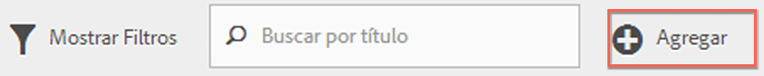
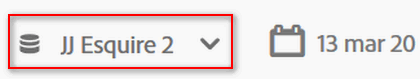
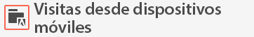
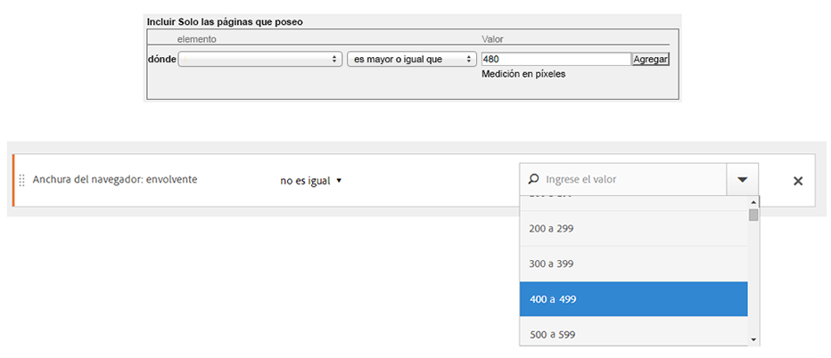

# Preguntas frecuentes

Responde preguntas frecuentes sobre las funciones de segmentación, acceso, permisos, recomendaciones y administración de segmentos heredados.

## Funciones {#section_BD58629D1A9346BF879E229FA6BEC7A2}

* Segmentación en Analysis Workspace:

   * [Compare segmentos](https://docs.adobe.com/content/help/es-ES/analytics/analyze/analysis-workspace/panels/segment-comparison/segment-comparison.html).
   * Utilice [segmentos como dimensiones](https://docs.adobe.com/content/help/es-ES/core-services/interface/audiences/audience-library.html) en una comparación.
   * Utilice segmentos en el [análisis de visitas en el orden previsto](https://docs.adobe.com/help/en/analytics/analyze/analysis-workspace/visualizations/fallout/compare-segments-fallout.html).

* Puede aplicar [varios segmentos a un informe o un proyecto](/help/components/segmentation/segmentation-workflow/seg-workflow.md).
* Los segmentos son universales para todos los grupos de informes.
* El [Generador de segmentos](/help/components/segmentation/segmentation-workflow/seg-workflow.md) simplifica la creación de segmentos.
* El nuevo [Administrador de segmentos](/help/components/segmentation/segmentation-workflow/seg-workflow.md) le permite configurar [flujos de trabajo](/help/components/segmentation/segmentation-workflow/seg-workflow.md) con funciones de uso compartido, etiquetado, verificación y aprobación de segmentos.

* Ahora puede [etiquetar segmentos](/help/components/segmentation/segmentation-workflow/seg-workflow.md) para organizar y buscar más tarde en lugar de utilizar carpetas. Antes, utilizaba las carpetas (en [!DNL Ad Hoc Analysis]) para organizar los segmentos.

* Ahora puede crear [Segmentos secuenciales](/help/components/segmentation/segmentation-workflow/seg-sequential-build.md) fuera de Ad Hoc Analysis.
* El contenedor de vista de página se llama ahora “contenedor de visita individual” para indicar que el contenedor segmenta todos los tipos de datos, no solo vistas de página. Por ejemplo, si vincula las llamadas de seguimiento, el Contenedor de visita individual incluirá o excluirá las llamadas trackAction desde los SDK móviles. Tenga en cuenta que no se ha modificado la manera de funcionar del contenedor; simplemente se le ha cambiado el nombre.

Consulte la publicación [Mejora de segmentación en Adobe Analytics](https://blogs.adobe.com/digitalmarketing/analytics/improving-segmentation-adobe-analytics/) en el blog de marketing digital para obtener más detalles.

## Acceso a las herramientas de segmentación {#section_088AD0E4E21943DFA8CF7206AEC485DD}

**¿Cómo accedo al Generador de segmentos?**

Para acceder al Generador de segmentos, haga lo siguiente:

* Muestre un informe existente y haga clic en el icono de Segmentos  en el menú de navegación de la izquierda. Haga clic en **[!UICONTROL Agregar]** en el carril de segmentos que se muestra o bien

* En la parte superior del Administrador de segmentos, haga clic en **[!UICONTROL + Agregar]**.  

   O bien

* Haga clic en un título de segmento existente en el Administrador de segmentos para editarlo en el Generador de segmentos.

**¿Cómo accedo al Administrador de segmentos?**

Acceda al Administrador de segmentos de una de las siguientes maneras:

* Vaya a **[!UICONTROL Análisis]** > **[!UICONTROL Componentes]** en el panel de navegación superior. A continuación, haga clic en **[!UICONTROL Segmentos]**, o bien

* Muestre un informe existente y haga clic en el icono de Segmentos  en el menú de navegación de la izquierda. A continuación, haga clic en **[!UICONTROL Administrar]**, o bien

* Presione la tecla de barra &quot;/&quot; situándose en cualquier lugar de la interfaz y busque el Administrador de segmentos.

**¿Dónde está ahora la lista desplegable de segmentos heredados?**

La lista desplegable de segmentos de Reports &amp; Analytics se ha sustituido por una interfaz de  [Generador de segmentos](/help/components/segmentation/segmentation-workflow/seg-workflow.md) con muchas más funciones que le permite crear segmentos &quot;universales&quot; utilizables en los grupos de informes y en las soluciones de Adobe Analytics. Para ver una lista de segmentos existentes, haga clic en el icono Segmentos 

en la navegación izquierda, y se mostrará el carril de segmentos.

**¿Dónde está ahora la lista desplegable de grupo de informes heredado?**

La lista desplegable de grupo de informes se ha trasladado junto al selector de fecha, en la esquina superior derecha de cada informe o panel.

## Permisos {#section_648DFA3A882146C485A84ED014EEC707}

**¿Qué derechos y privilegios necesito para utilizar, crear y administrar segmentos?**

De forma predeterminada, todos los usuarios pueden crear y editar segmentos personales. Sin embargo, los administradores pueden decidir quién cuenta con los [permisos para crear segmentos](https://docs.adobe.com/content/help/es-ES/analytics/admin/user-product-management/user-groups/groups.html) y pueden asignarlos a grupos específicos. Estos segmentos se pueden compartir directamente con cualquier otro usuario de Analytics.

Los administradores pueden editar cualquier segmento, así como compartir segmentos con grupos y con cualquier persona de la organización. [Más...](/help/components/segmentation/seg-reference/seg-rights.md)

**¿Puedo ver todos los segmentos de mi compañía?**

Sí, los administradores pueden ver todos los segmentos incluidos en las interfaces de usuario de [!DNL Analysis Workspace] e [!DNL Reports & Analytics].

Ad Hoc Analysis y Report Builder muestran sus propios segmentos y los que se han compartido con usted.

**¿Puedo administrar todos los segmentos de análisis en el Administrador de segmentos?**

Sí. Todos los segmentos pueden administrarse en el Administrador de segmentos, en Analysis Workspace, en Reports &amp; Analytics y también en Ad Hoc Analysis. El Administrador de segmentos muestra los segmentos que son visibles para el propietario (el usuario que creó el segmento), para usuarios compartidos y para los administradores. El selector de segmentos muestra los segmentos que son propiedad del usuario y que se comparten con él.

Los administradores pueden ver todos los segmentos incluidos en las interfaces de usuario de Analysis Workspace y [!DNL Reports & Analytics].

Ad Hoc Analysis y Report Builder solo muestran segmentos creados por usted o los segmentos que han sido compartidos específicamente con usted.

**¿Por qué no puedo eliminar este segmento?**

Si el segmento se [publicó en Experience Cloud](/help/components/segmentation/segmentation-workflow/seg-workflow.md), no es posible eliminarlo ni editarlo. Pero sí copiarlo y editar esa versión copiada.

## Prácticas recomendadas {#section_E2C3A1B4B4274D1B86CAA9C0359D049C}

**¿Qué debería hacer con los segmentos duplicados que tienen el mismo nombre pero que pueden tener definiciones distintas?**
Ahora que los segmentos funcionan en múltiples grupos de informes, es posible que descubra que tiene múltiples segmentos con el mismo nombre. Le recomendamos que siga uno de los procedimientos siguientes

* Cambie el nombre de los segmentos que tienen el mismo nombre pero tienen definiciones distintas, o
* Elimine los segmentos que ya no son necesarios.

**¿Qué recomienda Adobe con respecto a la limpieza de segmentos?**

* Etiquete todos los segmentos con la etiqueta heredada.
* Revise los segmentos que tiene.
* Añádalos a la biblioteca de segmentos cuando sea pertinente.
* Apruebe los segmentos canónicos.
* Etiquete los segmentos siguiendo las  [prácticas recomendadas](/help/components/segmentation/segmentation-workflow/seg-workflow.md).

## Administración de segmentos heredados {#section_76CF47142D1A4FB6A0718AD9073049FE}

**¿Qué ha pasado con mis segmentos existentes?**

Sus segmentos existentes seguirán funcionando como siempre. Todos los informes a los que se hayan aplicado dichos segmentos funcionarán correctamente. [Más...](/help/components/segmentation/seg-transition.md)

La mayoría de los segmentos de grupo y predefinidos antiguos se migrarán como  plantillas de segmentos al Generador de segmentos. Las plantillas de segmentos se utilizan para generar rápidamente segmentos personalizados con audiencias comunes. Las plantillas de segmentos no pueden aplicarse a un informe directamente, pero pueden guardarse de manera muy sencilla en un segmento personalizado.

Las plantillas de segmentos están marcadas con un icono especial en el Generador de segmentos:

**¿Qué ha pasado con mis carpetas de segmentos existentes?**

En lugar de utilizar carpetas (Ad Hoc Analysis), el Administrador de segmentos emplea  . Los nombres de sus carpetas se convierten automáticamente en etiquetas, que se aplican a los segmentos respectivos.

**¿Qué ha pasado con los informes programados que tienen segmentos aplicados?**

Los informes programados siguen ejecutándose correctamente con los segmentos que haya definido.

Si elimina un segmento, los informes programados y los paneles a los que se haya aplicado siguen funcionando normalmente, es decir, el informe o panel siguen utilizando el segmento eliminado.

Los informes programados no se actualizan cuando edita un segmento con el mismo nombre. Por ejemplo, suponga que tiene dos segmentos con el mismo nombre en diferentes grupos de informes:

Tiene un marcador que hace referencia al segmento para el grupo de informes mainprod. Elimine dicho segmento, ya que es un duplicado. El marcador seguirá funcionando, haciendo referencia a la definición del segmento eliminado. Si cambia la definición del segmento para el segmento maindev con el fin de incluir Isla Santa Catalina y Tijuana, el segmento aplicado al marcador no cambiará. Utilizará la definición antigua. Para arreglarlo, actualice el marcador a fin de que haga referencia a la definición nueva. Si no sabe con seguridad si un marcador, panel o informe programado esté utilizando un segmento eliminado, puede cambiar el nombre del resto del segmento para que quede claro si el marcador lo utiliza.

**¿Qué les sucede a los segmentos del Data Warehouse?**

Todos los segmentos del Data Warehouse seguirán funcionando en el Data Warehouse. La mayoría de los segmentos de Data Warehouse también seguirán funcionando en otros componentes, como Analysis Workspace, Ad Hoc Analysis y Reports &amp; Analytics.

Puede crear o editar segmentos nuevos del Almacén de datos en el Generador/Data Warehouse. El mecanismo de compatibilidad del producto en el Generador de segmentos determina automáticamente si un segmento es compatible con el Data Warehouse.

**¿Qué les sucede a los Segmentos favoritos (Ad Hoc Analysis)?**

Estos segmentos de Ad Hoc Analysis se muestran como segmentos regulares en Adobe Analytics.

No se deben confundir con la función Favoritos del Administrador de segmentos, que le permite marcar segmentos como favoritos.

**¿Qué les sucede a los segmentos configurados previamente?**

* **Visitas a una sola página**
* **Visitas desde dispositivos móviles**
* **Visitas de búsqueda natural**
* **Visitas de búsqueda de pago**
* **Visitas con cookie de ID de visitante**

Estos segmentos se migrarán como plantillas de segmentos al Generador de segmentos.

Los informes existentes que tengan estos segmentos aplicados seguirán funcionando correctamente.

**Qué sucede a los segmentos de Experience Cloud (Suite):**

* No compradores
* Compradores
* Visitas por primera vez
* Visitas provenientes de sitios sociales
* Visitas de más de 10 minutos*
* Visitas con más de 5 visitas previas*
* Visitas provenientes de Facebook*

La mayoría de estos segmentos (excepto los marcados con un asterisco *) se migrarán como  plantillas de segmentos al Generador de segmentos. Además, se han agregado varias plantillas de segmentos nuevas.

Los informes existentes que tengan estos segmentos aplicados seguirán funcionando correctamente.

**¿Qué les sucede a los segmentos de administración (conocidos como segmentos &quot;Globales&quot;)?**

Los segmentos de **Administrador** se migrarán en la nueva interfaz de segmentos y se mostrarán como segmentos compartidos para todos.

El propietario de estos segmentos se establece como administrador con la cuenta de inicio de sesión más antigua de la lista de usuarios administradores de la empresa; no obstante, todos los administradores pueden eliminar, editar y compartir estos segmentos.

Ya no está disponible la interfaz de administración de segmentos en Admin Console donde los administradores creaban y gestionaban estos segmentos globales. Ahora, los administradores deben utilizar el nuevo Generador de segmentos para crear segmentos y compartirlos con los grupos o las personas adecuadas, o con todos.

<!-- 

seg_definition.xml

 -->

Los segmentos existentes que utilizan la lógica que se ha modificado según se describe en este documento siguen funcionando correctamente, aunque deben actualizarse antes de poder guardarse de nuevo. Por ejemplo, si tiene un segmento existente donde los estados de Estados Unidos contienen “Nueva York”, dicho segmento sigue funcionando correctamente, aunque la próxima vez que lo edite tendrá que actualizarlo para que utilice el tipo enumerado con una condición “es igual a”.

**Consejos para la migración**

Los siguientes consejos le ayudarán a migrar dimensiones comunes:

* Ciudad/región/país geográfico: Busca y selecciona ciudades, regiones o países específicos, en lugar de utilizar una coincidencia parcial.
* Exploradores: Utiliza la dimensión Tipos de exploradores para obtener todos los exploradores de un tipo, por ejemplo Google Chrome.
* Sistemas operativos: Utiliza las dimensiones Tipos de sistemas operativos para obtener todos los sistemas operativos de un tipo, como Microsoft Windows.

* [Dimensiones nuevas y renombradas](/help/components/segmentation/seg-transition.md#section_73CF121B64A24DEF8E6499F3167BF742)
* [Cambios en Contiene](/help/components/segmentation/seg-transition.md#section_1A9EDEE5CBC44B5AA6262560052ABE77)
* [Cambios en Menor que y Mayor que](/help/components/segmentation/seg-transition.md#section_84A8AAD0344148AD9F9211D3EB271903)

## Dimensiones nuevas y renombradas {#section_73CF121B64A24DEF8E6499F3167BF742}

La siguiente tabla contiene una lista de dimensiones que se renombraron en el Generador de segmentos.

<table id="table_1A8C1940FD0446FA8414C6A7DE66E44C"> 
 <thead> 
  <tr> 
   <th colname="col1" class="entry"> Nuevo nombre de dimensión </th> 
   <th colname="col2" class="entry"> Nombre anterior </th> 
   <th colname="col3" class="entry"> Notas </th> 
  </tr> 
 </thead>
 <tbody> 
  <tr> 
   <td colname="col1"> Tipos de sistemas operativos </td> 
   <td colname="col2"> Nuevo </td> 
   <td colname="col3"> Agregado en la primavera de 2015. </td> 
  </tr> 
  <tr> 
   <td colname="col1"> Anchura del explorador: Agrupado </td> 
   <td colname="col2"> Anchura del explorador </td> 
   <td colname="col3"> Esta dimensión es compatible con todas las interfaces, y se divide en una lista enumerada de intervalos, en lugar de valores de entero específicos. Si necesita segmentar valores específicos, utilice la versión pormenorizada de esta dimensión en el segmento del almacén de datos. </td> 
  </tr> 
  <tr> 
   <td colname="col1"> Altura del explorador: Agrupado </td> 
   <td colname="col2"> Altura del explorador </td> 
   <td colname="col3"> Esta dimensión es compatible con todas las interfaces, y se divide en una lista enumerada de intervalos, en lugar de valores de entero específicos. Si necesita segmentar valores específicos, utilice la versión pormenorizada de esta dimensión en el segmento del almacén de datos. </td> 
  </tr> 
  <tr> 
   <td colname="col1"> Ancho del explorador - Pormenorizado </td> 
   <td colname="col2"> Anchura del explorador </td> 
   <td colname="col3"> 
Se ha renombrado y ahora solo es compatible con el almacén de datos. Cuando defina segmentos compatibles con todas las interfaces, utilice el tipo enumerado, Ancho del explorador - Agrupado. 
 </td> 
  </tr> 
  <tr> 
   <td colname="col1"> Alto del explorador - Pormenorizado </td> 
   <td colname="col2"> Altura del explorador </td> 
   <td colname="col3"> 
Se ha renombrado y ahora solo es compatible con el almacén de datos. Cuando defina segmentos compatibles con todas las interfaces, utilice el tipo enumerado, Alto del explorador - Agrupado. 
 </td> 
  </tr> 
  <tr> 
   <td colname="col1"> Compatibilidad con cookies </td> 
   <td colname="col2"> Cookies </td> 
   <td colname="col3"> - </td> 
  </tr> 
  <tr> 
   <td colname="col1"> Profundidad de color </td> 
   <td colname="col2"> Profundidad del color del monitor </td> 
   <td colname="col3"> - </td> 
  </tr> 
  <tr> 
   <td colname="col1"> - </td> 
   <td colname="col2"> "Aplicación - *" </td> 
   <td colname="col3"> Los prefijos "Aplicación -" se eliminaron de varios tipos de dimensiones. Debido a que los datos de las aplicaciones móviles suelen capturarse en un grupo de informes que no contiene datos web, estos prefijos no eran necesarios. </td> 
  </tr> 
  <tr> 
   <td colname="col1"> Página de entrada original </td> 
   <td colname="col2"> Página de entrada original </td> 
   <td colname="col3"> - </td> 
  </tr> 
  <tr> 
   <td colname="col1"> Habilitado para Java </td> 
   <td colname="col2"> Java </td> 
   <td colname="col3"> - </td> 
  </tr> 
  <tr> 
   <td colname="col1"> Longitud máxima de la dirección URL del explorador móvil </td> 
   <td colname="col2"> Longitud de la dirección URL del explorador móvil </td> 
   <td colname="col3"> - </td> 
  </tr> 
  <tr> 
   <td colname="col1"> Decoración de correo móvil </td> 
   <td colname="col2"> Compatibilidad con decoración de correo móvil </td> 
   <td colname="col3"> - </td> 
  </tr> 
  <tr> 
   <td colname="col1"> Dispositivo móvil </td> 
   <td colname="col2"> Nombre de dispositivo móvil </td> 
   <td colname="col3"> - </td> 
  </tr> 
  <tr> 
   <td colname="col1"> Longitud máxima del marcador móvil </td> 
   <td colname="col2"> Longitud máxima de la dirección URL del marcador móvil </td> 
   <td colname="col3"> - </td> 
  </tr> 
  <tr> 
   <td colname="col1"> Longitud máxima del correo electrónico móvil </td> 
   <td colname="col2"> Longitud máxima de la dirección URL del mensaje móvil </td> 
   <td colname="col3"> - </td> 
  </tr> 
  <tr> 
   <td colname="col1"> Sistema operativo móvil (obsoleto) </td> 
   <td colname="col2"> Sistema operativo móvil </td> 
   <td colname="col3"> Utilice la dimensión Sistema operativo y aplique una visita desde segmentos de dispositivos móviles en su lugar. </td> 
  </tr> 
  <tr> 
   <td colname="col1"> Pulsar y hablar móvil </td> 
   <td colname="col2"> PTT móvil </td> 
   <td colname="col3"> - </td> 
  </tr> 
  <tr> 
   <td colname="col1"> Vistas del Encuesta </td> 
   <td colname="col2"> Vistas del Encuesta totales </td> 
   <td colname="col3"> - </td> 
  </tr> 
  <tr> 
   <td colname="col1"> Respuestas de Encuesta </td> 
   <td colname="col2"> Respuestas de Encuesta totales </td> 
   <td colname="col3"> - </td> 
  </tr> 
  <tr> 
   <td colname="col1"> Profundidad de la visita </td> 
   <td colname="col2"> Longitud de ruta </td> 
   <td colname="col3"> - </td> 
  </tr> 
  <tr> 
   <td colname="col1"> Código postal </td> 
   <td colname="col2"> Código postal </td> 
   <td colname="col3"> - </td> 
  </tr> 
 </tbody> 
</table>

## Cambios en las dimensiones basadas en cadenas que tienen valores conocidos  {#section_1A9EDEE5CBC44B5AA6262560052ABE77}

Las dimensiones basadas en cadenas que tienen un conjunto de valores conocidos se cambiaron a tipos enumerados. Al crear un segmento utilizando estas dimensiones, la lista se rellena previamente con todos los valores conocidos y solo se admite el operador &quot;es igual a&quot;. Esto le permite segmentar rápidamente los valores exactos que estaba buscando sin seleccionar valores no intencionados al utilizar coincidencias menos restrictivas.

Las siguientes dimensiones se cambiaron a listas enumeradas:

| fabricante de dispositivos móviles | longitud de correo electrónico móvil | profundidad de color |
|---|---|---|
| tamaño de la pantalla del dispositivo móvil | número de dispositivo móvil | resolución del monitor |
| altura de la pantalla del dispositivo móvil | pulsar y hablar móvil | plugin |
| compatibilidad con cookies del dispositivo móvil | decoración de correo móvil | sistema operativo |
| compatibilidad con la imagen del dispositivo móvil | servicios de información móvil | tipo de referente |
| profundidad de color del dispositivo móvil | tipo de dispositivo móvil | motor de búsqueda |
| compatibilidad con el audio del dispositivo móvil | tipo de explorador | state |
| compatibilidad con el vídeo del dispositivo móvil | explorador | país geográfico |
| DRM móvil | tipo de conexión | región geográfica |
| protocolos de red móvil | operador de telefonía móvil | ciudad geográfica |
| sistema operativo móvil | cookie | DMA geográfico |
| máquina virtual Java móvil | lealtad del cliente | cookie persistente |
| longitud del marcador móvil | Habilitado para Java | búsqueda de pago |
| longitud de dirección URL móvil | idioma |  |

## Cambios en las dimensiones basadas en enteros que tienen valores conocidos  {#section_84A8AAD0344148AD9F9211D3EB271903}

Las dimensiones basadas en enteros (como el ancho del explorador) con un conjunto de valores conocidos se dividieron en varios intervalos para que pueda definir rápidamente segmentos para un intervalo específico. A estas listas enumeradas se les ha agregado &quot;- Agrupado&quot; tras el nombre de la dimensión. La siguiente pantalla demuestra cómo se segmentan estas dimensiones utilizando la interfaz antigua y nueva del generador de segmentos:

Los operadores menor que, mayor que y similares ahora son compatibles únicamente con segmentos del Data Warehouse. Los segmentos que pretenden ser compatibles con todas las interfaces de informes deberían utilizar la versión “agrupada” de la métrica con el operador “es igual a”.
