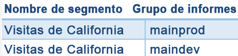

# Segmentos heredados

Este artículo responde a las preguntas más frecuentes sobre las prácticas recomendadas para administrar segmentos heredados. Los segmentos heredados son segmentos que se crearon antes de 2014.

## Administración de segmentos heredados {#legacy}

+++ **¿Qué ha pasado con mis segmentos existentes?**

Los segmentos existentes siguen funcionando como antes. Todos los informes a los que se hayan aplicado dichos segmentos funcionarán correctamente.

La mayoría de los anteriores segmentos predefinidos y de grupo se migran como plantillas de segmento al Generador de segmentos. Las plantillas de segmentos se utilizan para generar rápidamente segmentos personalizados con audiencias comunes. Las plantillas de segmentos no pueden aplicarse a un informe directamente, pero pueden guardarse de manera muy sencilla en un segmento personalizado.

Las plantillas de segmentos están marcadas con un icono especial  en el Generador de segmentos.

+++

+++ **¿Qué ha pasado con los informes programados que tienen segmentos aplicados?**

Los informes programados siguen ejecutándose correctamente con los segmentos que haya definido.

Si elimina un segmento, los informes programados y los paneles a los que se haya aplicado siguen funcionando normalmente, es decir, el informe o panel siguen utilizando el segmento eliminado.

Los informes programados no se actualizan cuando edita un segmento con el mismo nombre. Por ejemplo, suponga que tiene dos segmentos con el mismo nombre en diferentes grupos de informes:

Tiene una visualización que hace referencia al segmento para el grupo de informes **[!UICONTROL mainprod]**. Elimine dicho segmento, ya que es un duplicado. La visualización seguirá ejecutándose, haciendo referencia a la definición del segmento eliminado. Si cambia la definición del segmento para el segmento maindev con el fin de incluir Isla Santa Catalina y Tijuana, México, el segmento aplicado a la visualización no cambia y utiliza la definición antigua. Para utilizar la nueva definición, actualice la visualización para hacer referencia a la nueva definición. Si no está seguro de si una visualización, un proyecto o un informe programado está utilizando un segmento eliminado, cambie el nombre del resto del segmento para mostrar si la visualización utiliza el resto del segmento.

+++

+++ **¿Qué ha pasado con los segmentos de Data Warehouse?**

Todos los segmentos de Data Warehouse seguirán funcionando en Data Warehouse. La mayoría de los segmentos de Data Warehouse también funcionan en otros componentes, como Analysis Workspace.

Puede crear o editar segmentos nuevos del Almacén de datos en el Generador/Data Warehouse. El mecanismo de compatibilidad del producto en el Generador de segmentos determina automáticamente si un segmento es compatible con Data Warehouse.

+++

+++ **¿Qué ha pasado con los segmentos configurados previamente?**

* **Visitas a una sola página**
* **Visitas desde dispositivos móviles**
* **Visitas de búsqueda natural**
* **Visitas de búsqueda de pago**
* **Visitas con cookie de ID de visitante**

Estos segmentos se migran como plantillas de segmento al Generador de segmentos. Todos los informes a los que se hayan aplicado dichos segmentos funcionarán correctamente.

+++

+++ **¿Qué ha pasado con los segmentos de Experience Cloud (Suite)?:**

* No compradores
* Compradores
* Visitas por primera vez
* Visitas provenientes de sitios sociales
* Visitas de más de 10 minutos*
* Visitas con más de 5 visitas previas*
* Visitas provenientes de Facebook*

La mayoría de estos segmentos (excepto aquellos marcados con un asterisco *) se migraron como plantillas de segmento al Generador de segmentos. Además, se han añadido varias plantillas de segmentos nuevas.

Todos los informes a los que se hayan aplicado dichos segmentos funcionarán correctamente.

+++

+++ **¿Qué ha pasado con los segmentos de administración (conocidos también como segmentos &quot;Globales&quot;)?**

Los segmentos de **Admin** se migrarán a la nueva interfaz de segmentos y se mostrarán como segmentos compartidos para todos.

El propietario de estos segmentos se establece en el administrador con la cuenta de usuario administrador más antigua. Sin embargo, todos los administradores pueden eliminar, editar y compartir estos segmentos.

Ya no está disponible la interfaz de administración de segmentos en Admin Console donde los administradores creaban y gestionaban estos segmentos globales. Ahora, los administradores deben utilizar el nuevo Generador de segmentos para crear segmentos y compartirlos con los grupos o las personas adecuadas, o con todos.

Los segmentos existentes que utilizan la lógica que se ha modificado según se describe en este documento siguen funcionando correctamente, aunque los segmentos deben actualizarse antes de poder guardarse de nuevo. Por ejemplo, si tiene un segmento existente donde **[!UICONTROL Estados de EE. UU.]** **[!UICONTROL contiene]** `New York`, ese segmento sigue funcionando correctamente. La próxima vez que edite el segmento, deberá actualizar el segmento para utilizar el tipo enumerado con una condición **[!UICONTROL es igual que]**.

+++

+++ **¿Qué debería hacer con los segmentos duplicados que tienen el mismo nombre pero que pueden tener definiciones distintas?**
Ahora que los segmentos funcionan en múltiples grupos de informes, es posible que descubra que tiene múltiples segmentos con el mismo nombre. Recomendaciones:

* Cambie el nombre de los segmentos que tienen el mismo nombre pero tienen definiciones distintas, o
* Elimine los segmentos que ya no son necesarios.

+++

+++ **¿Qué recomienda Adobe con respecto a la limpieza de segmentos?**

* Etiquete todos los segmentos con la etiqueta heredada.
* Revise los segmentos que tiene.
* Añádalos a la biblioteca de segmentos cuando sea pertinente.
* Apruebe los segmentos canónicos.
* Etiquete los segmentos según las [prácticas recomendadas](/help/components/segmentation/segmentation-workflow/seg-workflow.md).

+++

### Consejos para la migración

Las siguientes sugerencias le ayudan a migrar dimensiones comunes:

* Ciudad/región/país geográfico: Busca y selecciona ciudades, regiones o países específicos, en lugar de utilizar una coincidencia parcial.
* Exploradores: Utilice la dimensión Tipos de exploradores para obtener todos los exploradores de un tipo, por ejemplo, Google Chrome
* Sistemas operativos: Utilice las dimensiones Tipos de sistemas operativos para obtener todos los sistemas operativos de un tipo, por ejemplo, Microsoft Windows.
* Consulte “Dimensiones nuevas y renombradas” (véase a continuación)

## Dimensiones nuevas y renombradas {#renamed}

La siguiente tabla contiene una lista de dimensiones que se renombraron en el Generador de segmentos.

| Nuevo nombre de dimensión | Nombre anterior | Notas |
|--- |--- |--- |
| Tipos de sistemas operativos | Nuevo | Agregado en la primavera de 2015. |
| Anchura del explorador: Agrupado | Anchura del explorador | Esta dimensión es compatible con todas las interfaces, y se divide en una lista enumerada de intervalos, en lugar de valores de entero específicos. Si necesita segmentar valores específicos, utilice la versión granular de esta dimensión en un segmento de Data Warehouse. |
| Altura del explorador: Agrupado | Altura del explorador | Esta dimensión es compatible con todas las interfaces, y se divide en una lista enumerada de intervalos, en lugar de valores de entero específicos. Si necesita segmentar valores específicos, utilice la versión granular de esta dimensión en un segmento de Data Warehouse. |
| Ancho del explorador - Pormenorizado | Anchura del explorador | Se ha cambiado el nombre de esta dimensión y ahora solo es compatible con Data Warehouse. Cuando defina segmentos compatibles con todas las interfaces, utilice el tipo enumerado, Ancho del explorador - Agrupado. |
| Alto del explorador - Pormenorizado | Altura del explorador | Se ha cambiado el nombre de esta dimensión y ahora solo es compatible con Data Warehouse. Cuando defina segmentos compatibles con todas las interfaces, utilice el tipo enumerado, Alto del explorador - Agrupado. |
| Compatibilidad con cookies | Cookies | - |
| Profundidad de color | Profundidad del color del monitor | - |
| - | &quot;Aplicación - *&quot; | Los prefijos &quot;Aplicación -&quot; se eliminaron de varios tipos de dimensiones. Debido a que los datos de las aplicaciones móviles suelen capturarse en un grupo de informes que no contiene datos web, estos prefijos no eran necesarios. |
| Página de entrada original | Página de entrada original | - |
| Habilitado para Java | Java | - |
| Longitud máxima de la dirección URL del explorador móvil | Longitud de la dirección URL del explorador móvil | - |
| Decoración de correo móvil | Compatibilidad con decoración de correo móvil | - |
| Dispositivo móvil | Nombre de dispositivo móvil | - |
| Longitud máxima del marcador móvil | Longitud máxima de la dirección URL del marcador móvil | - |
| Longitud máxima del correo electrónico móvil | Longitud máxima de la dirección URL del mensaje móvil | - |
| Sistema operativo móvil (obsoleto) | Sistema operativo móvil | Utilice la dimensión Sistema operativo y aplique una visita desde segmentos de dispositivos móviles en su lugar. |
| Pulsar y hablar móvil | PTT móvil | - |
| Vistas del Encuesta | Vistas del Encuesta totales | - |
| Respuestas de Encuesta | Respuestas de Encuesta totales | - |
| Profundidad de la visita | Longitud de ruta | - |
| Código postal | Código postal | - |

{style="table-layout:auto"}

## Cambios en las dimensiones basadas en cadenas que tienen valores conocidos {#string-based-dims}

Las dimensiones basadas en cadenas que tienen un conjunto de valores conocidos se cambiaron a tipos enumerados. Al crear un segmento utilizando estas dimensiones, la lista se rellena previamente con todos los valores conocidos y solo se admite el operador **[!UICONTROL es igual a]**. Esta población de valores le permite segmentar rápidamente los valores exactos que estaba buscando sin seleccionar valores no deseados al utilizar coincidencias menos restrictivas.

Las siguientes dimensiones se cambiaron a listas enumeradas:

| Nombre de la dimensión | Nombre de la dimensión | Nombre de la dimensión |
| --- | --- | --- |
| fabricante de dispositivos móviles | longitud de correo electrónico móvil | profundidad de color |
| tamaño de la pantalla del dispositivo móvil | número de dispositivo móvil | resolución del monitor |
| altura de la pantalla del dispositivo móvil | pulsar y hablar móvil | plugin |
| compatibilidad con cookies del dispositivo móvil | decoración de correo móvil | sistema operativo |
| compatibilidad con la imagen del dispositivo móvil | servicios de información móvil | tipo de referente |
| profundidad de color del dispositivo móvil | tipo de dispositivo móvil | motor de búsqueda |
| compatibilidad con el audio del dispositivo móvil | tipo de explorador | estado |
| compatibilidad con el vídeo del dispositivo móvil | explorador | país geográfico |
| DRM móvil | tipo de conexión | región geográfica |
| protocolos de red móvil | operador de telefonía móvil | ciudad geográfica |
| sistema operativo móvil | cookie | DMA geográfico |
| máquina virtual Java móvil | lealtad del cliente | cookie persistente |
| longitud del marcador móvil | Habilitado para Java | búsqueda de pago |
| longitud de dirección URL móvil | idioma |  |

## Cambios en dimensiones basadas en enteros que tienen valores conocidos {#integer-based-dims}

Las dimensiones basadas en enteros (como el ancho del explorador) con un conjunto de valores conocidos se dividen en intervalos enumerados para que pueda definir rápidamente segmentos para un intervalo específico. A estas listas enumeradas se les ha agregado &quot;- Agrupado&quot; tras el nombre de la dimensión. La siguiente pantalla muestra cómo se segmentan estas dimensiones utilizando la interfaz antigua y nueva del generador de segmentos:

Los operadores menor que, mayor que y similares ahora son compatibles únicamente con segmentos del Data Warehouse. Los segmentos que pretenden ser compatibles con todas las interfaces de informes deben utilizar la versión &quot;agrupada&quot; de la métrica con el operador **[!UICONTROL es igual a]**.
