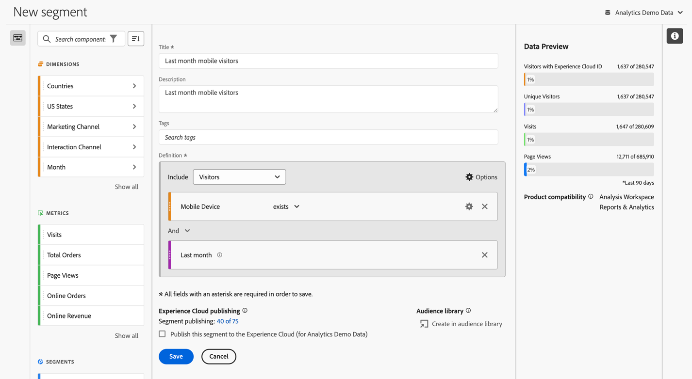
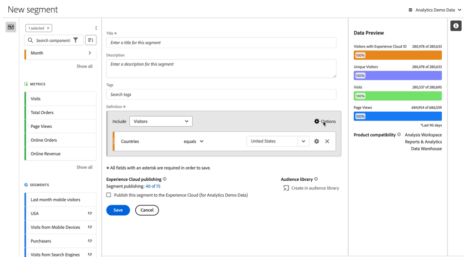
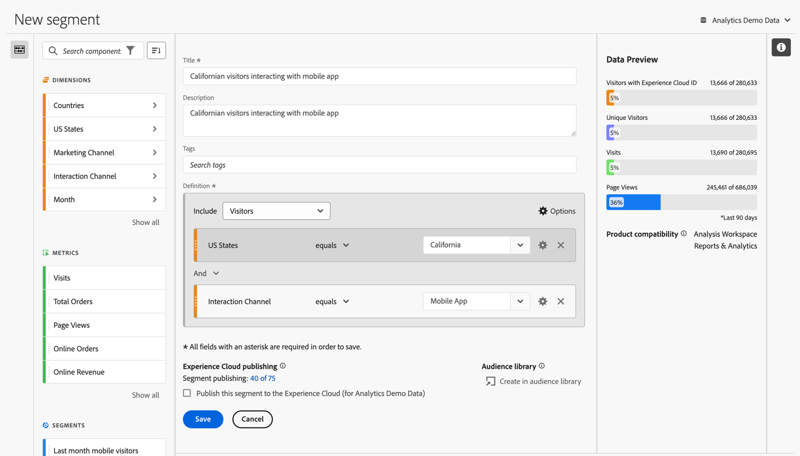
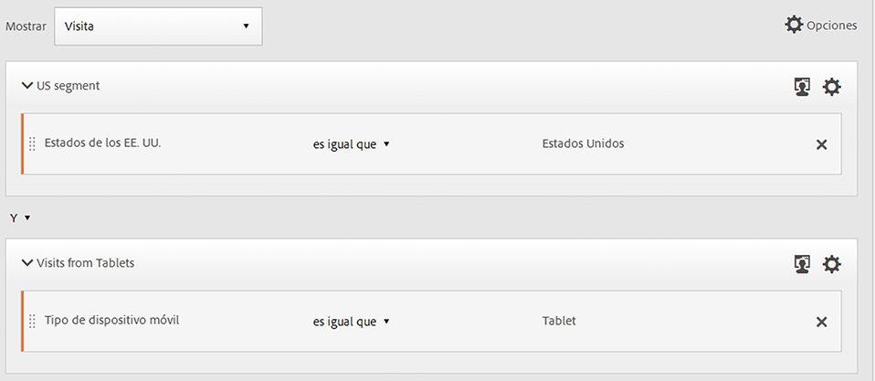

# Generador de segmentos {#segment-builder}

>[!CONTEXTUALHELP]
>id="components_segments_productcompatibility"
>title="Compatibilidad del producto"
>abstract="Un pequeño número de criterios de segmento disponibles no son compatibles con todas las herramientas de Adobe Analytics. Las herramientas que son compatibles con el segmento se indican en esta lista. Para que un segmento sea compatible con todas las herramientas de Adobe Analytics, edite los criterios."

>[!CONTEXTUALHELP]
>id="components_filters_createaudience"
>title="Creación de público"
>abstract="Los públicos se pueden crear a partir de un segmento y compartirse con Adobe Experience Platform para su activación."

>[!CONTEXTUALHELP]
>id="components_filters_datapreview"
>title="Previsualización de los datos"
>abstract="Compara los datos de este segmento con los datos de la vista de datos. El porcentaje de vista previa se basa en el número total de la vista de datos de los **últimos 90 días**.  Si la vista previa no se carga, es posible que la conexión aún esté reponiendo los datos."

El cuadro de diálogo **[!UICONTROL Generador de segmentos]** se usa para crear segmentos nuevos o editar los existentes. El cuadro de diálogo se titula **[!UICONTROL Nuevo segmento]** o **[!UICONTROL Editar segmento]** para los segmentos que se creen o administren desde el administrador de [[!UICONTROL Segmentos]](/help/components/segmentation/segmentation-workflow/seg-manage.md).

>[!BEGINTABS]

>[!TAB Generador de segmentos]

>[!TAB Crear o editar segmento]

>[!ENDTABS]

1. Especifica los siguientes detalles ( es obligatorio):

   | Elemento | Descripción |
   | --- | --- |
   | **[!UICONTROL Grupo de informes]** | Puede seleccionar el grupo de informes para el segmento. |
   | **[!UICONTROL Segmento solo de proyecto]** | Un cuadro de información que explica que el segmento solo es visible en el proyecto en el que se crea y que este no se añade a la lista de componentes. Habilite **[!UICONTROL Poner este segmento a disposición de todos los proyectos y añadirlo a la lista de componentes]** para cambiar esa configuración. Este cuadro de información solo es visible cuando crea un [segmento rápido](seg-quick.md) y convierte su información en un segmento normal mediante la opción **[!UICONTROL Abrir generador]** de la interfaz de [!UICONTROL Segmento rápido]. |
   | **[!UICONTROL Título]**  | Asigne un nombre al segmento como, por ejemplo, `Last month mobile visitors`. |
   | **[!UICONTROL Descripción]** | Proporcione una descripción para el segmento, por ejemplo, `Segment to define the mobile customers for the last month`. |
   | **[!UICONTROL Etiquetas]** | Organice el segmento creando o aplicando una o varias etiquetas. Empiece a escribir para buscar las etiquetas existentes que puede seleccionar. O presione **[!UICONTROL Entrar]** para agregar una etiqueta nueva. Selecciona  para quitar una etiqueta. |
   | **[!UICONTROL Definición]**  | Defina su segmento con el [Generador de definiciones](#definition-builder). |

   {style="table-layout:auto"}

1. Para comprobar si la definición del segmento es correcta, utilice la previsualización constantemente actualizada de los resultados del segmento situada en la parte superior derecha.
1. Para publicar el segmento en Experience Cloud, seleccione **[!UICONTROL Publicar este segmento en Experience Cloud (para *grupo de informes*)]**. Consulte [Publicar segmentos a Experience Cloud](/help/components/segmentation/segmentation-workflow/seg-publish.md) para obtener más información.
1. Seleccione lo siguiente:
   * **[!UICONTROL Guardar]** para guardar el segmento.
   * **[!UICONTROL Guardar como]** para guardar una copia del segmento.
   * **[!UICONTROL Eliminar]** para eliminar el segmento.
   * **[!UICONTROL Cancelar]** para cancelar los cambios realizados en un segmento o cancelar la creación de un nuevo segmento.

## Generador de definiciones

El Generador de definiciones se utiliza para crear la definición del segmento. En esa construcción, se utilizan componentes, contenedores, operadores y lógica.

Se puede configurar el tipo y el ámbito de la definición:

1. Para especificar el tipo de definición, especifique si desea que la generación incluya o excluya una definición. Seleccione  **[!UICONTROL Opciones]** y, luego, **[!UICONTROL Incluir]** o **[!UICONTROL Excluir]** del menú desplegable.
1. Para especificar el ámbito de su definición, seleccione en el menú desplegable **[!UICONTROL Incluir]** o **[!UICONTROL Excluir]** si desea que el ámbito de la definición sea **[!UICONTROL Visitas individuales]**, **[!UICONTROL Visitas]** o **[!UICONTROL Visitantes]**.

Siempre puede cambiar esta configuración más adelante.

### Componentes

Una parte vital de la creación de la definición del segmento es el uso de dimensiones, métricas, segmentos existentes e intervalos de fechas. Todos estos componentes están disponibles en el panel del componente del generador de segmentos.

{width=100%}

Para añadir un componente, haga lo siguiente:

1. Arrastre y suelte un componente del panel de componentes hasta **[!UICONTROL Arrastre y suelte aquí métricas, segmentos o dimensiones]**. Puede utilizar la  en la barra de componentes para buscar componentes específicos.
1. Especifique los detalles del componente. Por ejemplo, seleccione un valor en **[!UICONTROL Seleccionar valor]**. O bien, introduzca un valor El hecho de especificar uno o varios valores y cómo hacerlo dependen del componente y del operador.
1. Si lo desea, modifique el operador predeterminado. Por ejemplo, de **[!UICONTROL es igual a]** a **[!UICONTROL es igual a cualquiera de]**. Consulte [Operadores](../seg-reference/seg-operators.md) para obtener información general sobre los operadores disponibles.

Para editar un componente:

* Seleccione un operador nuevo para el componente en el menú desplegable del operador.
* Seleccione o especifique un valor diferente para el operador, si procede.
* Si el tipo de componente es una dimensión, puede definir el modelo de atribución. Consulte [Modelo de atribución](#attribution) para obtener más información.

Para eliminar un componente:

* Seleccione  en un componente.

### Contenedores

Puede agrupar varios componentes en uno o varios contenedores y definir la lógica dentro de los contenedores y entre ellos. Los contenedores le permiten crear definiciones complejas para su segmento.

{Width=100%}

* Para añadir un contenedor, seleccione **[!UICONTROL Añadir contenedor]** en  **[!UICONTROL Opciones]**.
* Para añadir un componente existente al contenedor, arrastre y suelte el componente en el contenedor.
* Para añadir otro componente al contenedor, arrastre y suelte un componente del panel del componente en el contenedor. Utilice la línea de inserción azul como guía.
* Para añadir otro componente fuera del contenedor, arrastre y suelte un componente del panel del componente fuera del contenedor, pero dentro del contenedor de definición principal. Utilice la línea de inserción azul como guía.
* Para modificar la lógica entre los componentes de un contenedor, entre contenedores o entre un contenedor y un componente, seleccione los operadores **[!UICONTROL And]**, **[!UICONTROL Or]**, **[!UICONTROL Then]** adecuados. Si selecciona **[!UICONTROL Then]**, convertirá el segmento en uno secuencial. Consulte [Crear segmento secuencial](seg-sequential-build.md) para obtener más información.
* Para cambiar el nivel de contenedor, seleccione  **[!UICONTROL Visitas individuales]**, , **[!UICONTROL Visitas]** o , **[!UICONTROL Visitantes]**.

Puede usar  en un contenedor para las siguientes acciones:

| Acción del contenedor | Descripción |
|---|---|
| **[!UICONTROL Añadir contenedor]** | Añada un contenedor anidado al contenedor. |
| **[!UICONTROL Exclusión]** | Excluya el resultado del contenedor en la definición del segmento. Una fina barra izquierda roja identifica un contenedor de exclusión. |
| **[!UICONTROL Inclusión]** | Incluya el resultado del contenedor en la definición del segmento. Incluir es la opción. Una fina barra gris a la izquierda identifica un contenedor de inclusión. |
| **[!UICONTROL Contenedor de nombres]** | Cambie el nombre del contenedor desde la descripción predeterminada. Escriba un nombre en el campo de texto. Si no proporciona ninguna entrada, se utiliza la descripción predeterminada. |
| **[!UICONTROL Eliminar contenedor]** | Elimine el contenedor de la definición. |

## Intervalos de fechas

Puede generar segmentos que contengan intervalos de fechas móviles. Por lo tanto, puede responder preguntas sobre campañas o eventos en curso. Por ejemplo, puede crear un segmento que incluya *a todas las personas que hayan efectuado una compra en línea en los últimos 60 días*.

>[!BEGINSHADEBOX]

Consulte  [Intervalos de fechas móviles en segmentos](https://video.tv.adobe.com/v/25403/?quality=12&learn=on){target="_blank"} para ver un vídeo de demostración.

>[!ENDSHADEBOX]

## Apilar segmentos {#stack}

Puede crear un segmento mediante segmentos. Cuando utiliza segmentos en un segmento, puede optimizarlo y reducir la complejidad.

Imagine que desea segmentar la combinación del canal de interacción (5) y estados de los EE. UU. (50). Puede crear 250 segmentos, cada uno para la combinación única de tipo de dispositivo (teléfono móvil frente a tableta) y por estado de los EE. UU. Para obtener los usuarios de tabletas de California, debe utilizar uno de los 250 segmentos:

O bien, puede definir 55 segmentos: 50 segmentos para los estados de EE. UU. y 5 para los posibles canales de interacción. Y luego apilar los segmentos para obtener los mismos resultados. Para obtener los usuarios de aplicaciones móviles de California, apilaría dos segmentos:

## Atribución {#attribution}

>[!CONTEXTUALHELP]
>id="components_filters_attribution_repeating"
>title="Repetido"
>abstract="Incluye instancias y valores persistentes para la dimensión."

>[!CONTEXTUALHELP]
>id="components_filters_attribution_instance"
>title="Instancia"
>abstract="Incluye instancias para la dimensión."

>[!CONTEXTUALHELP]
>id="components_filters_attribution_nonrepeatinginstance"
>title="Instancia no repetida"
>abstract="Incluye instancias únicas (no repetitivas) para la dimensión."

Cuando se utiliza una dimensión en el Generador de segmentos, se tienen las opciones para especificar el modelo de atribución para esa dimensión. El modelo de atribución que seleccione determina si los datos cumplen los requisitos para la condición especificada para el componente de dimensión.

Seleccione  dentro del componente de dimensión y seleccione uno de los modelos de atribución en la ventana emergente:

| Modelos | Descripción |
|---|---|
| **[!UICONTROL Modelo repetitivo (predeterminado)]** | Incluya valores de instancia y persistentes para la dimensión para determinar la calificación. |
| **[!UICONTROL Instancia]** | Incluya solo valores de instancia para la dimensión para determinar la calificación. |
| **[!UICONTROL Instancia no repetida]** | Incluya valores de instancia únicos (no repetitivos) para la dimensión para determinar la calificación. |

### Ejemplo

Como parte de una definición de segmento, ha especificado la siguiente condición: Nombre de página es igual a Mujeres. Similar al ejemplo anterior. Repita esta definición de segmento con los otros dos modelos de atribución. Por lo tanto, tiene tres segmentos, cada uno con su propio modelo de atribución:

* Página Mujeres - Atribución - Repetición (predeterminada)
* Página Mujeres - Atribución - Instancia
* Página Mujeres - Atribución - Instancia no repetida

La tabla siguiente explica, para cada modelo de atribución, qué eventos entrantes se clasifican como  para esa condición.

| Página Mujeres - Atribución -  *modelo de atribución* | Evento 1: Nombre de página igual a Mujeres | Evento 2: Nombre de página igual a Hombres | Evento 3: Nombre de página igual a Mujer | Evento 4: Nombre de página igual a Mujer (persistió) | Evento 5: Nombre de página igual a Cierre de compra | Evento 6: Nombre de página igual a Mujeres | Evento 7: Nombre de página igual a Inicio |
|---|:---:|:---:|:---:|:---:|:---:|:---:|:--:|
| Repetido (predeterminado) |  |  |  |  |  |  |  |
| Instancia |  |  |  |  |  |  |  |
| Instancia no repetida |  |  |  |  |  |  |  |

Un informe de ejemplo sobre los eventos que utilizan los tres segmentos tiene este aspecto:

<!--

The [!UICONTROL Segment builder] lets you build simple or complex segments that identify visitor attributes and actions across visits and page hits. It provides a canvas to drag and drop metric dimensions, events, or other segments in order to segment visitors based on hierarchy logic, rules, and operators.

There are several ways to access the Segment builder:

* **Analytics top navigation**: Click **[!UICONTROL Analytics]** > **[!UICONTROL Components]** > **[!UICONTROL Segments]**.
* **[!UICONTROL Analysis Workspace]**: Click **[!UICONTROL Analytics]** > **[!UICONTROL Workspace]**, open a project and click **[!UICONTROL + New]** > **[!UICONTROL Create Segment]**.
* **[!UICONTROL Report Builder]**: [Add or edit segments in Report Builder](https://experienceleague.adobe.com/en/docs/analytics/analyze/report-builder/work-with-segments).

## Builder criteria {#section_F61C4268A5974C788629399ADE1E6E7C}

You can add rule definitions and containers to define your segments.

1. **[!UICONTROL Title]**: Name the segment.
1. **[!UICONTROL Description]**: Provide a description for the segment. 
1. **[!UICONTROL Tags]**: [Tag the segment](/help/components/segmentation/segmentation-workflow/seg-workflow.md) you are creating by picking from a list of existing tags or creating a new tag.
1. **[!UICONTROL Definitions]**: This is where you [build and configure segments](/help/components/segmentation/segmentation-workflow/seg-workflow.md), add rules, and nest and sequence containers. 
1. **[!UICONTROL Show]**: (Top Container selector.) Lets you select the top-level [container](/help/components/segmentation/seg-overview.md) ( [!UICONTROL Visitor], [!UICONTROL Visit], [!UICONTROL Hit]). The default top-level container is the Hit container.
1. **[!UICONTROL Options]**: (gear) icon

   * **[!UICONTROL + Add container]**: Lets you add a new container (below the top-level container) to the segment definition.
   * **[!UICONTROL Exclude]**: Lets you define the segment by excluding one or more dimensions, segments, or metrics.

1. **[!UICONTROL Dimensions]**: Components are dragged and dropped from the Dimensions list (orange sidebar).
1. **[!UICONTROL Operator]**: You can compare and constrain values using selected operators.
1. **[!UICONTROL Value]**: The value you entered or selected for the dimension or segment or metric.
1. **[!UICONTROL Attribution Models]**: Available for dimensions only, these models determine what values in a dimension to segment for. Dimension models are particularly useful in sequential segmentation.

   * **[!UICONTROL Repeating]** (default): Includes instances and persisted values for the dimension.
   * **[!UICONTROL Instance]**: Includes instances for the dimension.
   * **[!UICONTROL Non-repeating instance]**: Includes unique instances (non-repeating) for the dimension. This is the model applied in Flow when repeat instances are excluded.

   

   **Example: Hit segment where eVar1 = A** 

   |  Example  | A  | A  |  A (persisted) | B  | A  | C  |
   |---|---|---|---|---|---|---|
   |  Repeating  | X  | X  | X  | -  | X  | -  |
   |  Instance  | X  | X  | - | - | X | - |
   |  Non-repeating instance  | X | - | - | -  | X  | -  |

1. **[!UICONTROL And/Or/Then]**: Assigns the [!UICONTROL AND/OR/THEN] operators between containers or rules. The THEN operator lets you [define sequential segments](/help/components/segmentation/segmentation-workflow/seg-sequential-build.md).
1. **[!UICONTROL Metric]**: (Green sidebar) Metric that was dragged and dropped from the Metrics list.
1. **[!UICONTROL Comparison]** operator: You can compare and constrain values using selected operators.
1. **[!UICONTROL Value]**: The value you entered or selected for the dimension or segment or metric.
1. **[!UICONTROL X]**: (Delete) Lets you delete this part of the segment definition.
1. **[!UICONTROL Experience Cloud publishing]**: Publishing an Adobe Analytics segment to the Experience Cloud lets you use the segment for marketing activity in [!DNL Audience Manager] and in other activation channels. [Learn more...](/help/components/segmentation/segmentation-workflow/seg-publish.md)
1. **[!UICONTROL Audience library]**: Adobe's audience services manage the translation of visitor data into audience segmentation. As such, creating and managing audiences is similar to creating and using segments, with the added ability to share the audience segment to the Experience Cloud. [Learn more...](https://experienceleague.adobe.com/docs/core-services/interface/audiences/audience-library.html)
1. **[!UICONTROL Search]**: Searches the list of dimensions, segments, or metrics.
1. **[!UICONTROL Dimensions]**: (List) Click the header to expand.
1. **[!UICONTROL Metrics]**: Click the header to expand.
1. **[!UICONTROL Segments]**: Click the header to expand.
1. **[!UICONTROL Report suite selector]**: Lets you select the report suite that this segment will be saved under. You can still utilize the segment in all report suites.
1. **[!UICONTROL Segment Preview]**: Lets you preview the key metrics to see whether you have a valid segment and how broad the segment is. Represents the breakdown of the data set you can expect to see if you apply this segment. Shows 3 concentric circles and a list to show the number and percentage of matches for [!UICONTROL Hits], [!UICONTROL Visits], and [!UICONTROL Visitors] for a segment run against a data set. This chart is updated immediately after you create or make changes to your segment definition.
1. **[!UICONTROL Product Compatibility]**: Provides a list of which Adobe Analytics products (Analysis Workspace, Data Warehouse) with which the segment you created is compatible. Most segments are compatible with all products. However, not all operators and dimensions are compatible with all Analytics products, especially [Data Warehouse](/help/components/segmentation/seg-reference/seg-compatibility.md). This chart is updated immediately after you make changes to your segment definition.
1. **[!UICONTROL Save]** or **[!UICONTROL Cancel]**: Saves or cancels the segment. After clicking **[!UICONTROL Save]**, you are taken to the Segment manager where you can manage the segment.

## Build segments {#build-segments}

1. Simply drag a Dimension, Segment, or Metric Event from the left pane to the [!UICONTROL Definitions] field.

   

   The default top-level [!UICONTROL Hit] container is shown after dragging an element to [!UICONTROL Definitions]. You can change the container type to Visit or Visitor from the **[!UICONTROL Show]** drop-down menu.

1. Set the [operator](/help/components/segmentation/seg-reference/seg-operators.md) from the drop-down menu.
1. Enter or select a value for the item selected.
1. Add additional containers if needed, using **[!UICONTROL And]**, **[!UICONTROL Or]**, or **[!UICONTROL Then]** rules.
1. After placing the containers and setting the rules, see the results of the segment in the validation chart at the top right. The validator indicates the percentage and absolute number of page views, visits, and unique visitors that match the segment you created.
1. Under **[!UICONTROL Tags]**, [tag](/help/components/segmentation/segmentation-workflow/seg-tag.md) the container by selecting an existing tag or creating a new one.
1. Click **[!UICONTROL Save]** to save the segment.

You are now taken to the [Segment manager](/help/components/segmentation/segmentation-workflow/seg-manage.md), where you can tag, share, and manage your segment in multiple ways.

## Add containers {#section_1C38F15703B44474B0718CEF06639EFD}

You can [build a framework of containers](/help/components/segmentation/seg-overview.md) and then place logic rules and operators between.

1. Click **[!UICONTROL Options > Add Container]**.

   

   A new [!UICONTROL Hit] container opens without a [!UICONTROL Hit] (Page View) identified.

   

1. Change the container type as needed.
1. Drag a Dimension, Segment, or Event from the left pane to the container.
1. Continue to add new containers from the top-level **[!UICONTROL Options]** > **[!UICONTROL Add container]** button at the top of the definition, or add containers from within a container to nest logic.

   **OR**

   Select one or more rules and then click **[!UICONTROL Options]** > **[!UICONTROL Add container from selection]**. This turns your selection into a separate container.

## Use date ranges {#concept_252A83D43B6F4A4EBAB55F08AB2A1ACE}

You can build segments that contain rolling date ranges in order to answer questions about ongoing campaigns or events.

For example, you can easily build a segment that includes "everyone who has made a purchase over the past 60 days".

You create a Visit container and within it, add the [!UICONTROL Last 60 days] time range and the metric [!UICONTROL Orders is greater than or equal to 1], with an AND operator:

>[!BEGINSHADEBOX]

See  [Rolling date ranges in segments](https://video.tv.adobe.com/v/25403?quality=12&learn=on){target="_blank"} for a demo video.

>[!ENDSHADEBOX]

## Stack segments {#task_58140F17FFD64FF1BC30DC7B0A1B0E6D}

Stacking segments works by combining the criteria in each segment using an 'and' operator, and then applying the combined criteria. This can be done in a Workspace project directly or in segment builder. 

For example, stacking a "mobile phone users" segment and a "US geography" segment would return data only for mobile phone users in the US.

Think of these segments as building blocks or modules that you can include in a segment library, for users to use as they see fit. That way, you can dramatically reduce the number of segments needed. For example, assume you have 40 segments:

* 20 for mobile phone users in different countries (US_mobile, Germany_mobile, France_mobile, Brazil_mobile, etc.) 
* 20 for tablet users in different countries (US_tablet, Germany_tablet, France_tablet, Brazil_tablet, etc.)

By using segment stacking, you can reduce your segment count to 22 and stack them as needed. You would need to create these segments:

* one segment for mobile users 
* one segment for tablet users 
* 20 segments for the different geographies

>[!NOTE]
>
>When stacking two segments, they are by default joined by an AND statement. This cannot be changed to an OR statement.

1. Go to the Segment builder.
1. Provide a title and description for the segment.

   Step Result 1. Click **[!UICONTROL Show Segments]** to bring up the list of segments in the left navigation.

   Step Result 1. Drag and drop the segments you want to stack to the segment definition canvas. Here is an example of a segment that stacks the existing segments "Visits from Tablets" and "US Geo":

   

1. Save the segment.

   Step Result 

-->

## Plantillas de segmentos {#concept_5098446CC78D441E93B8E4D1D1EA6558}

Las plantillas de segmentos se proporcionan para casos de uso de segmentación comunes, como “Visitas por primera vez” o “Visitas desde dispositivos móviles”. Están disponibles en proyectos de Workspace y en el generador de segmentos como componentes básicos para nuevos segmentos.

Las plantillas se identifican con el logotipo “A” de Adobe. A continuación puede consultar una muestra de las plantillas:

<table id="table_98B87D807E9344C9BEBF072C65D87B1B"> 
 <thead> 
  <tr> 
   <th colname="col1" class="entry"> Nombre de plantilla </th> 
   <th colname="col2" class="entry"> Definición </th> 
  </tr> 
 </thead>
 <tbody> 
  <tr> 
   <td colname="col1"> Abandonar carro </td> 
   <td colname="col2">Ver datos de visitantes que agregaron elementos al carro pero no realizaron ningún pedido. En la definición de segmento, el contenedor es Visita. La regla de este segmento secuencial es: 
 Adiciones al carro no es nulo 
 
Entonces 
 
Pedidos es igual a 0. 
 </td> 
  </tr> 
  <tr> 
   <td colname="col1"> Visitas por primera vez </td> 
   <td colname="col2">Ver datos de visitantes que han visitado el sitio como máximo una [1] vez. En la definición de segmento, el contenedor es Visita. La regla es: 
Número de visitas es igual a 1. 
 </td> 
  </tr> 
  <tr> 
   <td colname="col1"> No compradores </td> 
   <td colname="col2">Ver datos de los visitantes que no participaron en un evento de pedido. En la definición de segmento, el contenedor es Visitante. Este segmento utiliza la lógica Excluir. La regla es: 
El pedido no es nulo. 
 </td> 
  </tr> 
  <tr> 
   <td colname="col1"> Visita de página no única (no rebotes) </td> 
   <td colname="col2">Ver datos de los visitantes que visitaron más de una vez. En la definición de segmento, el contenedor es Visitante. Este segmento utiliza la lógica Excluir. La regla es: 
El acceso único no es nulo. 
 </td> 
  </tr> 
  <tr> 
   <td colname="col1"> Búsqueda de pago </td> 
   <td colname="col2">Ver datos de visitantes procedentes de una búsqueda de pago. En la definición de segmento, el contenedor es Visita. La regla es: 
La búsqueda de pago es igual a 1. 
 </td> 
  </tr> 
  <tr> 
   <td colname="col1"> Compradores </td> 
   <td colname="col2">Ver datos de los visitantes que participaron en un evento de pedido. En la definición de segmento, el contenedor es Visitante. La regla es: 
El pedido no es nulo. 
 </td> 
  </tr> 
  <tr> 
   <td colname="col1"> Visitas de retorno </td> 
   <td colname="col2">Ver datos de los visitantes que han visitado por lo menos una vez. En la definición de segmento, el contenedor es Visita. La regla es: 
Número de visitas es mayor que 1. 
 </td> 
  </tr> 
  <tr> 
   <td colname="col1"> Visitas de página única </td> 
   <td colname="col2"> Ver datos de las visitas en las que se ve el valor de una sola página, aunque se envíen varias vistas de página durante esa visita. En el segmento se incluyen las visitas a una sola página con eventos de vínculo de salida. En la definición de segmento, el contenedor es Visita. La regla es: 
Visitas de página única es igual a 1. 
 </td> 
  </tr> 
  <tr> 
   <td colname="col1"> Producto visto no se agregó al carro </td> 
   <td colname="col2">Ver datos de los visitantes que vieron productos pero no agregaron nada al carro. En la definición de segmento, el contenedor es Visita. La regla de este segmento secuencial es: 
Vistas de producto no es nulo 
 
Entonces 
 
 Adiciones al carro es igual a 0. 
 </td> 
  </tr> 
  <tr> 
   <td colname="col1"> Visitas desde campaña </td> 
   <td colname="col2">Ver datos de visitantes remitidos desde campañas. En la definición de segmento, el contenedor es Visita. La regla es: 
El código de seguimiento no es nulo. 
 </td> 
  </tr> 
  <tr> 
   <td colname="col1"> Visitas desde dispositivos móviles </td> 
   <td colname="col2">Ver datos de visitantes que utilizan dispositivos móviles. En la definición de segmento, el contenedor es Visita. La regla es: 
El dispositivo móvil no es nulo. 
 </td> 
  </tr> 
  <tr> 
   <td colname="col1"> Visitas de búsqueda natural </td> 
   <td colname="col2">Ver datos de visitantes que no proceden de una búsqueda de pago. En la definición de segmento, el contenedor es Visita. La regla es: 
La búsqueda de pago es igual a 0. 
 </td> 
  </tr> 
  <tr> 
   <td colname="col1"> Visitas desde un dispositivo no móvil </td> 
   <td colname="col2">Ver datos de visitantes que no utilizan dispositivos móviles. En la definición de segmento, el contenedor es Visita. Este segmento utiliza la lógica Excluir. La regla es: 
El tipo de dispositivo móvil es igual a teléfono móvil 
 
O 
 
El tipo de dispositivo móvil es igual a tableta. 
 </td> 
  </tr> 
  <tr> 
   <td colname="col1"> Visitas desde teléfonos </td> 
   <td colname="col2">Ver datos de los visitantes que utilizan teléfonos. En la definición de segmento, el contenedor es Visita. La regla es: 
El tipo de dispositivo es igual a teléfono móvil. 
 </td> 
  </tr> 
  <tr> 
   <td colname="col1"> Visitas desde motores de búsqueda </td> 
   <td colname="col2">Ver datos de visitantes remitidos desde motores de búsqueda. En la definición de segmento, el contenedor es Visita. La regla es: 
El tipo de referente es igual a motores de búsqueda. 
 </td> 
  </tr> 
  <tr> 
   <td colname="col1"> Visitas provenientes de sitios sociales </td> 
   <td colname="col2">Ver datos de visitantes remitidos desde sitios sociales. En la definición de segmento, el contenedor es Visita. La regla es: 
El tipo de referente es igual a redes sociales. 
 </td> 
  </tr> 
  <tr> 
   <td colname="col1"> Visitas desde tabletas </td> 
   <td colname="col2">Ver datos de los visitantes que utilizan tabletas. En la definición de segmento, el contenedor es Visita. La regla es: 
El tipo de dispositivo es igual a tableta. 
 </td> 
  </tr> 
  <tr> 
   <td colname="col1"> Visitas con cookie de ID de visitante </td> 
   <td colname="col2">Ver datos de los visitantes del sitio con los que se requiere una cookie persistente. En la definición de segmento, el contenedor es Visita. La regla es: 
La cookie persistente es igual a 1. 
 </td> 
  </tr> 
 </tbody> 
</table>
