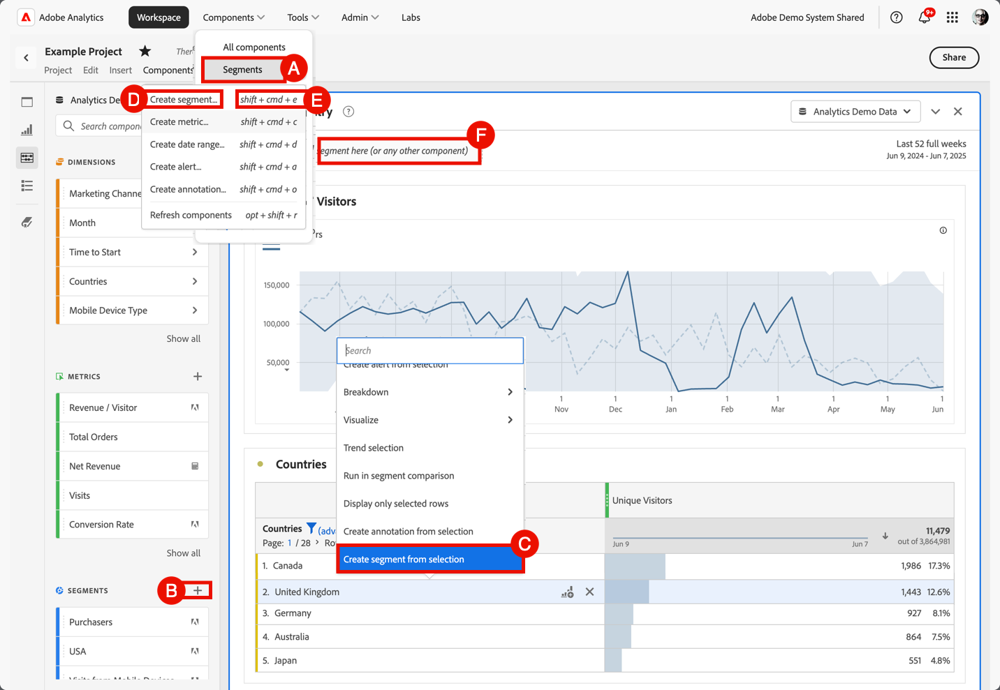

# Crear segmentos

Puede crear diferentes tipos de segmentos en Adobe Analytics.  El tipo que seleccione dependerá de la complejidad de los segmentos y de si solo deben aplicarse al proyecto de Workspace actual o a todos los proyectos. Puede crear segmentos directamente en la interfaz principal de Adobe Analytics o cuando trabaje en un proyecto de Workspace.

[Los derechos de segmentos por función](/help/components/segmentation/seg-reference/seg-rights.md) explican quién puede crear segmentos.

Puede crear un segmento de las siguientes maneras:

* **A**. En la interfaz principal, seleccione **[!UICONTROL Componentes]** y seleccione **[!UICONTROL Segmentos]**. Seleccione  [!UICONTROL **[!UICONTROL Add]**] del administrador de [[!UICONTROL segmentos]](seg-manage.md).
* **B**. En un proyecto de Workspace, en el panel izquierdo Componentes, seleccione  en  **Segmentos**.
* **C**. En un proyecto de Workspace, en el menú contextual de una visualización, seleccione **[!UICONTROL Crear segmento de selección]**.
* **D**. En un proyecto de Workspace, seleccione **[!UICONTROL Componentes]** en el menú y seleccione **[!UICONTROL Crear segmento]**.
* **E**. En un proyecto de Workspace, usa el método abreviado **[!UICONTROL mayús+cmd+e]** (macOS) o **[!UICONTROL mayús+ctrl+e]** (Windows).
* **F**. Seleccione  en ***Colocar un segmento aquí (o cualquier otro componente)*** zona de colocación. Esta acción crea un segmento solo de proyecto.

Para definir el nuevo segmento, usa el [Generador de segmentos](seg-build.md).

Cuando esté en un proyecto de Workspace, también puede crear un segmento rápidamente usando [Segmento rápido](seg-quick.md).
