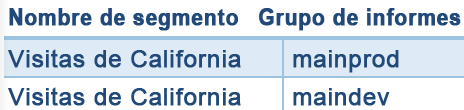

# Eliminar segmentos

Enumera una serie de consideraciones que debe tener en cuenta antes de eliminar segmentos.

Cuando elimina un segmento:

* Los informes programados y los paneles a los que se ha aplicado dicho segmento siguen funcionando normalmente, es decir, el informe o panel siguen utilizando el segmento eliminado.
* Los informes programados no se actualizan cuando edita un segmento con el mismo nombre. Por ejemplo, suponga que tiene dos segmentos con el mismo nombre en diferentes grupos de informes:

   

   Tiene un marcador que hace referencia al segmento para el grupo de informes mainprod. Elimine dicho segmento, ya que es un duplicado. El marcador seguirá funcionando, haciendo referencia a la definición del segmento eliminado. Si cambia la definición del segmento para el resto del segmento con el fin de incluir Isla Santa Catalina y Tijuana, el segmento aplicado al marcador no cambiará. Utilizará la definición antigua. Para arreglarlo, actualice el marcador a fin de que haga referencia a la definición nueva. Si no sabe con seguridad si un marcador, panel o informe programado esté utilizando un segmento eliminado, puede cambiar el nombre del resto del segmento para que quede claro si el marcador lo utiliza.
