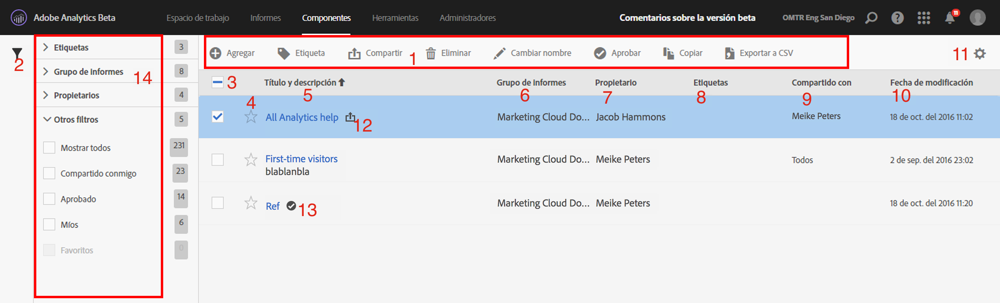
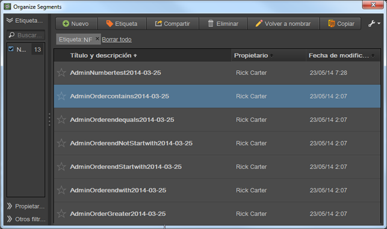

# Administración de segmentos

El Administrador de segmentos ofrece numerosas maneras de conservar los segmentos, como compartir, filtrar, etiquetar, aprobar, copiar, eliminar y marcar como favoritos.

El Administrador de segmentos de Analytics le muestra todos los segmentos que posee y que han compartido con usted. Los usuarios con nivel de administrador pueden ver todos los segmentos de la organización. Esta introducción presenta la interfaz de usuario y las capacidades del Administrador de segmentos. Acceda al Administrador de segmentos de una de las siguientes maneras:

* Vaya a **[!UICONTROL Análisis]** > **[!UICONTROL Componentes]** > **[!UICONTROL Segmentos]** en el panel de navegación superior.
* Muestre un informe existente y haga clic en el icono de Segmentos  en el menú de navegación de la izquierda. A continuación, haga clic en **[!UICONTROL Administrar]**.

## Vídeo explicativo {#section_B3C5DA22DC5248DBA17C56E03DA2D4F2}

En este [vídeo de YouTube de Adobe Analytics](https://www.youtube.com/watch?v=CdfOq98PTrg&amp;index=6&amp;list=PL2tCx83mn7GtHqZicFTa--aE6d02BvvTd) se proporciona una breve descripción sobre cómo utilizar el administrador de segmentos.

## Interfaz de usuario del Administrador de segmentos {#section_7FDCD12949BE4741A402DB83AB7B37DF}

| # | Función de la interfaz de usuario | Descripción |
|---|---|---|
| 1 | Barra de herramientas del Administrador de segmentos | Cuando marque un segmento, aparecerá esta barra de herramientas. Puede realizar la mayoría de las tareas de gestión desde esta barra de herramientas. |
| 2 | Mostrar filtros | Al hacer clic en el icono de filtro, aparece el menú de filtro. Puede filtrar por Etiquetas, Propietarios, Mostrar todo (solo administrador), Míos, Favoritos, Aprobados y Compartidos conmigo. |
| 3 | Casillas de verificación | Marque un segmento para administrarlo. |
| 4 | Favoritos | Si hace clic en la estrella que aparece junto a un segmento, esta se pondrá de color amarillo y el segmento se marcará como favorito. |
| 5 | Títulos y descripciones de segmentos | Aparecen en el Generador de segmentos. Para editar el título y la descripción, haga clic en el vínculo del título. Se le redirigirá al Generador de segmentos. |
| 6 | Grupos de informes | Esta columna indica en qué grupo de informes se guardó por última vez el segmento. |
| 7 | Propietario | Indica a quién pertenece el segmento. Si no es el administrador, solo podrá ver los segmentos que le pertenecen o que compartieron con usted. |
| 8 | Etiquetas (la columna no aparece porque no está marcada en el selector de columnas) | Etiquetas que se aplicaron al segmento, tanto por su parte como por parte de las personas que compartieron el segmento con usted. |
| 9 | Compartido con | Enumera las personas o grupos (solo administrador) o todos (solo administrador) con los que compartió el segmento. |
| 10 | Fecha de modificación | Muestra la última fecha de modificación del segmento. |
| 11 | Selector de columnas | Le permite seleccionar o deseleccionar columnas en el Administrador de segmentos. |
| 12 | Icono compartido | Indica que usted compartió este segmento con otra persona o que lo han compartido con usted. |
| 13 | Icono de aprobado | Indica que un administrador ha aprobado este segmento. |
| 14 | Filtros | Permite ver y seleccionar los filtros de Etiquetas, Conjuntos de informes, Propietarios y Otros (Mostrar todo, Míos, Compartidos conmigo, Aprobados y Favoritos). |

## Administrador de segmentos en Ad Hoc Analysis {#section_CC8BDC968EBC4BC1919870869D8443A9}

El Organizador de segmentos en análisis específicos le muestra todos los segmentos que posee y todos los que han compartido con usted.

Para acceder al Organizador de segmentos en [!DNL ad hoc analysis]:

* Vaya a la ficha **[!UICONTROL Segmentos]** en el panel de la izquierda, haga clic en el icono de la llave inglesa  y seleccione **[!UICONTROL Organizar segmentos]** en el menú.

Al igual que el Administrador de segmentos en la interfaz de usuario web, esta consola ofrece varias funciones, incluidas las acciones de compartir segmentos, filtrar, etiquetar, aprobar, copiar, eliminar y marcar como favorito.
