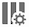

# Administración de segmentos

Puede [compartir](t-seg-share.md), [segmento](t-seg-filter.md), [etiqueta](seg-tag.md), [aprobar](seg-approve.md), cambiar el nombre, [copiar](seg-copy.md), eliminar, exportar segmentos y marcar segmentos como [favoritos](t-seg-favorite.md) desde una interfaz de administración central de [!UICONTROL Segmento]. Para administrar segmentos:

* Seleccione **[!UICONTROL Componentes]** en la interfaz principal y luego seleccione **[!UICONTROL Segmentos]**.

>[!NOTE]
>
>Los segmentos rápidos que cree en un proyecto específico de Workspace no aparecerán en el administrador de [!UICONTROL Segmento], a menos que haya puesto el segmento a disposición de todos sus proyectos.
>

## Administrador de segmentos

El Administrador de segmentos tiene los siguientes elementos de interfaz:

### Lista de segmentos

La lista de segmentos ➊ muestra todos los segmentos que posee, los segmentos a los que se ha dado ámbito en todos sus proyectos y los segmentos que se han compartido con usted. La lista tiene las siguientes columnas:

| Columna | Descripción |
| --- | --- | 
|  | Seleccione para favorecer a  o para anular el favor de  en un segmento. Ver [Marcar segmento como favorito](t-seg-favorite.md) |
| **[!UICONTROL Título y descripción]** | Para editar el segmento, seleccione el vínculo del título, que abre el [Generador de segmentos](seg-build.md). Se ha indicado un segmento compartido con . |
| **[!UICONTROL Grupo de informes]** | El grupo de informes al que se aplica este segmento. |
| **[!UICONTROL Propietario]** | El propietario del segmento. Como usuario, solo verá los segmentos que le pertenecen o las anotaciones que se han compartido con usted. |
| **[!UICONTROL Etiquetas]** | Las etiquetas de este segmento. |
| **[!UICONTROL Compartido con]** | El número de individuos o grupos con los que compartió el segmento. Seleccione esta opción para abrir el cuadro de diálogo **[!UICONTROL Compartir componente]**. Consulte [Compartir segmentos](t-seg-share.md) para obtener más información. |
| **[!UICONTROL Publicado]** | Si el segmento [se ha publicado](seg-publish.md) en Experience Cloud. |
| **[!UICONTROL Fecha de modificación]** | La fecha y la hora de la última modificación del segmento. |

Usa  para especificar qué columnas deseas mostrar.

### Barra de acciones

Puede realizar acciones en los segmentos mediante la barra de acciones ➋. La barra de acciones contiene las siguientes acciones:

| Acción | Descripción |
|---|---|
|  **[!UICONTROL Añadir]** | Agregue otro segmento con el [Generador de segmentos](seg-build.md). |
|  [!UICONTROL *Búsqueda por el título*] | Cuando no haya ningún segmento seleccionado en la lista, busque segmentos utilizando este campo de búsqueda. |
|  **[!UICONTROL Etiqueta]** | Etiquete los segmentos seleccionados. En el cuadro de diálogo **[!UICONTROL Segmento de etiqueta]**, seleccione o anule la selección de las etiquetas de los segmentos seleccionados. Seleccione **[!UICONTROL Guardar]** para guardar las etiquetas de los segmentos seleccionados. Consulte [Etiquetar segmentos](seg-tag.md) para obtener más información. |
|  **[!UICONTROL Compartir]** | Compartir los segmentos seleccionados. En el cuadro de diálogo **[!UICONTROL Compartir segmento]**, puede  *Buscar individuos o grupos* o puede seleccionar **[!UICONTROL Organización]** o **[!UICONTROL Grupos]**. Seleccione **[!UICONTROL Guardar]** para guardar los detalles de uso compartido de los segmentos seleccionados. Consulte [Compartir segmentos](t-seg-share.md) para obtener más información. |
|  **[!UICONTROL Eliminar]** | Eliminar los segmentos seleccionados. Se le pedirá una confirmación. |
|  **[!UICONTROL Cambiar nombre]** | Cambiar el nombre de un solo segmento seleccionado. Cuando se selecciona, puede cambiar el nombre del segmento en línea. |
|  **[!UICONTROL Aprobar]** | Apruebe los segmentos seleccionados. Consulte [Aprobar segmentos](seg-approve.md) para obtener más información. |
|   **[!UICONTROL Copiar]** | Copie el segmento seleccionado. Los segmentos nuevos se crean con el mismo nombre y sufijo `(Copy)`. |
|  **[!UICONTROL Exportar a CSV]** | Exportar los segmentos a un archivo de `Segments List.csv`. |

### Barra de filtro activa

La barra de filtro ➌ muestra los segmentos activos aplicados desde el panel de filtro a la lista de segmentos (si los hay). Puedes quitar rápidamente un filtro con . Si se especifica más de un filtro, puede quitar todos los filtros usando **[!UICONTROL Quitar todos]**.

### Panel Filtro

Puede filtrar la lista de segmentos con el panel izquierdo  **[!UICONTROL Filtro]** ➍. El panel Filtro muestra el tipo de filtro y el número de segmentos que respetan el filtro específico. Seleccione  para alternar la visualización del panel Filtro.

Ver [Filtrar la lista de segmentos](t-seg-filter.md) para obtener más información.

<!--

The Segment Manager offers many ways of curating segments, such as sharing, filtering, tagging, approving, copying, deleting, and marking as favorites.

The Analytics Segment Manager shows you all the segments you own and that have been shared with you. Admin-level users can see all segments in the organization. This overview presents the user interface and the capabilities of the Segment Manager. 

## Access the Segment Manager

1. In Adobe Analytics, select the **[!UICONTROL Components]** tab, then select **[!UICONTROL Segments]**.

   Or 

   In an existing report, select the Segments icon  in the left navigation, then select **[!UICONTROL Manage]**.

## Available actions in the Segment Manager

In the Segment Manager, you can:

* [Filter segments](/help/components/segmentation/segmentation-workflow/t-seg-filter.md)

* [Mark segments as favorites](/help/components/segmentation/segmentation-workflow/t-seg-favorite.md)

* [Approve segments](/help/components/segmentation/segmentation-workflow/seg-approve.md)

* [Tag segments](/help/components/segmentation/segmentation-workflow/seg-tag.md)

* [Share segments](/help/components/segmentation/segmentation-workflow/t-seg-share.md)

* Export a segment to a CSV file.

* [Copy segments](/help/components/segmentation/segmentation-workflow/seg-copy.md)

* [Delete segments](/help/components/segmentation/segmentation-workflow/seg-delete.md)

## Configure columns

You can configure the information displayed for each segment in the Segment Manager by configuring the columns that are displayed.

To configure the visible columns in the Segment Manager:

1. In Adobe Analytics, select the **[!UICONTROL Components]** tab, then select **[!UICONTROL Segments]**. 

1. In the Segment Manager, select the **Customize columns** icon , then select the columns that you want to be displayed in the Segment Manager.

   The following columns are available:

   | Column title | Description  |
   |---|---|
   | Title and description | These values are provided in the Segment builder. To edit the title and description, select the title link to open the Segment builder.  |
   | Favorites  | Displays star icons next to each segment, allowing you to mark segments as favorites. For more information, see [Mark segments as favorites](/help/components/segmentation/segmentation-workflow/t-seg-favorite.md). |
   | Report suites  | This column indicates in which report suite the segment was last saved.  |
   | Owner  | Indicates who owns the segment. As a non-Admin, you can see only segments you own or those that were shared with you.  |
   | Tags (not checked in column selector, hence column not appearing)  | Tags that were applied to the segment, either by you or by people who shared the segment with you.  |
   | Shared with  | Lists individuals or groups (Admin only) or All (Admin only) that you shared the segment with. 
When a segment is being shared by you or with you, a share icon displays next to the segment name.
|
   | Date modified  | Shows the date that the segment was last modified.  |
   | Used in | Shows where segments are currently being used, and how many times they are being used in each area. 
For example, if the segment is being used in 40 projects and 2 alerts, then the value of this column shows as [!UICONTROL **42 components**].
 
Select the value in this column to see the breakdown of where the segments are being used (for example, [!UICONTROL **Projects (40)**], [!UICONTROL **Alerts (2)**]). Furthermore, you can view the list of items where the segments are being used. For example, so see the list of projects where they are being used, select the [!UICONTROL **Projects (40)**] link.

Each of the following areas shows the number of instances of segments being used in that area:
  <ul><li>[!UICONTROL **Projects**]
Contains segments that were [created in the segment builder](/help/components/segmentation/segmentation-workflow/seg-build.md) and are available for all projects.
</li><li>[!UICONTROL **Ad hoc components**]
Contains segments that were [created as quick segments](/help/analyze/analysis-workspace/components/segments/quick-segments.md) and are available only within a single project.
</li><li>[!UICONTROL **Scheduled projects**]</li><li>[!UICONTROL **Mobile Scorecards**]</li><li>[!UICONTROL **Annotations**]</li><li>[!UICONTROL **Alerts**]</li><li>[!UICONTROL **Calculated metrics**]</li><li>[!UICONTROL **Report Builder**]
Selecting this option downloads a CSV file, with the following columns of data:
<ul><li>Report Builder Name</li><li>Last accessed</li><li>Last accessed IMS User ID</li><li>Last accessed user name</li></ul>
When viewing information for Report Builder, usage information is available starting in September 2024.
</li></ul>
This information can help you determine whether a component is valuable to users in your organization, where it is used, and if it needs to be deleted or modified.

Consider the following when viewing this column:
<ul><li>This information is available only to system administrators.</li><li>The [!UICONTROL **Used in**] column does not display by default. [Configure columns](#configure-columns) to display it.</li><li>If a segment includes another segment in its definition, any use of that segment is not shown in the [!UICONTROL **Used in**] column. If a segment is included in the definition of another type of component (such as a calculated metric), then usage is shown in the [!UICONTROL **Used in**] column.</li><li>This information does not include usage from the API or Data Warehouse.</li><li>If there is no data in this column for a given component but it has a [!UICONTROL **Last used**] date, the component might have been used in an analysis without being saved.</li><li>Usage information is available starting in September 2023.</li></ul>
You can use the [Data Dictionary](/help/analyze/analysis-workspace/components/data-dictionary/data-dictionary-overview.md) along with this information to help you keep track of and better understand how components are being used in your organization.
  |
   | Last used | Shows the date when the segment was last used in any of the following component types: <ul><li>Alerts</li><li>Calculated metrics</li><li>Projects</li><li>Scheduled projects</li><li>Segments</li></ul> 
This information can help you determine whether a component is valuable to users in your organization, where it is used, and if it needs to be deleted or modified.

Consider the following when viewing this column:
<ul><li>This information does not include usage from the API, Report Builder, or Data Warehouse.</li><li>For some components, this column might not contain data if the component was last used prior to September 2023.</li><li>This information is available only to system administrators.</li></ul>
You can use the [Data Dictionary](/help/analyze/analysis-workspace/components/data-dictionary/data-dictionary-overview.md) along with this information to help you keep track of and better understand how components are being used in your organization. |
   
   {style="table-layout:auto"}

## How-To Video {#section_B3C5DA22DC5248DBA17C56E03DA2D4F2}

This [Adobe Analytics video](https://experienceleague.adobe.com/docs/analytics-learn/tutorials/components/segmentation/segment-management-and-sharing.html?lang=es) gives a short overview of how to use the Segment Manager.

-->