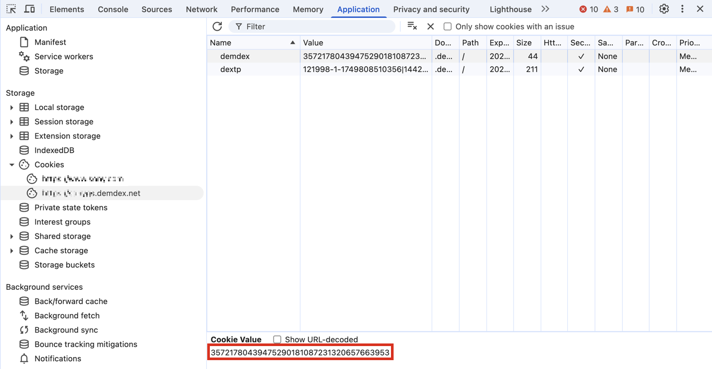

# Publicar segmentos {#publish-segments}

>[!CONTEXTUALHELP]
>id="components_segments_publishing"
>title="Publicación de Experience Cloud"
>abstract="Se puede dirigir al público a la biblioteca de audiencias, ya que este se puede utilizar para actividades de marketing en Target y otras soluciones de Experience Cloud."

>[!CONTEXTUALHELP]
>id="components_segments_audiencelibrary"
>title="Biblioteca de públicos"
>abstract="Los segmentos creados en la biblioteca de públicos están disponibles de forma instantánea y no dependen de las actualizaciones de Analytics."

Puede publicar un segmento de Adobe Analytics en Experience Cloud. Por lo tanto, puede usar el segmento para la actividad de marketing en [!DNL Audience Manager] y en otros canales de activación, como [!DNL Advertising Cloud], [!DNL Target] y [!DNL Campaign].

Puede publicar segmentos de Analytics en Experience Cloud en menos de 8 horas. Utilice estos segmentos para activar audiencias en el Audience Manager a todos los destinos de flujo descendente.

>[!BEGINSHADEBOX]

Consulte  [Publicar segmentos](https://video.tv.adobe.com/v/32842?quality=12&learn=on){target="_blank"} para ver un vídeo de demostración.

>[!ENDSHADEBOX]

>[!NOTE]
>
>Adobe Campaign (Classic y Standard) se comporta de forma diferente, ya que incurre en una latencia adicional de 24 horas además de la latencia de 8 horas.

## Requisitos previos

* Asegúrese de que el grupo de informes en el que está guardando este segmento esté [habilitado para Experience Cloud](https://experienceleague.adobe.com/en/docs/analytics/components/segmentation/segmentation-workflow/seg-publish). De lo contrario, no podrá publicarlo en Experience Cloud.
* Asegúrese de que su organización utiliza Experience Cloud ID.
* Para poder publicar segmentos, el administrador debe asignar el permiso [!UICONTROL Publicación de segmentos] a un perfil de producto en [Admin Console](https://experienceleague.adobe.com/es/docs/core-services/interface/administration/admin-tool-experience-cloud) y agregarlo al perfil de producto.

## Consideraciones

* **Límites del grupo de informes**: Puede publicar hasta 75 segmentos por grupo de informes. Este límite se aplica. Si ya ha publicado 75 segmentos, no podrá publicar ningún segmento adicional hasta que cancele la publicación de suficientes segmentos para bajar del umbral de 75 segmentos.
* **Límites de miembros**: las audiencias compartidas en [!DNL Experience Cloud] desde Adobe Analytics no pueden superar los 20 millones de miembros únicos.
* Las audiencias de **Privacidad de los datos** no se filtran según el estado de autenticación de un visitante. Un visitante podría examinar el sitio en los estados de autenticado y no autenticado. Las acciones que se producen cuando un visitante no está autenticado todavía pueden hacer que se incluya a un visitante en una audiencia. Revise la [privacidad de Adobe Experience Cloud](https://www.adobe.com/es/privacy/experience-cloud.html) para comprender las implicaciones de privacidad completas del uso compartido de audiencias.
* Para ver una discusión sobre las **diferencias entre los segmentos de [!DNL Adobe Analytics] y[!DNL Audience Manager]**, consulte [Comprender los segmentos en Analytics y Audience Manager](https://experienceleague.adobe.com/en/docs/analytics/integration/audience-analytics/audience-analytics-workflow/aam-analytics-segments).

## Cronología de publicación de segmentos

| Qué está disponible | Cuándo esté disponible | Dónde está disponible |
|---|---|---|
| Metadatos (título y definición del segmento) | Inmediatamente después de la publicación | [!DNL Audience Manager], [!UICONTROL Biblioteca de audiencias de Experience Cloud], [!DNL Target] |
| Segmento utilizable al ser miembro | ~ 8 horas después de la publicación | Visor de perfiles de visitante en [!DNL Audience Manager] |
| Población de miembros y características | En un plazo de 24-48 horas | [!DNL Audience Manager] |

>[!NOTE]
>Una vez a la semana, todos los datos se sincronizan por completo para tener en cuenta los retrasos o discrepancias que no se hayan capturado en la semana anterior.

## Publicar segmentos en [!UICONTROL Generador de segmentos]

1. En Adobe Analytics, vaya a **[!UICONTROL Componentes]** > **[!UICONTROL Segmentos]**
1. Seleccione **[!UICONTROL Agregar]** para crear un nuevo segmento.
   
1. Proporcione un título y una descripción para el segmento. Estos campos son obligatorios antes de poder guardar el segmento.
1. En la sección **[!UICONTROL Publicación de Experience Cloud]**, seleccione la opción **[!UICONTROL Publicar este segmento en Experience Cloud (para *grupo de informes*)]**.

   >[!IMPORTANT]
   >
   >Asegúrese de supervisar a **[!UICONTROL Visitantes con Experience Cloud ID]** en la **[!UICONTROL Vista previa de datos]** en lugar de a los **[!UICONTROL Visitantes únicos]** al comparar los números de Adobe Analytics con los de Audience Manager.
   >

| Elemento | Descripción |
|---|---|
| **[!UICONTROL Publicar este segmento en Experience Cloud (para *grupo de informes*)]** | Cuando esta opción está habilitada, el título y la definición del segmento se comparten con Experience Cloud de forma instantánea, mientras que la pertenencia al segmento se evalúa y comparte cada 4 horas.   Cuando dicha audiencia está asociada a una actividad en [!DNL Target], por ejemplo, [!DNL Analytics] comienza a enviar ID para los visitantes que son aptos para esta audiencia de Experience Cloud y [!DNL Target]. En este punto, el nombre de audiencia y los datos correspondientes empiezan a mostrarse en la página [!DNL Audience Library] de Experience Cloud.   |
| **[!UICONTROL Ventana de creación de audiencia]** | El lapso de tiempo seleccionado se utiliza para crear la audiencia en un calendario móvil. Por ejemplo, **[!UICONTROL Últimos 30 días]** (predeterminado) incluye visitantes que han cumplido los requisitos para la audiencia durante los últimos 30 días respecto a la fecha actual (NO desde la fecha original en que se creó el segmento). |
| **[!UICONTROL Crear en la biblioteca de audiencias]** | Los segmentos que cree y publique pueden estar disponibles sin latencia en la página [!DNL Audience Library] de Experience Cloud. No dependen de las actualizaciones de Analytics. Estos segmentos no cuentan con el límite de 75 segmentos publicados. |
| **[!UICONTROL x de 75 publicados]** | El número de segmentos que ha publicado en Experience Cloud. Haga clic en el vínculo para ver una lista de los segmentos publicados y su grupo de informes y propietario asociados. |
| **[!UICONTROL Guardar]** | Guarda este segmento. |

## Cancelar la publicación o eliminar segmentos

>[!CAUTION]
>
>Para eliminar un segmento publicado en Experience Cloud, tiene que cancelar la publicación del segmento primero. Para cancelar la publicación de un segmento, simplemente anule la selección de **[!UICONTROL Publicar este segmento en Experience Cloud (para *grupo de informes*)]**.

>[!NOTE]
>
>**No puede** cancelar la publicación de un segmento que esté actualmente en uso por ninguna de las siguientes soluciones de Adobe: [!DNL Analytics] (en [!DNL Audience Analytics]), [!DNL Campaign], [!DNL Advertising Cloud] (para clientes de [!DNL Core Service] y [!DNL Audience Manager]) y todos los demás socios externos (para clientes de [!DNL Audience Manager]). **Puede** cancelar la publicación de un segmento en uso por [!DNL Target].

## Ver el estado de publicación de los segmentos

El número máximo de segmentos de Adobe Analytics editables es de 75.

Para ver los segmentos publicados:

1. En Adobe Analytics, vaya a **[!UICONTROL Componentes]** > **[!UICONTROL Segmentos]**.

1. Ver la columna **[!UICONTROL Publicado]**. **[!UICONTROL Sí]** en esta columna indica que el segmento se ha publicado en Experience Cloud. **[!UICONTROL No]** indica que el segmento no se ha publicado.

## Conseguir el UUID de [!DNL Audience Manager]

Existen dos formas de registrar el UUID de Adobe Audience Manager asociado actualmente al explorador:

* Adobe Experience Cloud Debugger
* Herramienta nativa para desarrolladores en navegadores (por ejemplo, Chrome Developer Tools)

Las siguientes capturas de pantalla muestran cómo recuperar el UUID de Adobe Audience Manager en el explorador y utilizarlo en el visor de perfiles de visitantes de Audience Manager para validar la pertenencia de los rasgos y segmentos.

### Método 1: Uso de Adobe Experience Cloud Debugger

1. Descargue e instale [Adobe Experience Cloud Debugger](/help/implement/validate/debugger.md) en Chrome Web Store.
1. Inicie Debugger al cargar una página.
1. Desplácese hasta la sección Audience Manager y busque el UUID de Adobe Audience Manager definido en la página actual del navegador
(`35721780439475290181087231320657663953` en el ejemplo siguiente)

   

### Método 2: Uso de las herramientas para desarrolladores de Chrome (u otras herramientas para desarrolladores de explorador)

1. Iniciar Herramientas para desarrolladores Chrome antes de cargar una página
1. Cargue la página y seleccione Aplicaciones > Cookies. El UUID de Adobe Audience Manager debe configurarse en el
Cookie Demdex ([adobe.demdex.net](https://experienceleague.adobe.com/en/docs/audience-manager/user-guide/reference/demdex-calls) en el ejemplo siguiente). El parámetro de campo es el conjunto UUID de Adobe Audience Manager
en el explorador (`35721780439475290181087231320657663953` en el ejemplo siguiente).

   

## Uso del [!UICONTROL Visor de perfiles de visitantes] de Audience Manager

El UUID de Adobe Audience Manager en el explorador se encuentra de forma predeterminada cuando se carga el [!UICONTROL Visor de perfiles de visitante]. Si verifica la realización de características para otros usuarios, escriba un UUID en el campo UUID y haga clic en [!UICONTROL Actualizar]. Consulte [Visor de perfiles de visitantes](https://experienceleague.adobe.com/en/docs/audience-manager/user-guide/features/visitor-profile-viewer) para obtener más información.

## Vea las características del segmento en [!DNL Audience Manager]

En Adobe Audience Manager, la lista de visitantes con ECID para un segmento determinado se evalúa mientras que Analytics comparte segmentos con Experience Cloud.

1. En [!DNL Audience Manager], vaya a **[!UICONTROL Datos de audiencia]** > **[!UICONTROL Características]** > **[!UICONTROL Características de Analytics]**. Verá una carpeta para cada grupo de informes de Analytics asignada a su organización de Experience Cloud. Estas carpetas (para características, segmentos y fuentes de datos) se crean cuando se inicia o aprovisiona el servicio principal Perfiles y Audiencias/Personas.
1. Seleccione la carpeta para el grupo de informes en el que creó el segmento quería compartir con [!DNL Audience Manager]. Verá el segmento o la audiencia que creó. Cuando comparte un segmento, ocurren dos cosas en [!DNL Audience Manager]:
   * Se crea una característica, primero sin datos en ella. Aprox. 8 horas después de que se publique el segmento en [!DNL Analytics], la lista de ECID se incorpora y comparte con [!DNL Audience Manager] y otras soluciones de Experience Cloud.

     

   * Se crea un segmento de una característica. Este utiliza la fuente de datos asociada al grupo de informes donde publicó el segmento.
   * La caducidad de la característica ahora se establece en 16 días (antes era 2 días).

## Ver el segmento en [!DNL Adobe Target]

**[!UICONTROL Publicar este segmento en Experience Cloud]** permite que el segmento esté disponible en la biblioteca de audiencias personalizada de Adobe Target. Un segmento creado en Analytics o Audience Manager puede utilizarse para actividades en Target. Por ejemplo, puede crear actividades de campaña basadas en métricas de conversión de Analytics y segmentos de audiencias creados en Analytics.

En Adobe Target:

1. Seleccionar **[!UICONTROL audiencias]**.
1. En la página **[!UICONTROL Audiencias]**, busque la audiencia procedente de [!DNL Experience Cloud]. Estas audiencias están disponibles para su uso en actividades [!DNL Target].

   
