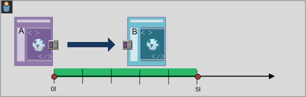

# Generar segmentos secuenciales

Los segmentos secuenciales se crean mediante el operador THEN, en lugar de AND u OR. THEN implica que se produce un criterio de segmento, seguido por otro. De forma predeterminada, un segmento secuencial identifica a todos los datos coincidentes y muestra el filtro “Incluir a todos”. Los segmentos secuenciales pueden filtrarse adicionalmente a un subconjunto de visitas coincidentes mediante las opciones “Solo antes de la secuencia” y “Solo después de la secuencia”.

Además, puede restringir los segmentos secuenciales a una duración, granularidad y recuentos entre puntos de comprobación específicos mediante los [operadores Después y En](/help/components/segmentation/segmentation-workflow/seg-sequential-build.md).

## Incluir a todos {#section_75ADDD5D41F04800A09E592BB2940B35}

Al crear un segmento en el cual se ha definido “Incluir a todos”, el segmento identifica las rutas de acceso que coinciden con el patrón determinado como conjunto. Este es un ejemplo de segmento de secuencia básica que busca una visita individual (Página A) seguida de otra (Página B) según la visita del mismo visitante. Este segmento está definido en Incluir a todos.

| Si el resultado... | Secuencia |
|--- |--- |
| Coincide | A entonces B A entonces (en una visita diferente) B A entonces D, que entonces B |
| No coincide | B entonces A |

## Solo Antes de la Secuencia y Solo Después de la Secuencia {#section_736E255C8CFF43C2A2CAAA6D312ED574}

Las opciones **[!UICONTROL Solo Antes de la Secuencia]** y **[!UICONTROL Solo Después de la Secuencia]** filtran el segmento a un subconjunto de datos anterior o posterior a la secuencia especificada.

* **Solo Antes de la Secuencia**: incluye todas las visitas anteriores a la secuencia + la primera visita de la propia secuencia (consulte los ejemplos 1 y 3). Si la secuencia aparece varias veces en una ruta, “Solo antes de la secuencia” incluye la primera visita de la última aparición de la secuencia y todas las visitas anteriores (consulte el ejemplo 2).
* **Solo Después de la Secuencia**: incluye todas las visitas posteriores a la secuencia + la última visita de la propia secuencia (consulte los ejemplos 1 y 3). Si la secuencia aparece varias veces en una ruta, “Solo después de la secuencia” incluye la última visita de la primera aparición de la secuencia y todas las visitas posteriores (consulte el ejemplo 2).

Por ejemplo, si tenemos una secuencia de B -> D, los tres filtros identificarán las visitas del modo siguiente:

**Ejemplo 1: B entonces D aparece una vez**

| Ejemplo | A | B | C | D | E | F |
|---|---|---|---|---|---|---|
| Incluir a todos | A | B | C | D | E | F |
| Solo Antes de la Secuencia | A | B |  |  |  |  |
| Solo Después de la Secuencia |  |  |  | D | E | F |

**Ejemplo 2: B entonces D aparece varias veces**

| Ejemplo | A | B | C | D | B | C | D | E |
|---|---|---|---|---|---|---|---|---|
| Incluir a todos | A | B | C | D | B | C | D | E |
| Solo Antes de la Secuencia | A | B | C | D | B |  |  |  |
| Solo Después de la Secuencia |  |  |  | D | B | C | D | E |

Vamos a enmarcar también este concepto con la dimensión Profundidad de visita.

**Ejemplo 3: Profundidad de visita 3 entonces 5**

## Restricciones de dimensión {#section_EAFD755F8E674F32BCE9B642F7F909DB}

En una cláusula “En”, entre instrucciones THEN, se puede agregar, por ejemplo, “En 1 instancia de palabra clave de búsqueda”, “En 1 instancia de eVar 47”. Esto restringe el segmento a una instancia de una dimensión.

La configuración de una cláusula “En dimensión” entre reglas permite a un segmento restringir datos a secuencias en las cuales se cumpla la cláusula. Vea el ejemplo siguiente, en el cual la restricción se define en “En 1 página”:

| Si el resultado... | Secuencia |
|--- |--- |
| Coincide | A entonces B |
| No coincide | A then C then B (porque B no estaba dentro de 1 página de A) **Nota:** Si se elimina la restricción de dimensión, tanto “A then B” como “A then C then B” coincidirán. |

## Secuencia de vista de página simple

Identifique a los visitantes que vieron una página y luego vieron otra página. Los datos en el nivel de visita individual filtrarán esta secuencia independientemente de las sesiones de visita anteriores, pasadas o intermedias, o el tiempo o el número de vistas de página que se sucedan entre ellas.

**Ejemplo**: Visitante que vio la página A y luego la página B en la misma visita o en otra.

**Casos de uso**

A continuación encontrará una serie de ejemplos de cómo se puede utilizar este segmento:

1. Los visitantes de un sitio de deportes ven la página de aterrizaje de fútbol y luego ven la página de aterrizaje de baloncesto en orden secuencial, pero no necesariamente en la misma visita. Esto da lugar a una campaña para ofrecer contenido de baloncesto a los espectadores de fútbol durante la temporada de fútbol.
1. El dueño de un concesionario de automóviles ve una relación entre aquellos que aterrizan en la página de fidelidad del cliente y luego van a la página de vídeos en cualquier momento durante la visita o en otra visita.

**Crear este segmento**

Anide dos reglas de página dentro de un contenedor de [!UICONTROL visitante] de nivel superior y secuencie las visitas individuales de página utilizando el operador [!UICONTROL THEN].

## Secuencia de visitante en varias visitas

Identifique a aquellos visitantes que no siguieron una campaña pero que luego volvieron a la secuencia de vistas de página en otra sesión.

**Ejemplo**: Visitante que vio la página A en una visita y luego vio la página B en otra visita.

**Casos de uso**

A continuación encontrará una serie de ejemplos de cómo se puede utilizar este tipo de segmento:

* Los visitantes ven la página de deportes de un sitio de noticias y vuelven a visitar la página de deportes en otra sesión.
* Un comerciante de ropa ve una relación entre los visitantes que aterrizan en una página de aterrizaje en una sesión y luego van directamente a la página de pago en otra sesión.

**Crear este segmento**

Este ejemplo anida dos contenedores de **[!UICONTROL visita]** dentro del contenedor de **[!UICONTROL visitante]** de nivel superior y secuencia el segmento utilizando el operador [!UICONTROL THEN].

## Secuencia de nivel mixto

Identifique a los visitantes que ven dos páginas en un número indeterminado de visitas, pero luego ven una tercera página en una visita separada.

**Ejemplo**: Visitantes que ven la página A y luego la página B en una o más visitas, seguido de una visita separada a la página C.

**Casos de uso**

A continuación encontrará una serie de ejemplos de cómo se puede utilizar este tipo de segmento:

* Los visitantes ven primero un sitio de noticias y luego la página de deportes en la misma visita. En otra visita, el visitante ve la página del tiempo.
* Un comerciante define a los visitantes que acceden a la página principal y luego a la página Mi cuenta. En otra visita, acceden a la página Ver carro.

**Crear este segmento**

1. Suelte dos dimensiones de página desde los paneles izquierdos dentro de un contenedor de [!UICONTROL visitante] de nivel superior.
1. Agregue entre ellos el operador THEN.
1. Haga clic en **[!UICONTROL Opciones]** > **[!UICONTROL Agregar contenedor]** y agregue un contenedor de [!UICONTROL visita] bajo el nivel de [!UICONTROL visitante] y secuenciado utilizando el operador [!UICONTROL THEN].

## Contenedores agregados

Si agrega múltiples contenedores de [!UICONTROL visita individual] dentro de un contenedor de [!UICONTROL visitante], puede emplear los operadores adecuados entre el mismo tipo de contenedores, y usar reglas y dimensiones tales como página y número de visita para definir la vista de página y proporcionar una dimensión de secuencia dentro del contenedor de [!UICONTROL visita individual]. Si aplica lógica al nivel de visita individual, puede restringir y combinar coincidencias de visitas individuales del mismo nivel dentro del contenedor de [!UICONTROL visitante] y así generar una variedad de tipos de segmento.

**Ejemplo**: visitantes que visitaron la página A después de la primera visita individual en la secuencia de vistas de página (página D en el ejemplo) y luego visitaron la página B o la página C independientemente del número de visitas.

**Casos de uso**

A continuación encontrará una serie de ejemplos de cómo se puede utilizar este tipo de segmento:

* Identificar a los visitantes que acceden a la página de aterrizaje principal en una visita, después ven la página de ropa masculina en otra visita, y después ven la página de aterrizaje de ropa femenina o infantil en otra visita.
* Una revista electrónica captura a los visitantes que acceden a la página de inicio en una visita, a la página de deportes en otra visita y a la página de opinión en otra visita.

**Crear este segmento**

1. Seleccione el contenedor de [!UICONTROL visitante] como contenedor de nivel superior.
1. Agregue dos contenedores de nivel de [!UICONTROL visita individual] (una dimensión con una dimensión numérica adecuada unida en el mismo nivel de [!UICONTROL visita individual] por el operador [!UICONTROL AND] y [!UICONTROL OR]).
1. Dentro del contenedor de [!UICONTROL visita], agregue otro contenedor de [!UICONTROL visita individual] y anide dos contenedores de [!UICONTROL visita individual] adicionales unidos con un operador [!UICONTROL OR] o [!UICONTROL AND].

   Secuencie estos contenedores de [!UICONTROL visita individual] anidados con el operador [!UICONTROL THEN].

## “Anidado” en segmentos secuenciales

Al colocar los puntos de comprobación tanto en el nivel de [!UICONTROL visita] como de [!UICONTROL visita individual], puede restringir el segmento para satisfacer los requisitos dentro de una visita específica, así como una visita individual específica.

**Ejemplo**: Visitante que visitó la página A y luego la página B en la misma visita. En una nueva visita, el visitante fue después a la página C.

**Crear este segmento**

1. Bajo el contenedor de [!UICONTROL visita] de nivel superior, arrastre dos dimensiones de página.
1. Haga una selección múltiple de ambas reglas, haga clic en **[!UICONTROL Opciones]** > **[!UICONTROL Agregar contenedor de selección]** y cambie a un contenedor de [!UICONTROL visita].
1. Únalas con un operador [!UICONTROL THEN].
1. Cree un contenedor de visita individual como homólogo del contenedor de [!UICONTROL visita] y arrastre una dimensión de página.
1. Una la secuencia anidada en el contenedor de [!UICONTROL visita] con el contenedor de [!UICONTROL visita individual] usando otro operador [!UICONTROL THEN].

## Excluir visitas

Las reglas de segmentos incluyen todos los datos a menos que se excluyan específicamente los datos de [!UICONTROL visitantes], [!UICONTROL visitas] o [!UICONTROL visitas individuales] usando la regla [!UICONTROL Excluir]. Esta regla permite rechazar datos comunes y crear segmentos más concretos. También permite crear segmentos que excluyan los grupos que se hayan descubierto a fin de identificar el conjunto de datos restante, tal como crear una regla que incluya a los visitantes que hayan hecho un pedido y luego excluirlos para identificar a los &quot;no compradores&quot;. Sin embargo, en la mayoría de casos, es mejor crear reglas que excluyan valores amplios en vez de intentar usar la regla [!UICONTROL Excluir] para dirigirse a valores de inclusión específicos.

Por ejemplo:

* **Exclusión de páginas**. Use una regla de segmento para eliminar una página específica (como la *`Home Page`*) de un informe, cree una regla de visita individual en la que página sea igual a &quot;Página de inicio&quot; y luego exclúyala. Esta regla incluye automáticamente todos los valores excepto la página de inicio.
* **Exclusión de dominios de referencia**. Use una regla que incluya solo los dominios de referencia de Google.com y excluya todos los demás.
* **Identificación de los no compradores**. Identifique el momento en que los pedidos son superiores a cero y luego excluya al [!UICONTROL visitante].

El operador [!UICONTROL Exclude] puede emplearse para identificar una secuencia en la que las visitas o visitas individuales específicas no son efectuadas por el visitante. La [!UICONTROL exclusión de puntos de comprobación] también puede incluirse dentro de un [grupo lógico](/help/components/segmentation/segmentation-workflow/seg-sequential-build.md).

### Exclusión entre puntos de comprobación

Aplique lógica a los visitantes de un segmento en el caso de que no se haya producido un punto de comprobación explícitamente entre otros dos puntos de comprobación.

**Ejemplo**: Visitantes que visitaron la página A y luego la página C, pero que no visitaron la página B.

**Casos de uso**

A continuación encontrará una serie de ejemplos de cómo se puede utilizar este tipo de segmento:

* Los visitantes que accedieron a la página de estilo de vida y luego a la sección de teatro sin visitar la página de arte.
* El dueño de un concesionario de automóviles ve una relación entre las personas que visitan la página de aterrizaje principal y luego acceden directamente a la campaña &quot;Sin intereses&quot; sin visitar la página del vehículo.

**Crear este segmento**

Cree un segmento como lo haría para un segmento secuencial simple, de nivel mixto o anidado y luego establezca el operador [!UICONTROL EXCLUDE] para el elemento contenedor. El ejemplo siguiente es un segmento agregado en el que los tres contenedores de [!UICONTROL visita individual] se arrastran al lienzo, el operador [!UICONTROL THEN] se asigna para unir la lógica del contenedor y luego se excluye el contenedor de vista de página central para incluir solo visitantes que fueron de la página A a C en la secuencia.

### Exclusión al inicio de la secuencia

Si el punto de comprobación de exclusión se encuentra al inicio de un segmento secuencial, se garantiza que no se ha producido una vista de página excluida antes de la primera visita individual no excluida.

**Ejemplo**: El visitante visitó la página A y no la página B.

**Casos de uso**

A continuación encontrará una serie de ejemplos prácticos de cómo se puede utilizar este tipo de segmento:

* Los visitantes que visitaron la página A y no la página B.
* Un restaurante quiere ver los usuarios habituales que evitan la página de aterrizaje principal y acceden directamente a la página de pedidos.

**Crear este segmento**

Cree dos contenedores de visita individual separados dentro de un contenedor de visitante de nivel superior. Luego establezca el operador [!UICONTROL EXCLUDE] para el primer contenedor.

### Exclusión al final de la secuencia

Si el punto de comprobación de exclusión está al final de la secuencia, se garantiza que el punto de comprobación no se produjo entre el último punto de comprobación no excluido y el final de la secuencia del visitante.

**Ejemplos**: Los visitantes que visitaron la página A y luego no visitaron la B en la visita actual o en visitas posteriores.

**Casos de uso**

A continuación encontrará una serie de ejemplos de cómo se puede utilizar este tipo de segmento:

* Los visitantes que visitaron la página A y no la página B.
* Un restaurante quiere ver los usuarios habituales que evitan la página de aterrizaje principal y acceden directamente a la página de pedidos.

**Crear este segmento**

Cree un segmento de secuencia simple arrastrando dos contenedores de [!UICONTROL visita individual] al lienzo y conectándolos con el operador [!UICONTROL THEN]. Luego asigne el operador [!UICONTROL EXCLUDE] al segundo contenedor de [!UICONTROL visita individual] de la secuencia.

## Contenedores de grupo lógico

Los contenedores de grupo lógico son necesarios para agrupar condiciones en un único punto de comprobación secuencial de segmento. El contenedor de grupo lógico especial solo está disponible en la segmentación secuencial, para garantizar que sus condiciones se cumplen después de cualquier punto de comprobación secuencial anterior y antes de cualquier punto de comprobación secuencial siguiente. Las condiciones dentro del propio punto de comprobación del grupo lógico pueden cumplirse en cualquier orden. Por otro lado, los contenedores no secuenciales (visita individual, visita, visitante) no requieren que se cumplan sus condiciones dentro de la secuencia global, lo que produce resultados poco intuitivos si se utilizan con un operador THEN.
El contenedor de [!UICONTROL grupo lógico] fue diseñado para tratar *varios puntos de comprobación como un grupo*, *sin ningún orden* entre los puntos de comprobación agrupados. En otras palabras, no nos importa el orden de los puntos de comprobación dentro de ese grupo. Por ejemplo, no puede anidar un contenedor de [!UICONTROL visitante] dentro de un contenedor de [!UICONTROL visitante]. Sin embargo, puede anidar un contenedor de [!UICONTROL grupo lógico] dentro de un contenedor de [!UICONTROL visitante] con puntos de comprobación de niveles de [!UICONTROL visita] y [!UICONTROL visita individual] específicos.

>[!NOTE]
>
>Un [!UICONTROL grupo lógico] solo puede definirse en un segmento secuencial, lo cual significa que el operador [!UICONTROL THEN] se utiliza dentro de la expresión.

| Jerarquía de contenedores | Ilustración | Definición |
|---|---|---|
| Jerarquía de contenedor estándar |  | Dentro del contenedor de [!UICONTROL visitante], los contenedores de [!UICONTROL visita] y [!UICONTROL visita individual] están anidados en secuencia para extraer segmentos en función de las visitas individuales, el número de visitas y el visitante. |
| Jerarquía de contenedor lógico |  | La jerarquía de contenedor estándar también se requiere fuera del contenedor de [!UICONTROL grupo lógico]. No obstante, dentro del contenedor de [!UICONTROL grupo lógico], los puntos de comprobación no requieren un orden o jerarquía establecidos; dichos puntos de comprobación solo tienen que ser satisfechos por parte del visitante en cualquier orden. |

Los grupos lógicos pueden resultar intimidantes. Aquí tiene algunas prácticas recomendadas sobre cómo utilizarlos:

**¿Grupo lógico o contenedor de visita/visita individual?**
Si desea agrupar puntos de comprobación secuenciales, su “contenedor” es un grupo lógico. Sin embargo, si estos puntos de comprobación secuenciales deben producirse en el ámbito de una sola visita o visita individual, se requiere un contenedor de visita individual o de visita. (Por supuesto, &#39;visita individual&#39; no tiene sentido para un grupo de puntos de comprobación secuenciales, cuando una visita no puede acreditar más de un punto de comprobación).

**¿Simplifican los grupos lógicos la creación de segmentos secuenciales?**
Sí. Supongamos que intenta identificar este segmento de visitantes: **Visitantes que vieron la página A y luego vieron cada una de las páginas de B, C y D**

Puede generar este segmento sin un contenedor de grupo lógico, pero es complejo y laborioso. Debe especificar cada secuencia de páginas que el visitante podría ver:
* `Visitor Container [Page A THEN Page B THEN Page C THEN Page D] or`
* `Visitor Container [Page A THEN Page B THEN Page D THEN Page C] or`
* `Visitor Container [Page A THEN Page C THEN Page B THEN Page D] or`
* `Visitor Container [Page A THEN Page C THEN Page D THEN Page B] or`
* `Visitor Container [Page A THEN Page D THEN Page B THEN Page C] or`
* `Visitor Container [Page A THEN Page D THEN Page C THEN Page B]`

Un contenedor de grupo lógico simplifica considerablemente la creación de este segmento, como se muestra aquí:

### Generar un segmento de grupo lógico {#section_A5DDC96E72194668AA91BBD89E575D2E}

Al igual que otros contenedores, los de [!UICONTROL grupo lógico] se pueden crear de varias formas dentro del [!UICONTROL Generador de segmentos]. A continuación se indica una de las mejores formas de anidar contenedores de [!UICONTROL grupo lógico]:

1. Arrastre dimensiones, eventos o segmentos desde los paneles izquierdos.
1. Cambie el contenedor superior por un contenedor de [!UICONTROL visitante].
1. Cambie el operador [!UICONTROL AND] u [!UICONTROL OR] insertado de forma predeterminada al operador THEN.
1. Seleccione los contenedores de [!UICONTROL visita individual] (la dimensión, evento o elemento) y haga clic en **[!UICONTROL Opciones]** > **[!UICONTROL Agregar contenedor de selección]**.
1. Haga clic en el icono de contenedor y seleccione **[!UICONTROL grupo lógico]**.  
1. Ahora puede establecer la [!UICONTROL visita individual] dentro del contenedor de [!UICONTROL grupo lógico] independientemente de la jerarquía.

### Puntos de comprobación de grupo lógico en cualquier orden

Usar el [!UICONTROL grupo lógico] le permite satisfacer las condiciones dentro de ese grupo que residen fuera de la secuencia. Esto le permite generar segmentos en los que un contenedor de [!UICONTROL visita] o [!UICONTROL visita individual] existe sin tener en cuenta la jerarquía normal.

**Ejemplo**: Los visitantes que visitaron la página A y luego visitaron la página B y C en cualquier orden.

**Crear este segmento**

Las páginas B y C están anidadas en un contenedor de [!UICONTROL grupo lógico] dentro del contenedor exterior de [!UICONTROL visitante]. Al contenedor de [!UICONTROL visita individual] para A lo sigue luego el contenedor de [!UICONTROL grupo lógico] con B y C identificadas usando el operador [!UICONTROL AND]. Como está en el [!UICONTROL grupo lógico], la secuencia no se define y visitar la página B o C hace que el argumento sea verdadero.

**Otro ejemplo**: Los visitantes que visitaron la página B o la página C y luego visitaron la página A.

El segmento debe coincidir al menos con uno de los puntos de comprobación del grupo lógico (B o C). Además, las condiciones de grupo lógico pueden cumplirse en la misma visita o en varias visitas individuales. &#x200B;

### Primera coincidencia del grupo lógico

Usar el [!UICONTROL grupo lógico] le permite satisfacer las condiciones dentro de ese grupo que residen fuera de la secuencia. En este segmento de primera coincidencia sin ordenar, las reglas del [!UICONTROL grupo lógico] se identifican primero como una vista de página de la página B o C, y luego la vista requerida de la página A.

**Ejemplo**: Los visitantes que visitaron la página B o la página C y luego visitaron la página A.

**Crear este segmento**

Las dimensiones de la página B y la página C se agrupan dentro de un contenedor de [!UICONTROL grupo lógico] con el operador [!UICONTROL OR] seleccionado, luego el contenedor de [!UICONTROL visita individual] que identifica una vista de página de la página A como valor.

### Grupo lógico excluir AND

Genere segmentos usando el [!UICONTROL grupo lógico] en el que se agregan múltiples vistas de página para definir qué páginas fue necesario visitar mientras que otras páginas se omitieron específicamente. ****

**Ejemplo**: El visitante que visitó la página A y luego no visitó expresamente la página B ni C, pero sí la página D.

**Crear este segmento**

Genere este segmento arrastrando dimensiones, eventos y segmentos pregenerados desde los paneles de la izquierda. Consulte [Generación de un segmento de grupo lógico](/help/components/segmentation/segmentation-workflow/seg-sequential-build.md).

Después de anidar los valores dentro del [!UICONTROL grupo lógico], haga clic en el botón **[!UICONTROL Excluir]** dentro del contenedor de [!UICONTROL grupo lógico].

### Grupo lógico excluir OR

Genere segmentos usando el [!UICONTROL grupo lógico] en el que se agregan múltiples vistas de página para definir qué páginas fue necesario visitar mientras que otras páginas se omitieron específicamente.

**Ejemplo**: Los visitantes que visitaron la página A pero que no visitaron ni la página B ni C antes de la página A.

**Crear este segmento**

Las páginas B y C iniciales se identifican en un contenedor de [!UICONTROL grupo lógico] que se excluye y luego son seguidas por una visita a la página A por parte del visitante.

Genere este segmento arrastrando dimensiones, eventos y segmentos pregenerados desde los paneles de la izquierda.

Después de anidar los valores dentro del [!UICONTROL grupo lógico], haga clic en el botón **[!UICONTROL Excluir]** dentro del contenedor de [!UICONTROL grupo lógico].

## Generar segmentos temporales En y Después

Use los operadores [!UICONTROL Within] y [!UICONTROL After] incorporados en el encabezado de cada contenedor para definir el tiempo, los eventos y recuentos.

Puede limitar las coincidencias a una duración de tiempo especificada usando los contenedores [!UICONTROL En] y [!UICONTROL Después] y especificando la granularidad y el recuento. El operador [!UICONTROL Within] se usa para especificar un límite máximo de tiempo entre dos puntos de comprobación. El operador [!UICONTROL After] se usa para especificar un límite mínimo de tiempo entre dos puntos de comprobación.

### Operadores After y Within {#section_CCAF5E44719447CFA7DF8DA4192DA6F8}

La duración está especificada por una sola letra en mayúsculas que representa la granularidad seguida de un número que representa el recuento de repetición de la granularidad.

**[!UICONTROL En]** incluye el punto final (menor o igual que).

**[!UICONTROL Después]** no incluye el punto final (mayor que).

| Operadores | Descripción |
|--- |--- |
| AFTER | El operador After se usa para especificar un límite mínimo de tiempo entre dos puntos de comprobación. Al establecer los valores de Después, el límite de tiempo empezará cuando se aplique el segmento. Por ejemplo, si el operador After se configura en un contenedor para identificar a los visitantes que visitan la página A pero no regresan a la página B hasta después de un día, ese día empezará cuando el visitante abandone la página A. Para que el visitante se incluya en el segmento, debe transcurrir un mínimo de 1440 minutos (un día) desde que salió de la página A hasta que visitó la página B. |
| WITHIN | El operador Within se usa para especificar un límite máximo de tiempo entre dos puntos de comprobación. Por ejemplo, si el operador Within se configura en un contenedor para identificar a los visitantes que visitan la página A y luego regresan para visitar la página B en un día, ese día comenzará cuando el visitante abandone la página A. Para incluirse en el segmento, el visitante tendrá un tiempo máximo de un día antes de abrir la página B. Para que el visitante se incluya en el segmento, la visita a la página B debe realizarse en un máximo de 1440 minutos (un día) desde que salió de la página A hasta que visitó la página B. |
| AFTER/WITHIN | Al usar los operadores After y Within, es importante entender que ambos operadores empezarán y finalizarán en paralelo, no en secuencia.   Por ejemplo, si genera un segmento con el contenedor establecido en:  `After = 1 Week(s) and Within = 2 Week(s)` , las condiciones para identificar a los visitantes en el segmento solo se satisfacen entre 1 y 2 semanas. Ambas condiciones se aplican desde el momento de la primera visita individual a la página. |

### Usar el operador After

* Después de tiempo le permite rastrear por año, mes, día, hora y minuto para hacer coincidir visitas.
* Después de tiempo solo puede aplicarse a un contenedor de [!UICONTROL visita individual] porque es el único nivel para el cual se define una granularidad tan fina.

**Ejemplo**: Los visitantes que visitaron la página A y luego visitaron la página B solo después de 2 semanas.****

**Creación del segmento**: Este segmento se crea mediante la adición de un contenedor de [!UICONTROL visitante] con dos contenedores de [!UICONTROL visita individual]. Luego puede establecer el operador [!UICONTROL THEN] y abrir la lista desplegable del operador [!UICONTROL AFTER] y establecer el número de semanas.

**Coincidencias**

En el caso de &quot;Después de 2 semanas&quot;, si una visita individual a una página A se produce el 1 de junio de 2019 a las 00:01 horas, entonces la siguiente visita individual a la página B coincidirá siempre y cuando se produzca antes del 15 de junio de 2019 a las 00:01 horas (14 días después).

| Visita individual A | Visita individual B | Coincidencia |
|--- |--- |--- |
| Visita individual **A**: 1 de junio de 2019, 00:01 | Visita individual **B**: 15 de junio de 2019, 00:01 | **Coincide**: Esta restricción temporal coincide porque es después del 1 de junio de 2019 (dos semanas). |
| Visita individual **A**: 1 de junio de 2019, 00:01 | Visita individual **B**: Visita individual B del 8 de junio de 2019 a las 00:01 Visita individual B del 15 de junio de 2019 a las 00:01 | **No coincide**: La primera visita individual a la página B no coincide porque está en conflicto con la restricción que requiere que sea después de dos semanas. |

### Usar el operador Within

* [!UICONTROL En] le permite rastrear por año, mes, día, hora y minuto para hacer coincidir visitas.
* [!UICONTROL En] solo puede aplicarse a un contenedor de [!UICONTROL visita individual] porque es el único nivel para el cual se define una granularidad tan fina.

>[!IMPORTANT]
>
>En una cláusula “En”, entre instrucciones THEN, se puede agregar, por ejemplo, “En 1 instancia de palabra clave de búsqueda”, “En 1 instancia de eVar 47”. Esto restringe el segmento a una instancia de una dimensión.

**Ejemplo**: Los visitantes que visitaron la página A y luego la página B en un plazo de 5 minutos.

**Creación del segmento**: Este segmento se crea mediante la adición de un contenedor de [!UICONTROL visitante] y luego arrastrando dos contenedores de [!UICONTROL visita individual]. A continuación, puede establecer el operador [!UICONTROL THEN] y abrir la lista desplegable del operador [!UICONTROL AFTER] para establecer el intervalo: visitas individuales, vistas de página, visitas, minutos, horas, días, semanas, meses, trimestres o años.

**Coincidencias**

Las coincidencias deben producirse dentro del límite temporal. Para la expresión, si una visita individual a la página A se produce a las 00:01 horas, una visita posterior a la página B producirá una coincidencia siempre que se produzca a las 00:06 o antes (cinco minutos después, incluido el mismo minuto). Las visitas individuales dentro del mismo minuto también serán una coincidencia.

### Los operadores Within y After

Use [!UICONTROL En] y [!UICONTROL Después] para proporcionar un punto final máximo y mínimo en ambos extremos de un segmento.

**Ejemplos**: Los visitantes que visitaron la página A y luego la página B después de 2 semanas pero dentro del plazo de un mes.

**Creación del segmento**: Cree el segmento secuenciando dos contenedores de [!UICONTROL visita individual] dentro de un contenedor de [!UICONTROL visitante]. Luego establezca los operadores [!UICONTROL After] y [!UICONTROL Within].

**Coincidencias**

Los visitantes que visiten la página A el 1 de junio de 2019 y vuelvan después del 15 de junio de 2019 a las 00:01 horas, pero *antes* del 1 de julio de 2019, se incluyen en el segmento. Compárese con [Tiempo entre exclusiones](/help/components/segmentation/segmentation-workflow/seg-sequential-build.md).

Los operadores [!UICONTROL After] y [!UICONTROL Within] pueden usarse juntos para definir un segmento secuencial.

Este ejemplo muestra una segunda visita a la página B después de dos semanas pero dentro del plazo de 1 mes.
