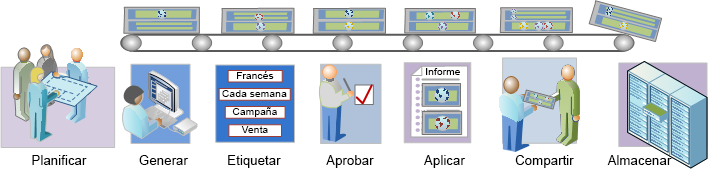

# Resumen del flujo de trabajo de segmentación

Describe un flujo de trabajo sugerido para los segmentos creados con el Generador de segmentos y administrados con el Administrador de segmentos.

<!-- 

seg_workflow.xml

 -->

 [ Planificar segmentos](/help/components/segmentation/segmentation-workflow/seg-plan.md)

¿Ha hecho las preguntas correctas antes de crear segmentos y establecer un nuevo entorno de administración de segmentos? ¿Ha diseñado el segmento teniendo en cuenta su propósito y su uso específico?

Consulte la lista de comprobación para la planificación de segmentos para obtener más ayuda a la hora de planificar y organizar sus segmentos.

 [Generar segmentos](/help/components/segmentation/segmentation-workflow/seg-build.md)

Genere y edite segmentos para utilizarlos en todas las capacidades de Analytics.

Consulte [Generación de segmentos secuenciales](/help/components/segmentation/segmentation-workflow/seg-sequential-build.md) para obtener información acerca de cómo generar segmentos con el operador THEN.

 [ Etiquetar segmentos](/help/components/segmentation/segmentation-workflow/seg-tag.md)

Etiquete segmentos para que sea más fácil organizar y compartir. Consulte cómo planificar y asignar etiquetas para la organización y las búsquedas simples y avanzadas.

 [ Aprobar segmentos](/help/components/segmentation/segmentation-workflow/seg-approve.md)

Apruebe segmentos para convertirlos en canónicos.

 [ Aplicar segmentos](/help/components/segmentation/segmentation-workflow/t-seg-apply.md)

Puede aplicar segmentos directamente desde un informe, desde el carril del segmento (Mostrar segmentos).

 [ Compartir segmentos](/help/components/segmentation/segmentation-workflow/t-seg-share.md)

Comparta sus segmentos con la audiencia deseada en otras herramientas de Analytics, así como en Adobe Target y Adobe Experience Cloud.

 [ Filtrar segmentos](/help/components/segmentation/segmentation-workflow/t-seg-filter.md)

Filtre por etiquetas, propietarios y otros filtros (Mostrar todo, Míos, Compartidos conmigo, Favoritos y Aprobados).

 [ Marcar segmentos como favoritos](/help/components/segmentation/segmentation-workflow/t-seg-favorite.md)

Marcar los segmentos como favoritos es otra manera de organizarlos para que su uso sea más sencillo.

[Administrar segmentos](/help/components/segmentation/segmentation-workflow/seg-manage.md)

El Administrador de segmentos ofrece numerosas maneras de conservar los segmentos, como compartir, filtrar, etiquetar, aprobar, copiar, eliminar y marcar como favoritos.
