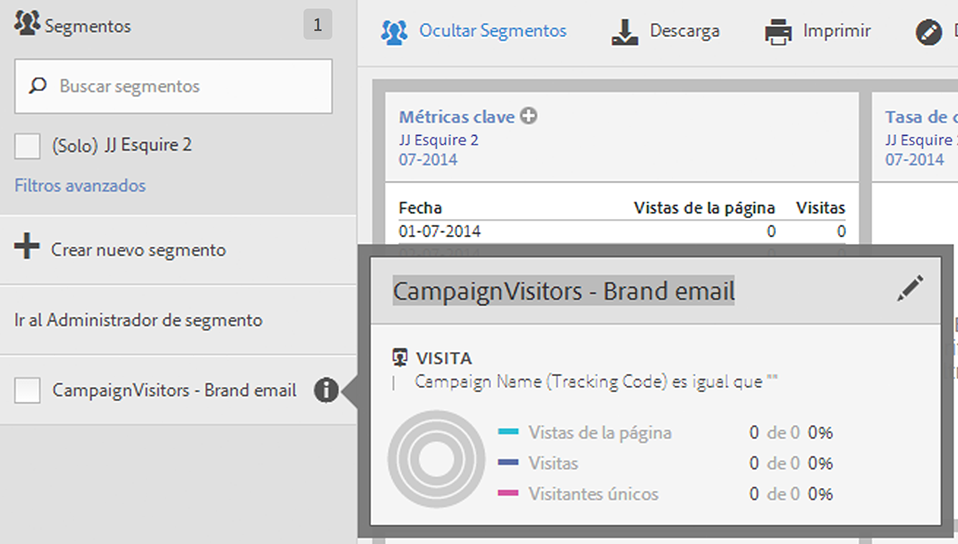
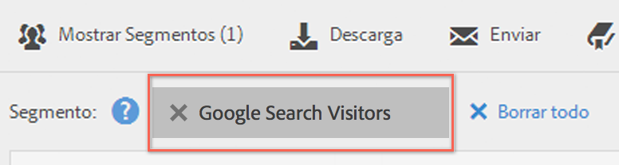

# Seleccionar y aplicar segmentos

Cómo aplicar uno o más segmentos a un informe desde el carril del segmento.

1. Visualice el informe al que desee aplicarle un segmento, por ejemplo el [!UICONTROL informe de páginas].
1. Haga clic en **[!UICONTROL Mostrar segmentos]**, encima del informe. El carril del segmento se abre.

   

1. Marque las casillas que aparecen junto a uno o varios segmentos o utilice **[!UICONTROL Buscar segmentos]** para encontrar el segmento adecuado.

   >[!NOTE]
   >
   >Puede aplicar más de un segmento a un informe (lo que se conoce como apilamiento de segmentos). Cuando se aplican varios segmentos, los criterios de cada uno de ellos se combinan utilizando un operador &quot;and&quot;, y se aplican a continuación. Puede apilar segmentos sin límite.

   >[!NOTE]
   >
   >Si hace clic en el icono de información (i) que aparece junto al nombre del segmento, podrá previsualizar las métricas claves para comprobar si tiene un segmento válido y ver su amplitud.

1. Puede filtrar por grupo de informes seleccionando la casilla **[!UICONTROL (Solo) `<report suite name>`]**. De este modo, se mostrarán únicamente los segmentos que se guardaron por última vez en ese grupo de informes.
1. Haga clic en **[!UICONTROL Aplicar segmento]** y el informe se actualizará. El segmento o segmentos aplicados se mostrarán ahora en la parte superior del informe:

   
