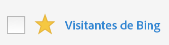

# Marcar segmentos como favoritos

Marcar los segmentos como favoritos es otra manera de organizarlos para que su uso sea más sencillo.

1. En el Administrador de segmentos, haga clic en la estrella que aparece junto a cualquier segmento que desee marcar como favorito. A partir de ahora, debería mostrarse como una estrella de color amarillo:

   

1. También puede filtrar por favoritos con **[!UICONTROL Filtros]** > **[!UICONTROL Otros filtros]** > **[!UICONTROL Favoritos]**.
