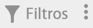
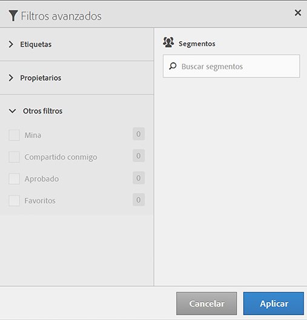

# Filtrar segmentos

Filtre por etiquetas, propietarios y otros filtros (Mostrar todo, Míos, Compartidos conmigo, Favoritos y Aprobados).

El uso de filtros hace mucho más sencilla la búsqueda de segmentos en el carril del segmento.

1. En el Administrador de segmentos, haga clic en el icono **[!UICONTROL Filtros]**:  

   

1. Los filtros disponibles son los siguientes:

   | Nombre del filtro | Descripción |
   |---|---|
   | Etiquetas | Le permite filtrar segmentos con determinadas [etiquetas](/help/components/segmentation/segmentation-workflow/seg-tag.md). La columna Etiquetas se muestra de manera predeterminada. |
   | Propietarios | Le permite filtrar segmentos por propietario. |
   | Otros filtros > Mostrar todo | **(Solo administrador)** Muestra todos los segmentos, su propietario y la última fecha de modificación. |
   | Otros filtros > Míos | Muestra todos los segmentos de su propiedad. |
   | Otros filtros > Compartidos conmigo | Muestra todos los segmentos que se han [compartido](/help/components/segmentation/segmentation-workflow/t-seg-share.md) con usted. |
   | Otros filtros > Favoritos | Muestra todos los segmentos que ha marcado como [Favoritos](/help/components/segmentation/segmentation-workflow/t-seg-favorite.md). |
   | Otros filtros > Aprobados | Muestra todos los segmentos oficialmente [aprobados](/help/components/segmentation/segmentation-workflow/seg-approve.md). |
   | Buscar segmentos | Le permite buscar segmentos por nombre. |
