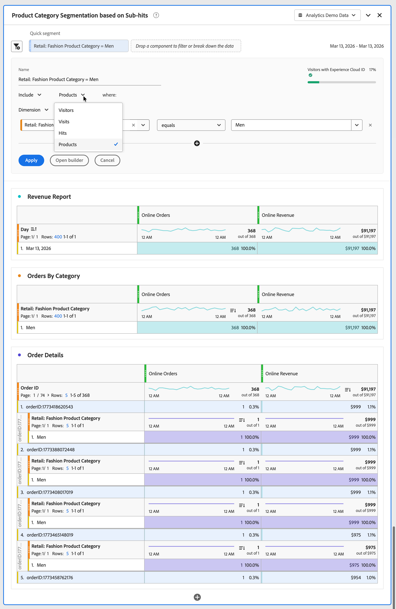

# Análisis de subvisitas

El análisis de subvisitas le permite analizar los datos de productos en un nivel más granular que el nivel de visita. En lugar de filtrar visitas individuales completas, puede segmentar productos individuales dentro de las visitas. Por ejemplo, segmentar una categoría de producto específica sin incluir todos los demás productos comprados en el mismo pedido.

En Adobe Analytics, la variable [Products](/help/components/dimensions/product.md) puede capturar varios productos con una sola visita. Sin el análisis de subvisitas, la segmentación en un atributo de producto devuelve todas las visitas en las que cualquier producto de una visita coincide con el atributo de producto. El resultado es una atribución incorrecta y métricas de ingresos infladas. El análisis de visitas secundarias establece el ámbito del filtro para filas de producto individuales dentro de una visita y resuelve estos problemas.

En el análisis de subvisitas, la lógica de exclusión se comporta de forma diferente a la exclusión estándar en el nivel de visita con la variable Products. Cuando excluye atributos de producto dentro del contenedor [!UICONTROL Product], el segmento devuelve visitas que **tienen productos** pero no coinciden con los criterios de exclusión. El segmento no devuelve visitas sin ningún producto.

## Ejemplo

Desea medir sólo los ingresos en línea de la categoría Hombres. Sin el análisis de visitas secundarias, la aplicación de un segmento para Hombres incluye los ingresos de cada producto en cualquier pedido (visita) que contenga al menos un producto con la categoría Hombres. Con el análisis de visitas secundarias, se establece el ámbito del filtro en el nivel de producto y se devuelven solo los ingresos de los productos de la categoría Hombres.

También desea medir los ingresos en línea de todas las demás categorías, excepto la categoría Hombres.

>[!BEGINTABS]

>[!TAB Análisis de visitas]

En el generador de segmentación o como parte de un **[!UICONTROL segmento rápido]**, especificas **[!UICONTROL Incluir]** el **[!UICONTROL Dimension]** **[!UICONTROL Comercio minorista: categoría de producto de moda]** **[!UICONTROL es igual a]** **[!UICONTROL Hombres]** en el contenedor de **[!UICONTROL Visitas]**.

Como resultado, se tienen en cuenta todos los pedidos que contienen al menos **[!UICONTROL Men]** **[!UICONTROL Retail: Fashion Product Category]**, y los ingresos de otros productos de esos pedidos se incluyen en la métrica **[!UICONTROL Ingresos en línea]**.
Cuando se informa sobre categorías, se informa de todos los demás valores de **[!UICONTROL Venta minorista: Categoría de productos de moda]** que formaban parte de un pedido que incluía un producto con la **[!UICONTROL Categoría de productos para hombres]** **[!UICONTROL Venta minorista: Categoría de productos de moda]**.

>[!TAB Análisis de subvisitas]

En el generador de segmentación o como parte de un **[!UICONTROL segmento rápido]**, especificas **[!UICONTROL Incluir]** el **[!UICONTROL Dimension]** **[!UICONTROL Comercio minorista: categoría de producto de moda]** **[!UICONTROL es igual a]** **[!UICONTROL Hombres]** en el contenedor de **[!UICONTROL Productos]**.

Como resultado, se tienen en cuenta todos los pedidos que contienen al menos **[!UICONTROL Men]** **[!UICONTROL Retail: Fashion Product Category]**, y solo se incluyen los ingresos de productos que pertenecen a **[!UICONTROL Men]** **[!UICONTROL Retail: Fashion Product Category]** para la métrica **[!UICONTROL Online Revenue]**.
Cuando se informa sobre categorías, solo se informa de la **[!UICONTROL Categoría de productos]** **[!UICONTROL Comercio minorista: Moda]** para hombres.

>[!TAB Análisis de subvisitas (excluir)]

En el generador de segmentación o como parte de un **[!UICONTROL segmento rápido]**, especificas **[!UICONTROL Excluir]** el **[!UICONTROL Dimension]** **[!UICONTROL Comercio minorista: categoría de producto de moda]** **[!UICONTROL es igual a]** **[!UICONTROL Hombres]** en el contenedor de **[!UICONTROL Productos]**.

Para excluir en el nivel de producto, se incluyen las visitas que contienen al menos un producto y, a continuación, la exclusión en el nivel de subvisita se aplica dentro de ese ámbito. Esta exclusión difiere de la exclusión de nivel de visita, que excluye toda la visita.

>[!ENDTABS]

En Adobe Analytics, el análisis de visitas secundarias se aplica específicamente a la variable **[!UICONTROL Products]**. La variable **[!UICONTROL Products]** es el único objeto de varios valores en Adobe Analytics que admite el análisis de visitas secundarias.

>[!WARNING]
>
>Las siguientes secciones se moverán a sus artículos relevantes (en Generador de segmentos, Segmento rápido, Histograma y más) cuando se publique esta función. Y estos artículos se referirán a este artículo para referencia sobre qué es el análisis de subvisitas. Esta acción no se realiza actualmente para no confundir a los clientes mientras la función no esté disponible.

## Inferencia automática del contenedor

Cuando arrastra una dimensión de producto o métrica al Generador de segmentos o al Panel de segmentos rápidos, el sistema selecciona automáticamente el contenedor de **[!UICONTROL Producto]** y no utiliza el contenedor de **[!UICONTROL visita]** predeterminado. Este comportamiento mantiene el alcance del segmento en productos individuales, en lugar de en toda la visita.

## Comportamiento mixto del contenedor

Si arrastra componentes de nivel de producto y de nivel de visita en una sola regla de segmento, el sistema usará el contenedor de **[!UICONTROL visita individual]**, que es el contenedor compartido más alto (menos granular). Si todos los componentes que forman parte de una regla de segmento son de nivel de producto, se utiliza el contenedor **[!UICONTROL Product]**.

## Filtros de producto en el carril izquierdo

El Generador de segmentos incluye una nueva opción de filtro en el carril izquierdo para mostrar solo las dimensiones y métricas del producto. Esto facilita la búsqueda de componentes de nivel de producto al crear segmentos de visitas secundarias.

>[!NOTE]
>
>Esta opción de filtro solo está disponible en el Generador de segmentos. No está disponible en otros carriles izquierdos, como paneles o visualizaciones de Analysis Workspace.

## Visualización del histograma

La visualización de histograma incluye un nuevo menú desplegable de contenedor de visita secundaria. Esto permite agrupar los valores de las métricas en el nivel de producto. Por ejemplo, recuento de ocurrencias de productos por pedido en lugar de por visita.

El histograma es la única visualización que requiere una selección de contenedor de visita secundaria. El resto de paneles y visualizaciones funcionan con datos de análisis de visitas secundarias sin necesidad de configuración adicional.
