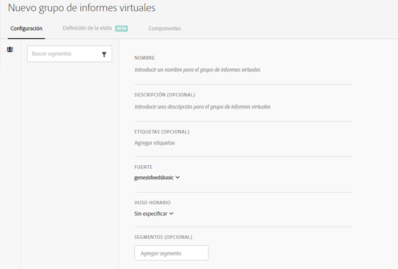
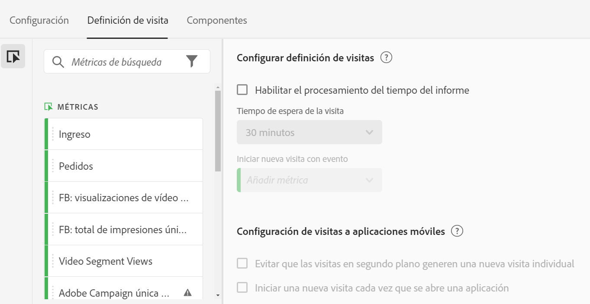
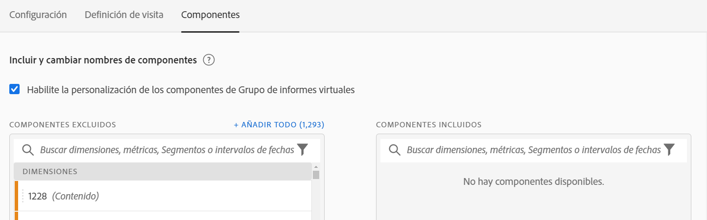

# Crear un grupo de informes virtuales

Antes de empezar a crear grupos de informes virtuales, hay que tener algunos aspectos en cuenta.

* Los usuarios que no sean administradores no pueden ver el Administrador de grupos de informes virtuales.
* Los grupos de informes virtuales no se pueden compartir. El uso compartido se realiza mediante grupos/permisos.
* En el Administrador de grupos de informes virtuales solo puede ver sus propios grupos. Debe hacer clic en “Mostrar todos” para ver los de otros usuarios.

1. Vaya a **[!UICONTROL Componentes]** > **[!UICONTROL Grupos de informes virtuales]**.
1. Haga clic en **[!UICONTROL Agregar +]**.

   

## Definir configuración

En la pestaña [!UICONTROL Settings], defina esta configuración y haga clic en **[!UICONTROL Continue]**.

| Elemento | Descripción |
| --- |--- |
| Nombre | El nombre del grupo de informes virtuales no se hereda del grupo de informes superior y debe ser distinto. |
| Descripción | Agregue una buena descripción para los usuarios empresariales. |
| Etiquetas | Puede agregar etiquetas para organizar los grupos de informes. |
| Fuente | El grupo de informes del que surge este grupo de informes virtuales hereda la siguiente configuración. La mayoría de los niveles y funciones de servicio (por ejemplo, la configuración eVar, las reglas de procesamiento, las Clasificaciones, etc.) se heredan. Para realizar cambios en esta configuración heredada en un VRS, debe editar el grupo de informes superior (Administración > Grupos de informes). |
| Zona horaria | Elegir una zona horaria es opcional. Si elige una zona horaria, esta se guarda junto con el VRS. En caso contrario, se usará la zona horaria del grupo de informes superior.  Al editar un VRS, la zona horaria que se guardó con el VRS se muestra en el selector desplegable. Si el VRS se creó antes de que se añadiera la opción de la zona horaria, en el selector desplegable se muestra la zona horaria del grupo de informes superior. |
| Segmentos | Solo tiene que añadir un segmento o apilar otros.   Nota: Al apilar dos segmentos, se unen de manera predeterminada con una instrucción AND. No es posible cambiarlo a una instrucción OR. Si intenta eliminar o modificar un segmento que se utilice en un grupo de informes virtuales, se muestra un error. |

## Definir la definición de la visita

En la pestaña [!UICONTROL Definición de la visita], defina esta configuración y haga clic en **[!UICONTROL Continuar]**.

| Elemento | Descripción |
| --- |--- |
| **Configurar definición de visitas** |  |
| Habilitar el procesamiento del tiempo del informe | Use el procesamiento del tiempo del informe para cambiar la duración predeterminada del tiempo de espera de la visita. Esta configuración no es destructiva y se aplica solo en Analysis Workspace. [Más información](/help/components/vrs/vrs-report-time-processing.md) |
| Tiempo de espera de la visita | Define la cantidad de inactividad que debe tener un visitante único antes de que se inicie una nueva visita automáticamente. Esto afectará la métrica de visitas, el contenedor de segmentos de visita y los eVars que caducan en la visita. |
| Iniciar nueva visita con evento | Inicia una nueva sesión cuando cualquiera de los eventos especificados se activa independientemente de si una sesión ha excedido el tiempo de espera. |
| **Configuración de visitas a aplicaciones móviles** | Modifique cómo se definen las visitas para las visitas a aplicaciones móviles recopiladas por los SDK móviles de Adobe. Esta configuración no es destructiva y se aplica solo en Analysis Workspace. |
| Evitar que las visitas en segundo plano generen una nueva visita individual | Evita que los resultados de fondo comiencen una nueva visita y que inflen las visitas y las métricas de visitante único. |
| Iniciar una nueva visita cada vez que se abre una aplicación | Se inicia una nueva sesión cuando se abre una aplicación. [Más información](/help/components/vrs/vrs-mobile-visit-processing.md) |

## Incluir y cambiar el nombre de los componentes

1. En la pestaña [!UICONTROL Components], active la casilla de verificación para aplicar la depuración para incluir, excluir y cambiar el nombre de los componentes de este grupo de informes virtuales en Analysis Workspace.
Para obtener más información sobre la depuración de VRS, consulte [Revisión de componentes de grupo de informes virtuales](https://experienceleague.adobe.com/docs/analytics/components/virtual-report-suites/vrs-components.html?lang=en#virtual-report-suites).

1. Arrastre componentes (dimensiones, métricas, segmentos o intervalos de fechas) que desee incluir en el VRS a la sección [!UICONTROL Componentes incluidos] .

1. Cuando haya terminado, haga clic en **[!UICONTROL Guardar]**.

## Vista previa de datos

A la derecha de cada ficha, puede obtener una vista previa del total de visitas, el total de visitas y el total de visitantes en este grupo de informes virtuales, en comparación con el grupo de informes original.

## Ver compatibilidad del producto

Algunos productos de Adobe Analytics no admiten algunas funciones de grupos de informes virtuales. La lista de compatibilidad del producto le permite ver qué productos de Adobe Analytics son compatibles en función de la configuración actual del grupo de informes virtuales.
