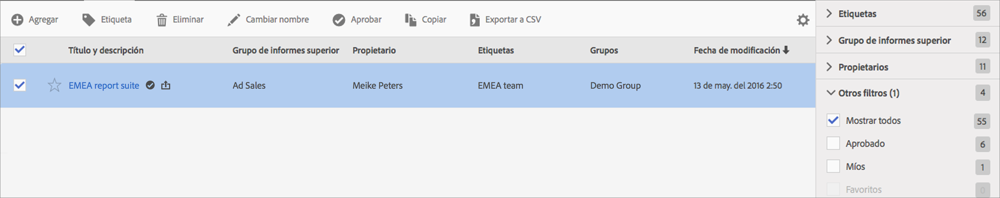

# Administrar grupos de informes virtuales

El administrador de grupos de informes virtuales permite a los administradores editar, añadir, etiquetar, eliminar, cambiar el nombre, aprobar, copiar, exportar y filtrar grupos de informes virtuales. No es visible para los usuarios que no son administradores.

**[!UICONTROL Analytics]** > **[!UICONTROL Componentes]** > **[!UICONTROL Grupos de informes virtuales]**

>[!NOTE]
>
>En el administrador de grupos de informes virtuales solo puede ver sus propios grupos. Haga clic en **[!UICONTROL Mostrar todo]** para ver los de los demás.

| Tarea | Descripción |
| --- | --- |
| Agregar | Le lleva al creador de grupos de informes virtuales, donde puede crear nuevos grupos de informes virtuales. |
| Etiqueta | Todos los usuarios pueden crear etiquetas para grupos de informes virtuales y aplicar una o más a un grupo de informes virtuales. Sin embargo, solo puede ver etiquetas de los grupos de informes virtuales de los que es propietario. ¿Qué tipo de etiquetas debería crear? A continuación encontrará una serie de sugerencias para crear etiquetas útiles:<ul><li>Etiquetas basadas en nombres de equipos, como Marketing social o Marketing móvil</li><li>Etiquetas de proyectos (etiquetas de análisis), como análisis de Páginas de entrada</li><li>Etiquetas de categorías: Para hombres o Área geográfica</li><li>Etiquetas de flujo de trabajo: Revisado para (unidad comercial específica); Aprobado</li></ul> |
| Eliminar | Si elimina un grupo de informes virtuales, los informes programados y los paneles a los que se haya aplicado seguirán funcionando normalmente. El informe o el tablero siguen utilizando el grupo de informes virtuales eliminado hasta que vuelva a guardar el informe programado.  Los informes programados no se actualizan cuando edita un grupo de informes virtuales con el mismo nombre. Por ejemplo: Supongamos que tiene dos grupos de informes virtuales con el mismo nombre y diferentes grupos de informes principales: Tiene un marcador que hace referencia al grupo de informes virtuales para el grupo de informes mainprod. A continuación, elimine el grupo de informes virtuales porque es un duplicado. El marcador seguirá funcionando y haciendo referencia a la definición de los grupos de informes virtuales eliminados. Si cambia la definición del resto de los grupos de informes virtuales, el grupo de informes virtuales aplicado al marcador no cambia. Utiliza la definición antigua. Para arreglarlo, actualice el marcador a fin de que haga referencia a la definición nueva. Si no sabe con seguridad si un marcador, tablero o informe programado está utilizando un grupo de informes virtuales eliminado, puede cambiar el nombre de los grupos de informes virtuales restantes para que quede claro si el marcador utiliza los grupos de informes virtuales restantes. |
| Cambiar nombre | En cualquier sitio en el que aparece el grupo de informes virtuales, como el selector de grupos de informes, muestra el nuevo nombre. |
| Aprobar/Desaprobar | Aprobar los grupos de informes virtuales para hacerlos “oficiales” o “conforme a los cánones”. Puede invertir el proceso desaprobándolo. |
| Copiar | Crea una copia distinta con su nuevo ID del grupo de informes propio, pero con el mismo nombre y definición. |
| Exportar a CSV | Exporta la definición del grupo de informes virtuales a un archivo .csv. |
| Filtro | Filtra por etiquetas, grupo de informes superior, propietarios y otros (Mostrar todos, Míos, Favoritos y Aprobado). |
