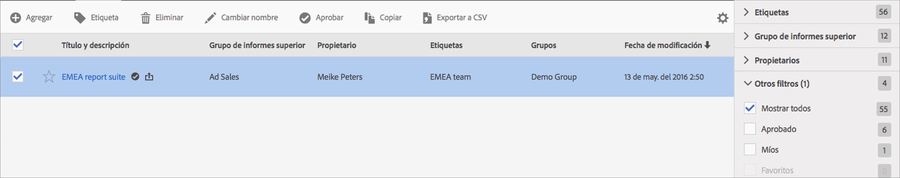

# Administrar grupos de informes virtuales

El Administrador de grupos de informes virtuales permite a los administradores editar, agregar, etiquetar, eliminar, cambiar el nombre, aprobar, copiar, exportar y filtrar grupos de informes virtuales. No es visible para los usuarios que no son administradores.

**[!UICONTROL Analytics]** > **[!UICONTROL Components]** > **[!UICONTROL Virtual Report Suites]**

>[!NOTE] En el Administrador de grupos de informes virtuales solo puede ver sus propios grupos. You have to click **[!UICONTROL Show All]** to see everyone else&#39;s.

| Tarea | Descripción |
|--- |--- |
| Agregue | Le lleva al creador de grupos de informes virtuales, donde puede crear nuevos grupos de informes virtuales. |
| Etiqueta | Todos los usuarios pueden crear etiquetas para segmentos y aplicar una o más etiquetas a un segmento. Sin embargo, solo puede ver las etiquetas de los segmentos de su propiedad. ¿Qué tipo de etiquetas debe crear? Estas son algunas sugerencias para etiquetas útiles:<ul><li>Etiquetas basadas en nombres de equipo, como Social Marketing o Mobile Marketing</li><li>Etiquetas de proyecto (etiquetas de análisis), como análisis de página de entrada</li><li>Etiquetas de Categoría: de los hombres; geografía</li><li>Etiquetas de flujo de trabajo: Depurado para (una unidad de negocio específica); Aprobado</li></ul> |
| Eliminar | Si elimina un grupo de informes virtuales, los informes programados y los tableros que tenga aplicados este grupo seguirán funcionando normalmente. El informe o el tablero siguen usando el grupo de informes virtuales eliminado mientras no vuelva a guardar el informe programado.  Los informes programados no se actualizan cuando edita un grupo de informes virtuales con el mismo nombre. Por ejemplo: Supongamos que tiene dos grupos de informes virtuales con el mismo nombre y diferentes grupos de informes principales: Tiene un marcador que hace referencia al grupo de informes virtuales para el grupo de informes mainprod. A continuación, elimine el grupo de informes virtuales porque es un duplicado. El marcador sigue ejecutándose, haciendo referencia a la definición del VRS eliminado. Si cambia la definición del resto del VRS, el VRS aplicado al marcador no cambia. Utiliza la definición antigua. Para solucionarlo, actualice el marcador para que haga referencia a la nueva definición. Si no tiene la seguridad de que un marcador, tablero o informe programado esté utilizando un VRS eliminado, puede cambiar el nombre del resto del VRS para que quede claro que el marcador utiliza este resto. |
| Cambiar nombre | En todas partes en las que se muestra el grupo de informes virtuales, como en el selector de grupos de informes, se muestra el nuevo nombre. |
| Aprobar/Desaprobar | Apruebe los grupos de informes virtuales para convertirlos en &quot;oficiales&quot; o &quot;canónicos&quot;. Puede revertir el proceso desaprobándolo. |
| Copiar | Crea una copia distinta con su propia ID de grupo de informes nueva, pero con el mismo nombre y definición. |
| Exportar a CSV | Exporte la definición del grupo de informes virtuales a un archivo .csv. |
| Filtro | Filtre por etiquetas, grupo de informes principal, propietarios y otros filtros (Mostrar todo, Míos, Favoritos y Aprobados). |
