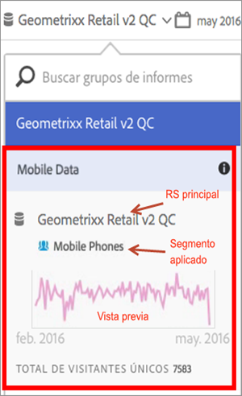

# Visualización de la información del grupo de informes virtuales

Haga clic en el icono i (Información) junto al nombre del grupo de informes para obtener información sobre él.

## En el selector de grupos de informes  {#section_74E43B60C1CA4180B5ACA57574C1FA0F}

Hacer clic en el icono Información junto al grupo de informes virtuales en el selector de grupos de informes proporciona esta información:

* Nombre del grupo de informes superior.
* Nombre de cualquier segmento aplicado a él.
* Vista previa del grupo de informes con el segmento aplicado.
* Cantidad total de visitantes únicos.

