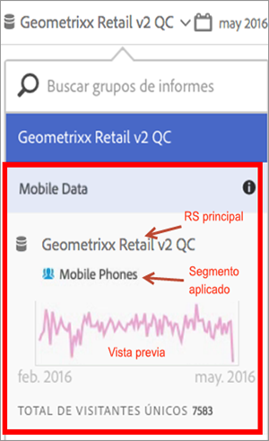

# Visualización de la información del grupo de informes virtuales

Haga clic en el icono i (Información) junto al nombre del grupo de informes para obtener información sobre él.

## En el selector de grupos de informes {#section_74E43B60C1CA4180B5ACA57574C1FA0F}

Al hacer clic en el icono de información situado junto al grupo de informes virtuales en el selector de grupos de informes, se proporciona la siguiente información:

* Nombre del grupo de informes principal.
* El nombre de cualquier segmento aplicado.
* Una sencilla previsualización del grupo de informes con el segmento aplicado.
* Recuento total de visitantes únicos.

