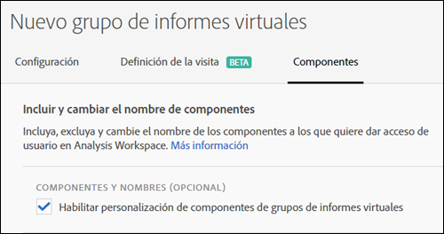
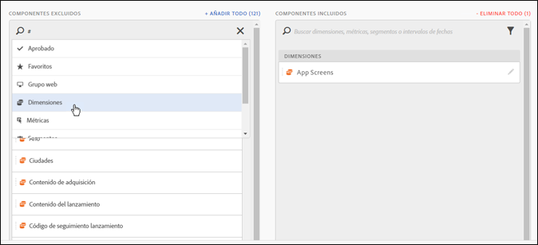
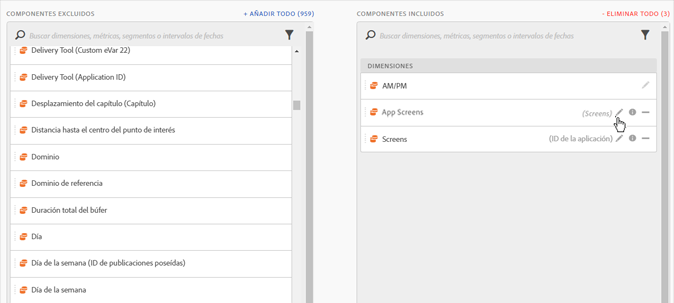
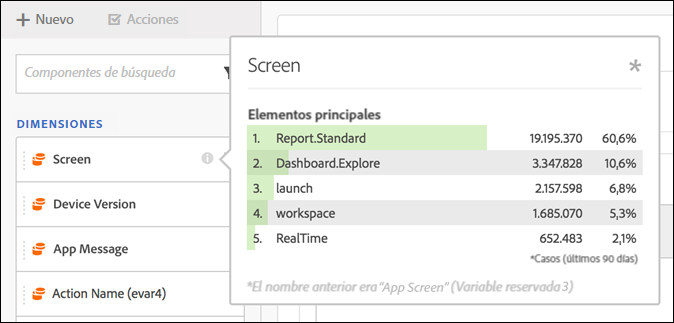
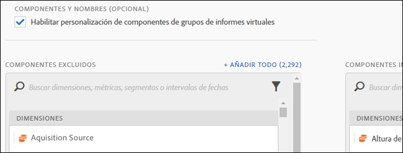

# Revisión de componentes de grupo de informes virtuales

Los grupos de informes virtuales se pueden revisar para que incluyan y excluyan componentes en Analysis Workspace.

>[!BEGINSHADEBOX]

Consulte  [Revisión de componentes](https://experienceleague.adobe.com/es/docs/analytics-learn/tutorials/components/virtual-report-suites/component-curation-in-virtual-report-suites){target="_blank"} para ver un vídeo de demostración.

>[!ENDSHADEBOX]

>[!NOTE]
>
>Se han realizado cambios en los componentes que los administradores y no administradores pueden ver en los proyectos organizados de Workspace y en los grupos de informes virtuales organizados. Anteriormente, cualquiera podía ver los componentes no organizados al hacer clic en **[!UICONTROL Mostrar todos los componentes]**. La [experiencia actualizada de organización](/help/analyze/analysis-workspace/curate-share/curate.md) permite un control más detallado sobre qué componentes son visibles.

Para habilitar la revisión de componentes,

1. Vaya a **[!UICONTROL Analytics]** > **[!UICONTROL Componentes]** > **[!UICONTROL Grupos de informes virtuales]** > **[!UICONTROL Crear nuevo grupo de informes virtuales]**.
1. Tras definir la **[!UICONTROL Configuración]**, haga clic en la ficha **[!UICONTROL Componentes]**.

1. Seleccione la casilla de verificación **[!UICONTROL Habilitar la personalización de componentes del grupo de informes virtuales]**:

   

   >[!NOTE]
   >
   >Si la personalización de componentes está habilitada, el grupo de informes virtuales **solo es accesible desde Analysis Workspace** y, por lo tanto, no lo es desde:
   >
   >* [!UICONTROL Data Warehouse]
   >* [!UICONTROL Report Builder]
   >* [!UICONTROL Activity Map]
   >* API de informes de Analytics

   Una vez comprobado, puede agregar los componentes que desee incluir en el grupo de informes virtuales arrastrando los componentes aplicables de la columna “componentes excluidos” a la columna “componentes incluidos”. Los componentes que se pueden incluir y excluir son los siguientes:

   * Dimensiones
   * Métricas
   * Segmentos
   * Intervalos de fechas

   >[!NOTE]
   >
   >No es necesario *compartir* componentes depurados (segmentos, métricas calculadas, intervalos de fechas). Siempre serán visibles en Analysis Workspace si se depuran para el grupo de informes virtuales aunque no se hayan compartido.

1. Además, puede filtrar o buscar en los componentes y añadir la selección filtrada entera a la columna “incluido” haciendo clic en **[!UICONTROL Añadir todo]**.

   

## Cambiar el nombre de los componentes {#section_0F7CD9F684FE4765BC00A2AFED56550E}

Puede cambiar los nombres para mostrar de los componentes incluidos específicos del grupo de informes virtuales. Por ejemplo, si quiere incluir Nombre de página en el grupo de informes virtuales, pero quiere cambiarle el nombre a otro más apropiado para el contexto móvil, puede cambiarlo a App Screens. El nuevo nombre se muestra en Analysis Workspace cada vez que se utiliza este grupo de informes virtuales.

En Analysis Workspace, haga clic en el icono de información de cualquier componente incluido para ver el nombre original del componente cuyo nombre ha cambiado:

## Grupos de componentes {#section_483BEC76F49E46ADAAA03F0A12E48426}

Use grupos de componentes para realizar agregaciones masivas de componentes a su grupo de informes virtuales. Por ejemplo, si desea importar un conjunto predeterminado de componentes específicos del análisis de aplicaciones móviles, seleccione el grupo de aplicaciones móviles. Un conjunto correspondiente de dimensiones y métricas (con el nombre ya cambiado) se añade automáticamente a la lista Incluidos del grupo de informes virtuales.

## Comportamiento de Workspace {#section_6C32F8B642804C0097FCB14E21028D4A}

Para obtener más información sobre la organización en Analysis Workspace, consulte [Organizar y compartir un proyecto](/help/analyze/analysis-workspace/curate-share/curate.md).
