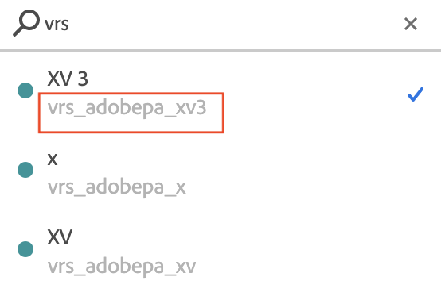

# Preguntas frecuentes sobre el grupo de informes virtuales

Sugerencias y prácticas recomendadas para los nuevos usuarios de los grupos de informes virtuales.

| Pregunta | Respuesta |
| --- | --- |
| **¿Debería consolidar mi implementación desde varios grupos de informes en un único grupo de informes globales y, a continuación, utilizar los grupos de informes virtuales para exponer distintos segmentos de datos a mis usuarios?** | Quizás. Estas son algunas circunstancias en las que debería considerar si desea continuar con grupos de informes individuales:<ul><li>Si agrupa variables o dimensiones con muchos números de valores únicos en un solo grupo de informes, los límites de valores únicos mensuales podrían excederse en este grupo global y causar un truncamiento (tráfico bajo como elemento de línea en los informes).</li><li>Si necesita un sistema de informes en tiempo real o de “datos actuales” para segmentos de personas (p. ej. marcas, unidades de negocio, etc.).</li><li>Los distintos grupos de informes pueden tener requisitos únicos para el seguimiento (es decir, si usan variables y eventos de Adobe Analytics de forma muy diferente). En este caso, tenga en cuenta que consolidarla en un grupo de informes globales no le otorgará variables ni eventos adicionales para el seguimiento.</li></ul> |
| **¿Qué configuración de los grupos de informes virtuales se hereda del grupo de informes principal?** | Un grupo de informes virtuales hereda la mayoría de los niveles de servicio del grupo de informes principal, como la configuración de eVars, reglas de procesamiento, clasificaciones, etc.  NO se heredan las siguientes opciones de configuración:<ul><li>ID del grupo de informes</li><li>Nombre del grupo de informes </li><li>Grupos de permisos (los grupos de informes virtuales se pueden asignar a sus propios grupos de permisos)</li></ul>**Nota**: Esto no incluye la mayoría de las entidades creadas por el usuario, como marcadores, tableros, informes programados, etc.Estos elementos no se heredan del grupo principal y se pueden crear y utilizar para el grupo de informes virtuales de forma específica (más información en la siguiente pregunta). |
| **¿En qué se diferencia trabajar con un grupo de informes virtuales de hacerlo con un grupo de informes base en la interfaz de usuario de Analytics?** | Una vez creado, el grupo de informes virtuales se trata como un grupo de informes base en toda la interfaz de usuario y, por lo general, lo admiten las funciones más habituales. Por ejemplo:<ul><li>Los grupos de informes virtuales aparecen en el selector de grupos de informes y se pueden seleccionar individualmente como cualquier otro grupo de informes base.</li><li>Informes, marcadores, tableros, destinos, alertas, segmentos, métricas calculadas, etc.: todos se pueden crear para un grupo de informes virtuales y comportarse de forma independiente con respecto al grupo superior.</li><li>Los grupos de informes virtuales se pueden añadir individualmente a los grupos de permisos como cualquier otro grupo de informes.</li><li>Los segmentos se pueden seguir aplicando cuando se ejecuten informes en el contexto de un grupo de informes virtuales; se apilarán automáticamente con los segmentos del grupo de informes virtuales cuando los datos del informe se estén recuperando.</li></ul> |
| **¿Cómo se gestionan los grupos de informes virtuales en Admin Console y en la API del administrador? ¿Puedo guardar funciones para ellos como grupos de informes base?** | No, los grupos de informes virtuales no son compatibles con la mayoría de las funciones de administrador. Como se ha mencionado anteriormente, un grupo de informes virtuales hereda la mayoría de los niveles de servicio y funciones del grupo principal (por ejemplo, la configuración de eVar, reglas de procesamiento, clasificaciones, etc.), por lo que debe alterar este grupo de informes principal para realizar cambios en esta configuración heredada en un grupo de informes virtuales. Como resultado, los grupos de informes virtuales aparecen en la interfaz de usuario solo aquí:<ul><li>El administrador de grupos de informes virtuales es donde se crean y se editan los grupos de informes virtuales. (Analytics > Componentes > Grupos de informes virtuales)</li><li>Adobe [Admin Console](https://helpx.adobe.com/es/enterprise/using/admin-console.html). Para usar un grupo de informes virtuales en informes o en Adobe Analytics, los permisos funcionan igual que para un grupo de informes. Esto significa que los grupos de informes virtuales aparecen en la herramienta de selección de un perfil de producto y se asignan a perfiles de producto del mismo modo que los grupos de informes.</li></ul>**Nota**: Cuando se utiliza la API de servicios web y se intenta guardar la configuración de la función para un grupo de informes virtuales, se produce una excepción. Las funciones solo se pueden establecer para un grupo de informes base. |
| **He marcado “comenzar nueva visita al inicio”. ¿Por qué sigo viendo que hay muchas más visitas que inicios?** | Cuando se activa la opción “comenzar nueva visita al inicio”, se sigue aplicando el tiempo de espera. Por tanto, si un usuario utiliza la aplicación durante 10 minutos y deja pasar un minuto entre cada acción, se generará una nueva visita al inicio y otras nueve más, creadas al superarse el tiempo de espera de visita. Para que el número de inicios y de visitas sea lo más parecido posible al utilizar la opción “comenzar nueva visita al inicio”, se debe establecer un tiempo de espera mayor que el tiempo de espera de sesión definido en el SDK. |
| **Establezco “comenzar nueva visita al inicio” y configuro un tiempo de espera mayor que el del SDK. ¿Por qué el número de inicios sigue siendo mucho menor que el de visitas?** | Si el tiempo de espera es mayor que el valor establecido en el SDK, es muy probable que la aplicación esté enviando visitas individuales cuando está en segundo plano, y que dichas visitas individuales se estén registrando como visitas nuevas. Compruébelo utilizando la dimensión Tipo de visita en el grupo de informes principal para ver si se producen visitas individuales en segundo plano. **Nota**: El SDK solo diferencia las visitas en primer y segundo plano a partir de la versión 4.13.6. Si su versión es anterior, todas las visitas individuales se mostrarán como visitas en primer plano. Si su versión del SDK es la correcta, habilite el ajuste “Impedir que las visitas en segundo plano inicien una nueva visita”.    Nota: Si deshabilita el procesamiento heredado de las visitas individuales en segundo plano en Admin Console, estas no aparecerán en el grupo de informes principal, pero sí en el grupo de informes virtuales. |
| **¿Qué versión del SDK necesito para poder realizar el seguimiento de las visitas individuales en segundo plano?** | Necesita la versión 4.13.6 o superior del SDK. |
| **¿Cómo encuentro el ID de un grupo de informes virtuales?** | <ul><li>Abriendo un proyecto de Workspace, haciendo clic en el Selector del grupo de informes y buscando el nombre de un grupo de informes virtuales en el cuadro de búsqueda. El ID aparece debajo del nombre en los resultados de búsqueda:  </li><li> O, mediante programación, en la [API del grupo de informes virtuales](https://www.adobe.io/apis/experiencecloud/analytics/docs.html#!AdobeDocs/analytics-2.0-apis/master/vrs.md).</li></ul> |
