# Sesiones según el contexto

Las sesiones según el contexto en los grupos de informes virtuales cambian el modo en que Adobe Analytics calcula las visitas de cualquier dispositivo. En este artículo también se describen las implicaciones de procesamiento que las visitas individuales y eventos de inicio de aplicaciones en segundo plano (todos ellos establecidos por el SDK para móviles) tienen para el modo en que se definen las visitas con dispositivos móviles.

Puede definir una visita del modo que desee sin alterar los datos subyacentes para adaptarse al modo en que sus visitantes interactúan con las experiencias digitales.

## Parámetro URL de perspectiva de cliente

El proceso de recopilación de datos de Adobe Analytics le permite establecer un parámetro de cadena de consulta que especifica la perspectiva del cliente (indicada como parámetro de cadena de consulta “cp”). Este campo especifica el estado de la aplicación digital del usuario final. Esto le ayuda a saber si se generó una visita mientras una aplicación móvil estaba en segundo plano.

## Procesamiento de visitas en segundo plano

Una visita en segundo plano es un tipo de visita que el SDK para móviles de Adobe versión 4.13.6 o superior envía a Analytics cuando la aplicación realiza una solicitud de seguimiento estando en segundo plano. Algunos ejemplos habituales son:

* Datos enviados durante el cruce de un límite geográfico
* Interacción con una notificación push

Los siguientes ejemplos describen la lógica empleada para determinar cuándo comienza y acaba una visita para cualquier visitante cuando el ajuste “Impedir que las visitas en segundo plano inicien una nueva visita” está o no habilitado para un grupo de informes virtuales.

**Si “Impedir que las visitas en segundo plano inicien una nueva visita” no está habilitado:**

Si esta función no está habilitada para un grupo de informes virtuales, las visitas en segundo plano se tratan como cualquier otra visita, lo que significa que inician nuevas visitas y se comportan igual que las visitas en primer plano. Por ejemplo, si se produce una visita en segundo plano menos de 30 minutos (el tiempo de espera de sesión estándar para un grupo de informes) antes de un grupo de visitas en primer plano, la visita en segundo plano es parte de la sesión.

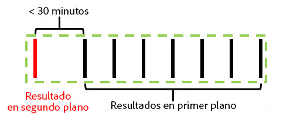

Si la visita en segundo plano se produce más de 30 minutos antes de cualquier visita en primer plano, la visita en segundo plano crea su propia visita y el número de estas sería de dos.

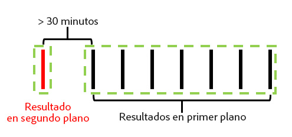

**Si “Impedir que las visitas en segundo plano inicien una nueva visita” está habilitado:**

Los siguientes ejemplos ilustran el comportamiento de las visitas en segundo plano cuando esta función está habilitada.

Ejemplo 1: Se produce una visita en segundo plano un tiempo (t) antes de una serie de visitas en primer plano.

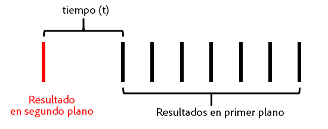

En este ejemplo, si *t* es mayor que el tiempo de espera de visita configurado del grupo de informes virtuales, la visita en segundo plano se excluye de la visita formada por las visitas en primer plano. Por ejemplo, si el tiempo de espera de visita del grupo de informes virtuales se estableció en 15 minutos y *t* fue 20 minutos, la visita formada por esta serie de visitas (indicadas por el contorno verde) excluiría la visita en segundo plano. Esto significa que cualquier eVar establecida con una caducidad de “visita” en la visita en segundo plano **no** persistiría en la siguiente visita, y que un contenedor de segmentos de visita solo incluiría las visitas en primer plano dentro del contorno verde.

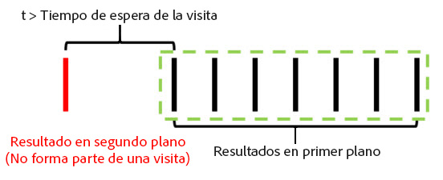

Por el contrario, si *t* es menor que el tiempo de espera de visita configurado del grupo de informes virtuales, la visita en segundo plano se incluye como parte de la visita, como si fuera una visita en primer plano (como se indica con el contorno verde):

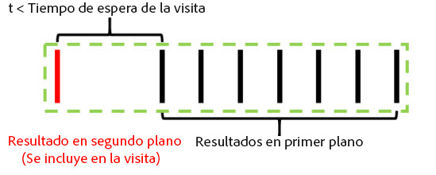

Esto significa que:

* Cualquier eVar establecida con una caducidad de “visita” en la visita en segundo plano persiste en su valor en las demás visitas de esta visita.
* Cualquier valor establecido en la visita en segundo plano se incluye en la evaluación de la lógica del contenedor de segmentos en el nivel de visita.

En ambos casos, el recuento total de visitas sería de 1.

Ejemplo 2: Si se produce una visita en segundo plano después de una serie de visitas en primer plano, el comportamiento es similar.

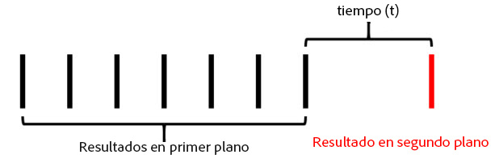

Si la visita en segundo plano se produce pasado el tiempo de espera configurado para el grupo de informes virtuales, la visita en segundo plano no es parte de una sesión (el contorno verde):

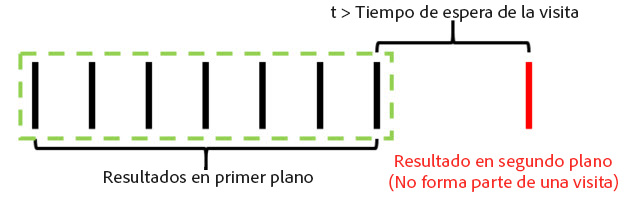

Igualmente, si el periodo de tiempo *t* fue inferior al tiempo de espera configurado del grupo de informes virtuales, la visita en segundo plano se incluye en la visita formada por las visitas en primer plano anteriores:

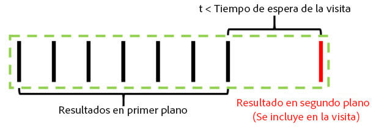

Esto significa que:

* Cualquier eVar establecida con una caducidad de “visita” en las visitas en primer plano anteriores persiste en su valor en la visita en segundo plano de esta visita.
* Cualquier valor establecido en la visita en segundo plano se incluye en la evaluación de la lógica del contenedor de segmentos en el nivel de visita.

Como antes, el total de visitas en ambos casos sería de 1.

Ejemplo 3: En algunas circunstancias, una visita en segundo plano puede provocar que lo que eran dos visitas separadas se combinen en una sola. En el siguiente escenario, una visita en segundo plano es precedida y seguida por una serie de visitas en primer plano:

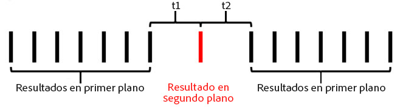

Si, en este ejemplo, *t1* y *t2* son inferiores al tiempo de espera de visita configurado para el grupo de informes virtuales, todas estas visitas se combinarían en una sola, aunque la suma de *t1* y *t2* exceda el tiempo de espera de visita:

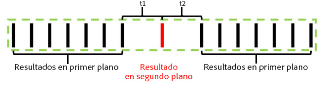

Sin embargo, si *t1* y *t2* son mayores que el tiempo de espera configurado, las visitas se separarían en dos visitas distintas:

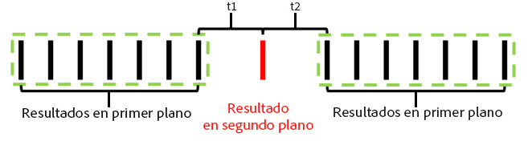

Del mismo modo (como en los ejemplos previos), si *t1* y *t2* son menores que el tiempo de espera, la visita en segundo plano se incluiría en la primera visita:

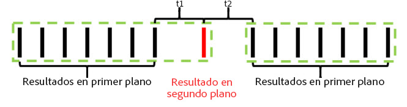

Si *t1* es mayor y *t2* es menor que el tiempo de espera, la visita en segundo plano se incluiría en la segunda visita:

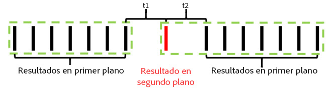

Ejemplo 4: En escenarios donde se produce una serie de visitas en segundo plano dentro del tiempo de espera de visita del grupo de informes virtuales, las visitas procedentes de una “visita en segundo plano” invisible no se incluyen en el recuento de visitas y no se puede acceder a ellas desde un contenedor de segmentación de visitas.

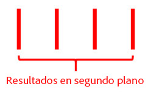

Aunque esto no se considere una visita, cualquier eVar establecida que tenga caducidad de visita persiste en su valor en las demás visitas en segundo plano de esta “visita en segundo plano”.

Ejemplo 5: En escenarios donde se producen varias visitas en segundo plano sucesivas, seguidas de una serie de visitas en primer plano, es posible (dependiendo del tiempo de espera configurado) que las visitas en segundo plano mantengan viva una visita más allá del tiempo de espera. Por ejemplo, si la combinación de *t1* y *t2* fuera mayor que el tiempo de espera de visita del grupo de informes virtuales, pero individualmente fueran menores que dicho tiempo de espera, la visita se extendería para incluir ambas visitas en segundo plano:

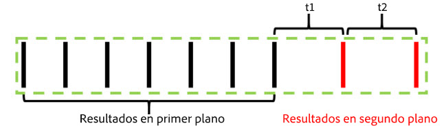

Igualmente, si se produce una serie de visitas en segundo plano antes de una serie de eventos en primer plano, se obtiene un comportamiento similar:

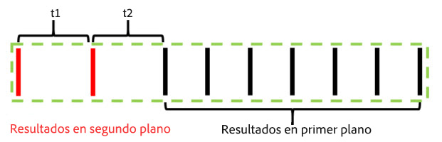

Las visitas en segundo plano se comportan de este modo para preservar cualquier efecto de atribución de eVars u otras variables establecidas durante las visitas en segundo plano. Esto permite que los eventos de conversión en primer plano posteriores se atribuyan a acciones realizadas cuando una aplicación estaba en segundo plano. También permite a un contenedor de segmentos de visita incluir las visitas en segundo plano que dieron como resultado una sesión en primer plano posterior, lo que resulta útil para medir la efectividad de los mensajes push.

## Comportamiento de la métrica de visitas

El recuento de visitas se basa únicamente en las visitas que incluyen al menos una visita en primer plano. Esto significa que las visitas en segundo plano huérfanas no se cuentan en la métrica.

## Comportamiento de tiempo pasado por métrica de visitas

El tiempo pasado se sigue calculando de un modo análogo a como se hace sin visitas en segundo plano, empleando el tiempo entre visitas. No obstante, si una visita incluye visitas en segundo plano (al producirse lo bastante próximas a visitas en primer plano), dichas visitas se incluyen en el cálculo del tiempo pasado por visita, como si fueran visitas en primer plano.

## Configuración del procesamiento de visitas en segundo plano

Como el procesamiento de visitas en segundo plano solo está disponible para grupos de informes virtuales que utilizan Procesamiento de intervalo de tiempo, Adobe Analytics admite dos modos de procesar las visitas en segundo plano para preservar el recuento de visitas en el grupo de informes base que no utiliza Procesamiento de intervalo de tiempo. Para obtener acceso a estos ajustes, vaya a Adobe Analytics Admin Console y a la configuración del grupo de informes base aplicable y, a continuación, diríjase al menú “Administración de móviles” y al submenú “Informes de aplicaciones móviles”.

1. “Procesamiento heredado activado”: esta es la configuración predeterminada para todos los grupos de informes. Si se deja activado el procesamiento heredado, las visitas en segundo plano se procesan como visitas normales en nuestro canal de procesamiento por lo que respecta al grupo de informes base de atribución de tiempo no de informes. Esto significa que cualquier visita en segundo plano que aparezca en el grupo de informes base aumente las visitas como una visita normal. Si no desea que las visitas en segundo plano aparezcan en el grupo de informes base, cambie este ajuste a “Desactivado”.
1. “Procesamiento heredado desactivado”: cuando el procesamiento heredado de visitas en segundo plano está desactivado, el grupo de informes base ignora las visitas en segundo plano, a las que solo se puede acceder si se configura el uso de Procesamiento de intervalo de tiempo en un grupo de informes virtuales creado en este grupo de informes base. Esto significa que cualquier dato captado por las visitas en segundo plano y enviado a este grupo de informes base solo aparece en los grupos de informes virtuales que tengan habilitado Procesamiento de intervalo de tiempo.

   Este ajuste está pensado para los clientes que desean aprovechar el nuevo procesamiento de visitas en segundo plano sin alterar el recuento de visitas en su grupo de informes base.

En cualquier caso, las visitas en segundo plano se facturan al mismo coste que cualquiera otra enviada a Analytics.

## Inicio de nuevas visitas tras cada inicio de aplicación

Además del procesamiento de visitas en segundo plano, los grupos de informes virtuales pueden forzar que se inicie una nueva visita cada vez que el SDK para móviles envíe un evento de inicio de aplicación. Cuando este ajuste está habilitado, cada vez que el SDK envía un evento de inicio de aplicación, se fuerza el inicio de una nueva visita, haya alcanzado o no cualquier visita actual su tiempo de espera. La visita que contiene el evento de inicio de aplicación se incluye como primer elemento de la nueva visita, incrementa el recuento de visitas y crea un contenedor de visitas propio para la segmentación.
