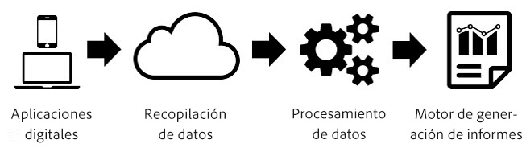
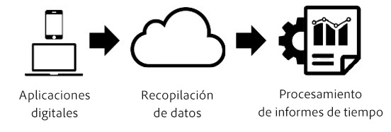

# Procesamiento de tiempo de los informes

El procesamiento de intervalo de tiempo es una configuración de los grupos de informes virtuales que permite procesar los datos de una forma retroactiva y no destructiva.

>[!NOTE]
>
>El procesamiento de intervalo de tiempo solo está disponible para Analysis Workspace.

Procesamiento de intervalo de tiempo solo afecta a los datos en el grupo de informes virtuales y no tiene efecto sobre ningún dato o recopilación de datos en el grupo de informes base. La diferencia entre Procesamiento de intervalo de tiempo y el procesamiento tradicional de Analytics se entiende mejor con el siguiente diagrama:

Durante el procesamiento de datos de Analytics, los datos fluyen por el canal de recopilación de datos hasta un paso de preprocesamiento que los prepara para la realización de informes. Este paso de preprocesamiento aplica lógica de caducidad de visitas y de persistencia de eVars (entre otras cosas) a los datos que se van recopilando. La principal desventaja de este modelo de preprocesamiento es que requiere que la configuración esté completada antes de recabar los datos. Por tanto, cualquier cambio realizado en la configuración de preprocesamiento solo se aplica a los nuevos datos desde ese momento en adelante. Esto puede suponer un problema si los datos no llegan ordenados, o si la configuración presenta errores.

Procesamiento de intervalo de tiempo es un modo fundamentalmente distinto de procesar datos de Analytics para la realización de informes. En lugar de predeterminar la lógica de procesamiento antes de la recopilación de datos, Analytics ignora el conjunto de datos durante el paso de preprocesamiento y aplica la lógica cada vez que se ejecuta un informe:

Esta arquitectura de procesamiento ofrece opciones de realización de informes mucho más flexibles. Por ejemplo, puede cambiar el tiempo de espera de visita a cualquier periodo que desee de forma no destructiva, cambios que se reflejan retroactivamente en la persistencia de eVars y los contenedores de segmentos, como si estos ajustes se hubieran aplicado antes de la recopilación de los datos. Además, puede crear cualquier número de grupos de informes virtuales, cada uno con distintas opciones de Procesamiento de intervalo de tiempo y basados en el mismo grupo de informes base, sin alterar ninguno de los datos del grupo de informes base.

Procesamiento de intervalo de tiempo también permite a Analytics impedir que las visitas en segundo plazo comiencen nuevas visitas, y permite al [SDK para móviles](https://marketing.adobe.com/developer/get-started/mobile/c-measuring-mobile-applications) indicar a la creación de informes que inicie una nueva visita cada vez que se active un evento de inicio de aplicación.

Los grupos de informes virtuales con Procesamiento de intervalo de tiempo habilitado disponen en este momento de las siguientes opciones de configuración:

* **Tiempo de espera de visita:** El tiempo de espera de visita es la cantidad de inactividad que un visitante exclusivo debe presentar antes de que se inicie automáticamente una nueva visita. El valor predeterminado es de 30 minutos. Por ejemplo, si establece el tiempo de espera de visita en 15 minutos, se crea un nuevo grupo de visitas por cada secuencia de visitas obtenida separada de la anterior por al menos 15 minutos de inactividad. Estos ajustes afectan no solo al recuento de visitas, sino también al modo de evaluar los contenedores de segmentos de visita y a la lógica de caducidad de visitas para cualquier eVar que caduque durante una visita. Reducir el tiempo de espera de visita probablemente aumente el número total de visitas en los informes, y viceversa.
* **Configuración de visitas de aplicación móvil:** Para los grupos de informes que contienen datos generados por aplicaciones móviles mediante los [SDK para móviles de Adobe](https://www.adobe.io/apis/cloudplatform/mobile.html), existen ajustes de visita adicionales. Dichos ajustes no son destructivos y afectan únicamente a las visitas recopiladas mediante los SDK para móviles. Estos ajustes no tienen efecto en los datos recopilados fuera del SDK para móviles.
* **Impedir que las visitas en segundo plano inicien una nueva visita:** Los SDK para móviles recopilan las visitas en segundo plano cuando la aplicación está en segundo plano.
* **Iniciar una nueva visita cada vez que se inicie la aplicación:** Además del tiempo de espera de visita, es posible forzar el comienzo de una visita cada vez que se registra un evento de inicio de aplicación procedente de los SDK para móviles, independientemente del tiempo de inactividad. Esta configuración afecta a la métrica de visitas y al contenedor de segmentos de visita, así como a la lógica de caducidad de visitas de las eVars.
* **Iniciar una nueva visita con el evento:** Una nueva sesión se inicia cuando se activa un evento, independientemente de si se ha superado o no el tiempo de espera de la sesión. La sesión recién creada incluye el evento que la ha iniciado. Además, es posible utilizar varios eventos para iniciar una sesión, y se activa una nueva si se observa cualquiera de esos eventos en los datos. Este ajuste afecta al recuento de visitas, al contenedor de segmentación de visitas y a la lógica de caducidad de las visitas en eVars.

Procesamiento de intervalo de tiempo no admite todas las métricas y dimensiones disponibles en los informes tradicionales de Analytics. Solo se puede acceder a los grupos de informes virtuales que utilizan Procesamiento de intervalo de tiempo desde Analysis Workspace. No es posible hacerlo desde [!UICONTROL Reports &amp; Analytics], Data Warehouse, Report Builder, Fuentes de datos o la API de informes.

Además, Procesamiento de intervalo de tiempo solo procesa los datos que se producen dentro del intervalo de fechas del informe (lo que se refiere como “limitación de fechas” más adelante). Esto significa que los valores de eVar establecidos para no caducar nunca para un visitante antes de intervalo de fechas del informe no persisten hasta el periodo del informe y no aparecen en este. También significa que las mediciones de lealtad de los clientes se basan exclusivamente en los datos presentes en el intervalo de fechas del informe, y no en el historial completo anterior a dicho intervalo.

A continuación se ofrece una lista de métricas y dimensiones que en este momento no son compatibles con Procesamiento de intervalo de tiempo:

* **Analytics para Target:** Actualmente no es compatible. Está prevista la compatibilidad futura.
* **Métricas y dimensiones reservadas de Analytics para Advertising Cloud:** Actualmente no es compatible. Está prevista la compatibilidad futura.
* **Métrica de acceso único:** No es compatible de forma permanente.
* **Variables de lista:** Actualmente no es compatible. Está prevista la compatibilidad futura.
* **eVars de contador:** No es compatible de forma permanente.
* **Variables de canales de marketing:** Actualmente no es compatible. Está prevista la compatibilidad futura.
* **Dimensión de días desde la última compra:** Debido a la naturaleza de la limitación de fechas del Procesamiento de intervalo de tiempo, esta dimensión no es compatible.
* **Dimensión de días antes de la primera compra:** Debido a la naturaleza de la limitación de fechas del Procesamiento de intervalo de tiempo, esta dimensión no es compatible.
* **Dimensión de frecuencia de retorno:** Debido a la naturaleza de la limitación de fechas del Procesamiento de intervalo de tiempo, esta dimensión no es compatible. Se puede utilizar un enfoque alternativo empleando una métrica de recuento de visitas en un segmento, o utilizando la métrica de visitas en un informe de histograma.
* **Dimensión de días desde la última visita:** Debido a la naturaleza de la limitación de fechas del Procesamiento de intervalo de tiempo, esta dimensión no es compatible.
* **Dimensión Página de entrada original:** Debido a la naturaleza de la limitación de fechas del Procesamiento de intervalo de tiempo, esta dimensión no es compatible.
* **eVars de asignación lineal:** Actualmente no es compatible. Está prevista la compatibilidad futura.
* **Dimensión del dominio de referencia original:** Actualmente no es compatible. Está prevista la compatibilidad futura.
* **Número de visitas:** Debido a la naturaleza de la limitación de fechas del Procesamiento de intervalo de tiempo, esta métrica no es compatible. Como alternativa en las aplicaciones móviles, puede utilizar una métrica calculada que incluya visitantes/visitas con la métrica Instalación de la aplicación para identificar nuevos visitantes o visitas.
* **Fuentes de datos de ID de transacción:** Actualmente no es compatible. Está prevista la compatibilidad futura.

A continuación se ofrece una lista de dimensiones y métricas que pueden verse afectadas por la configuración seleccionada para Procesamiento de intervalo de tiempo:

* Si “Impedir que las visitas en segundo plano inicien una nueva visita” está habilitado, se producirán los siguientes cambios: Consulte [Creación de sesiones según el contexto](vrs-mobile-visit-processing.md) para obtener más información.
   * **Devoluciones/Tasa de devoluciones:** Las visitas individuales en segundo plano que no van seguidas de una visita individual en primer plano no se consideran una devolución y no contribuyen a la tasa de devoluciones.
   * **Tiempo empleado en segundos por visita:** Solo las visitas que incluyen visitas individuales que se producen en primer plano contribuyen a esta métrica.
   * **Tiempo empleado por visita:** Solo las visitas que incluyen visitas individuales en primer plano contribuyen a esta métrica.
   * **Métricas y dimensiones de entrada y salida:** En esta dimensión solo aparecen las entradas y salidas de visitas con visitas individuales en primer plano.
   * **Métrica de visitantes únicos:** En los visitantes únicos no se incluyen los visitantes que solo tuvieron visitas individuales en segundo plano en el intervalo de fechas del informe.
* **Visitas:** Las visitas reflejan cualquier configuración del grupo de informes virtuales, que pueden diferir de las del grupo de informes base.
* **Eventos serializados con ID de evento:** Los duplicados de los eventos que utilizan la serialización de eventos con un ID de evento solo se eliminan en el caso de los eventos que se producen dentro del intervalo de fechas del informe para un visitante. Los duplicados de estos eventos no se eliminan en todas las fechas o visitantes globalmente debido a la limitación de fechas del Procesamiento de intervalo de tiempo.
* **Compras/Ingresos/Pedidos/Unidades:** Debido a la naturaleza de la limitación de fechas del Procesamiento de intervalo de tiempo, cuando se utiliza el ID de compra, los duplicados de estas métricas solo se eliminan para los ID de compra duplicados que se producen dentro del intervalo de fechas del informe para un visitante, y no en cualquier fecha y para cualquier visitante de forma global.
* **eVars que no sean de comercialización/eVars reservadas:** Debido a la naturaleza de la limitación de fechas del Procesamiento de intervalo de tiempo, un valor establecido en una eVar persiste solo si se estableció dentro del intervalo de fechas del informe. Además, las caducidades basadas en la hora pueden producirse 60 minutos antes o después si la persistencia se ve afectada por un cambio de hora.
* **eVars de comercialización/eVars reservadas:** Consulte lo anterior. Además, para la conversión de sintaxis, cuando el enlace está establecido en “cualquier evento”, se utiliza “cualquier visita”.
* **Tipo de visita individual:** Esta dimensión especifica si una visita individual es en primer o en segundo plano.
