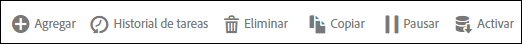

# Panel Fuente de datos

Puede realizar varias acciones en una fuente de datos.

En la interfaz de Fuente de datos, al seleccionar la casilla de verificación correspondiente a una o más fuentes, se muestran las acciones disponibles en forma de grupos de botones sobre la lista.

Para editar una fuente, busque su nombre en la lista y haga clic en él.
