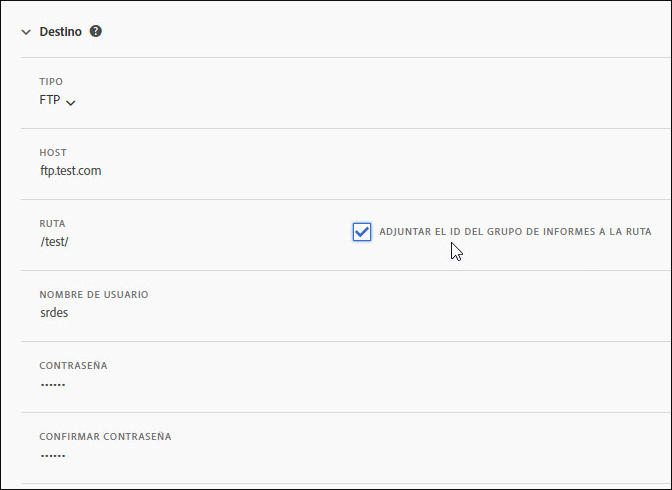
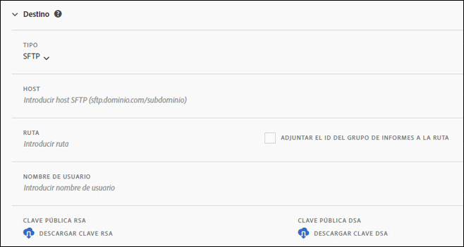
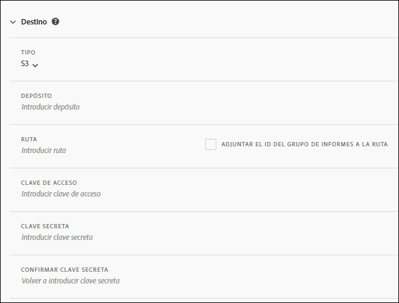
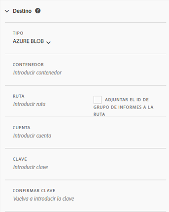

# Destino de la fuente

La sección Destino de la fuente define cómo se distribuye la fuente.

Hay cuatro canales de distribución:

* FTP
* SFTP
* Amazon S3
* Azure Blob

## FTP {#section_D2B521C49BDE4F91A1999FE222CF306F}

Los datos de las fuentes de datos se pueden entregar en una ubicación de Adobe o de FTP alojado por el cliente.

Si selecciona que los datos se carguen a su servidor FTP, asegúrese de proporcionar a Adobe el nombre de usuario, la contraseña y la ruta de carga correspondientes. Es responsabilidad suya implementar su propio proceso de gestión del espacio en disco en el servidor, ya que Adobe no elimina ningún dato del servidor.

## SFTP {#section_8D9215E441474D2BBC56228C2BC926E5}

Los datos de las fuentes de datos se pueden entregar en una ubicación de Adobe o de FTP alojado por el cliente.

Si selecciona que los datos se carguen a su servidor FTP, asegúrese de proporcionar a Adobe el nombre de usuario y la ruta de carga correspondientes.

<!-- 

Adobe Customer Care will provide you with a Public key. Verify in recording.

 -->

Es responsabilidad suya implementar su propio proceso de gestión del espacio en disco en el servidor, ya que Adobe no elimina ningún dato del servidor.

## Amazon S3 {#section_4191CD7B8D3F419EB850B286B542C14A}

Puede cargar sus archivos en un depósito Amazon S3. Amazon cifra automáticamente los datos almacenados (en los servidores de Amazon). Cuando se descarguen los datos, estos se descifrarán automáticamente.

Si selecciona cargar los datos mediante Amazon S3, debe proporcionar un nombre de depósito, un ID de clave de acceso, una clave secreta y un nombre de carpeta.

Las fuentes de datos se comunican con las 11 regiones estándar de AWS enumeradas a continuación mediante el algoritmo de firma pertinente, según sea necesario:

* us-east-1
* us-west-1
* us-west-2
* ap-south-1
* ap-northeast-2
* ap-southeast-1
* ap-southeast-2
* ap-northeast-1
* eu-central-1
* eu-west-1
* sa-east-1

Actualmente no trabajamos con Pekín como región de AWS en China (cn-north-1).

## Azure Blob {#section_1E9F1D0E7EAB4189A5D748FCA57D63D1}

Puede cargar sus archivos a un Azure Blob.

## Campos {#section_AD54B41BC7C945DC85F5FB8FCD4A4792}

La siguiente tabla incluye las opciones de todos los canales de distribución. La disponibilidad de estas opciones depende del canal de distribución seleccionado.

<table id="table_F743C620C82349D9943A13B99EA312BA"> 
 <thead> 
  <tr> 
   <th colname="col1" class="entry"> Campo </th> 
   <th colname="col2" class="entry"> Descripción </th> 
  </tr> 
 </thead>
 <tbody> 
  <tr> 
   <td colname="col1"> 
Clave de acceso 
 </td> 
   <td colname="col2"> 
Introduzca la clave de acceso de Amazon S3. 
 </td> 
  </tr> 
  <tr> 
   <td colname="col1"> 
Cubo 
 </td> 
   <td colname="col2"> 
Introduzca la ubicación del cubo de Amazon S3. 
 
Este valor debe coincidir con el formato utilizado para los depósitos S3 (See <a href="https://docs.aws.amazon.com/awscloudtrail/latest/userguide/cloudtrail-s3-bucket-naming-requirements.html" format="html" scope="external"> https://docs.aws.amazon.com/awscloudtrail/latest/userguide/cloudtrail-s3-bucket-naming-requirements.html</a>.) 
 
 
Nota: Consulte <a href="../../../export/analytics-data-feed/feed-troubleshooting.md#section_6797EBBB7E6D44D4B00C7AEDF4C2EE1D" format="dita" scope="local">Ajuste BucketOwnerFullControl para fuentes de datos de Amazon S3</a> más adelante para obtener información detallada sobre la configuración de Amazon S3. 
 
 </td> 
  </tr> 
  <tr> 
   <td colname="col1"> 
Contenedor 
 </td> 
   <td colname="col2"> 
Introduzca el nombre del contenedor del Azure Blob. 
 </td> 
  </tr> 
  <tr> 
   <td colname="col1"> 
 Host 
 </td> 
   <td colname="col2"> 
Especifique la ubicación del host de FTP o SFTP. 
 
Este valor debe especificarse con el formato adecuado para ftp/sftp, <code>ftp.dominio.com/subdominio</code> o <code>sftp.dominio.com/subdominio</code>. 
 
 Los puertos estándar 21 y 22 son necesarios para FTP y SFTP. 
 </td> 
  </tr> 
  <tr> 
   <td colname="col1"> 
Contraseña 
 
Confirmar contraseña 
 </td> 
   <td colname="col2"> 
Especifique la contraseña de FTP y vuelva a introducirla para confirmarla. 
 </td> 
  </tr> 
  <tr> 
   <td colname="col1"> 
Ruta 
 </td> 
   <td colname="col2"> 
Seleccione la ruta del host o del depósito. Esta ruta debe existir antes de crear la fuente. 
 
 
Nota: Consulte <a href="../../../export/analytics-data-feed/feed-troubleshooting.md#section_6797EBBB7E6D44D4B00C7AEDF4C2EE1D" format="dita" scope="local">Ajuste BucketOwnerFullControl para fuentes de datos de Amazon S3</a> más adelante para obtener información detallada sobre la configuración de Amazon S3. 
 
 </td> 
  </tr> 
  <tr> 
   <td colname="col1"> 
Cuenta 
 </td> 
   <td colname="col2"> 
 Introduzca la cuenta de almacenamiento de Azure. 
 </td> 
  </tr> 
  <tr> 
   <td colname="col1"> 
Clave pública 
 </td> 
   <td colname="col2"> 
Facilite la clave pública de SFTP. 
 
Debe descargar la clave pública para configurar el repositorio de SFTP. 
 
 
Nota: No es necesario descargar la clave pública para crear la fuente. 
 
 
Puede utilizar una clave pública que ya se haya descargado al crear una fuente anterior. 
 
Para obtener más información, consulte <a href="https://marketing.adobe.com/resources/help/en_US/whitepapers/ftp/ftp_sftp_dw.html" format="html" scope="external">https://marketing.adobe.com/resources/help/es_ES/whitepapers/ftp/ftp_sftp_dw.html</a>. 
 </td> 
  </tr> 
  <tr> 
   <td colname="col1"> 
Clave 
 
Confirmación de la clave 
 </td> 
   <td colname="col2"> 
 Introduzca la clave de acceso al almacenamiento. Vuelva a introducirla para confirmar. 
 
 
Nota: Consulte <a href="https://docs.microsoft.com/en-us/azure/storage/common/storage-create-storage-account#view-and-copy-storage-access-keys" format="https" scope="external">https://docs.microsoft.com/es-es/azure/storage/common/storage-create-storage-account#view-and-copy-storage-access-keys</a> para más información sobre cómo obtener las claves de acceso. 
 
 </td> 
  </tr> 
  <tr> 
   <td colname="col1"> 
Clave secreta 
 
Confirmar clave secreta 
 </td> 
   <td colname="col2"> 
Introduzca la clave secreta de Amazon S3. y vuelva a introducirla para confirmarla. 
 </td> 
  </tr> 
  <tr> 
   <td colname="col1"> 
Tipo 
 </td> 
   <td colname="col2"> 
Seleccione el tipo de destino. 
 
 
     <ul id="ul_B893EEDA73A34DE0AEB8570BE9027F21"> 
      <li id="li_325546FCEB404C50AA6829573CCA340B">FTP (predeterminado) </li> 
      <li id="li_6A2C03115903484797485D073A610607">AmazonS3 </li> 
      <li id="li_C24540F6FCD24702B7693A515CEBE977">SFTP </li> 
      <li id="li_8E03CA78E7FE427C9F6F8B112BC76266">Azure Blob </li> 
     </ul> 
 
Después de seleccionar el tipo de destino, la lista de campos cambia para reflejar las opciones disponibles para el destino seleccionado. 
 </td> 
  </tr> 
  <tr> 
   <td colname="col1"> 
Nombre de usuario 
 </td> 
   <td colname="col2"> 
Introduzca el nombre de usuario de FTP. 
 </td> 
  </tr> 
 </tbody> 
</table>

