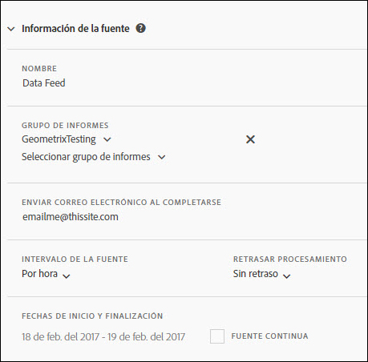

# Información de la fuente

Utilice la sección Información de la fuente para asignar un nombre a la fuente, especificar el grupo de informes que debe generarse con esta, determinar su recurrencia y especificar cuándo empieza y finaliza.

<table id="table_C98C7C3CE4194BEF819E792793EBC517">
 <thead>
  <tr>
   <th colname="col1" class="entry"> Campo </th>
   <th colname="col2" class="entry"> Descripción </th>
  </tr>
 </thead>
 <tbody> 
  <tr> 
   <td colname="col1"> 
Nombre (requerido) 
 </td>
   <td colname="col2"> 
Introduzca un nombre para la fuente. 
 
Debe ser único dentro del grupo de informes seleccionado y puede tener hasta 255 caracteres de longitud. 
 </td>
  </tr>
  <tr>
   <td colname="col1"> 
Conjunto de informes (requerido) 
 </td>
   <td colname="col2"> 
Especifique los grupos de informes correspondientes a la consulta de la fuente. 
 
Debe seleccionar al menos un grupo de informes y no se puede incluir el mismo grupo dos veces. 
 
Están disponibles todos los grupos de informes no virtuales disponibles para el usuario que ha iniciado sesión. 
</td>
  </tr>
  <tr>
   <td colname="col1"> 
Enviar correo electrónico al completarse (requerido) 
 </td>
   <td colname="col2"> 
Especifique el destinatario del correo electrónico que recibirá las actualizaciones de entrega de la fuente. 
 
Este campo no puede quedar vacío y debe incluir una dirección de correo electrónico con el formato correcto. 
 </td>
  </tr>
  <tr>
   <td colname="col1"> 
Intervalo de la fuente (requerido) 
 </td>
   <td colname="col2"> 
Especifique la periodicidad de la programación. 
 
Nota: Debido al tamaño potencial de los archivos comprimidos de fuentes de datos, compruebe que su proceso de ETL utiliza un programa de compresión de 64 bits. 
 </td>
  </tr>
  <tr>
   <td colname="col1"> 
Retrasar procesamiento (opcional) 
 </td>
   <td colname="col2"> 
Especifique el retraso que se aplicará a cada instancia de programación. 
 </td>
  </tr>
  <tr>
   <td colname="col1"> 
Fecha de inicio y finalización (requerido) 
 
Fuente continua (opcional) 
 </td>
   <td colname="col2"> 
Defina las fechas de inicio y finalización de la fuente. 
 

     <ul id="ul_509977336CD34032924B48E043E8CBC7">
      <li id="li_BFB5B6ADCB184D839C9BA42DB3DCAF32">Fecha de inicio: el valor predeterminado es la fecha actual </li>
      <li id="li_34F8DB45D9B54076840D1A0B782812D3">Fecha de finalización: el valor predeterminado es la fecha del día siguiente </li>
     </ul>
     
 </td>
  </tr>
 </tbody>
</table>