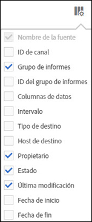

# Ordenar columnas

Puede definir qué columnas están disponibles y ordenarlas según sus necesidades.

1. To determine which columns are visible, click the **[!UICONTROL Columns Configuration]** button.

   

1. Para ordenar una columna, haga clic en el encabezado de columna.

   Las columnas alfabéticas se ordenan en orden alfabético. Haga clic en el encabezado para ordenarlas en orden alfabético inverso.

   Las columnas numéricas se ordenan en orden numérico. Haga clic en el encabezado para ordenarlas de menor a mayor o de mayor a menor.
