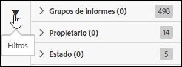

# Buscar y filtrar

La búsqueda y el filtrado le ayudan a localizar una fuente en la lista.

1. Haga clic en el icono de filtro o pase el ratón por encima para ver las opciones de filtrado.

   

   Hay tres opciones de filtrado:

   * Grupo de informes
   * Propietario
   * Estado

1. Introduzca un término de búsqueda para buscar en la lista de fuentes.

   

Puede combinar las funciones de filtrado y búsqueda para encontrar sus fuentes. Al combinar filtros, deben separarse con el operador AND.
