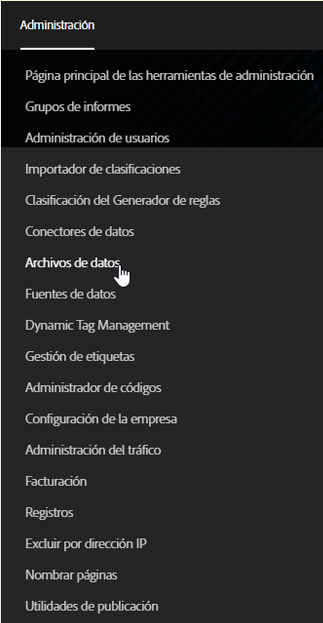
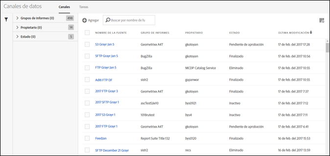

# Abrir la interfaz de fuente de datos

Se puede acceder a la interfaz de usuario de Fuente de datos desde la ficha Administración.

1. Abrir la ficha Administrador.
1. Select **[!UICONTROL Data Feeds]**.

   

La página de destino de fuente de datos incluye todas las fuentes que se hayan definido para su empresa, para todos los grupos de informes a los que pueda acceder el usuario administrador.

Si no se han definido fuentes, la página mostrará el botón **[!UICONTROL Crear nueva fuente de datos].**

To view your [jobs](../../../export/analytics-data-feed/c-data-feed-actions/t-feed-job-history.md#task_0D05F2D1B41B4E4A95B570DC78014480), click **[!UICONTROL Jobs]**. Para volver a la vista de fuentes, haga clic en **[!UICONTROL Fuentes]**.