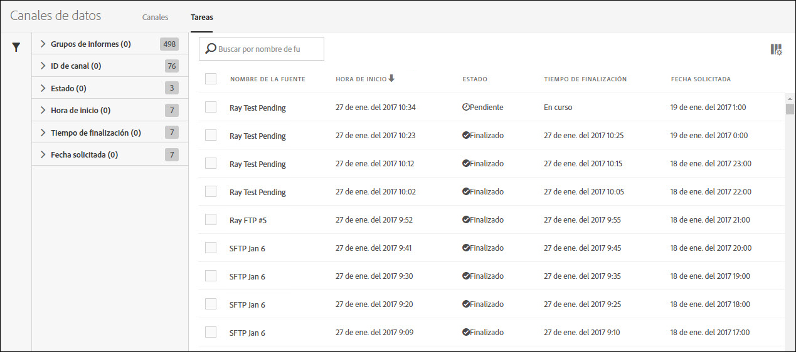
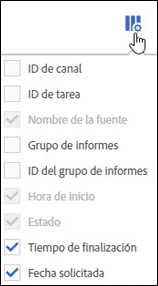

# Trabajos de fuente de datos: información general

Utilice la ficha Trabajos para ver los historiales de trabajos y administrarlos.

La lista Trabajos proporciona información sobre el estado de un trabajo e indica cuándo empieza y cuándo finaliza, cuánto ha tardado en ejecutarse, etc.

Haga clic en los encabezados de columna para seleccionar el orden en el que se muestran los trabajos.

Para definir la información que quiere ver en la lista Trabajos, haga clic en el icono de configuración y seleccione los nombres de columna deseados.

Nombre de la fuente, Hora de inicio y Estado son columnas obligatorias que no pueden eliminarse de la lista Trabajos.

| Columna | Descripción |
|---|---|
| ID de fuente | Identificador único de la fuente. |
| ID de trabajo | Identificador único del trabajo. |
| Nombre de la fuente | Nombre que se asigna a la fuente. |
| Hora de inicio | Hora de inicio del trabajo según su zona horaria. |
| Tiempo de ejecución | El tiempo necesario para que se ejecute el trabajo. Se indica como dd hh:mm:ss. |
| Estado | El estado [actual](../../../export/analytics-data-feed/c-df-jobs/r-job-status.md#reference_7A39A327F643447F9B5AE3A2502C72BA) del trabajo. |
| Tiempo de finalización | La hora a la que el trabajo ha finalizado su ejecución. Se indica según su zona horaria. |
| Fecha solicitada | Marca de fecha de los datos incluidos en el trabajo. |

