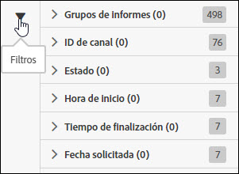

# Lista de trabajos de filtro

Las funciones de búsqueda y filtrado le permiten encontrar el trabajo que busca en la lista.

1. Haga clic en el icono de filtro o pase el ratón por encima para ver las opciones de filtrado.

   

   Hay varias opciones de filtrado:

   * Grupo de informes
   * ID de fuente
   * Estado
   * Hora de inicio
   * Tiempo de finalización
   * Fecha solicitada

1. Introduzca un término de búsqueda para buscar en la lista Trabajos.

   

Puede combinar las funciones de filtrado y búsqueda para encontrar sus trabajos. Cuando se utilizan varios filtros y términos de búsqueda, deben separarse con el operador AND.
