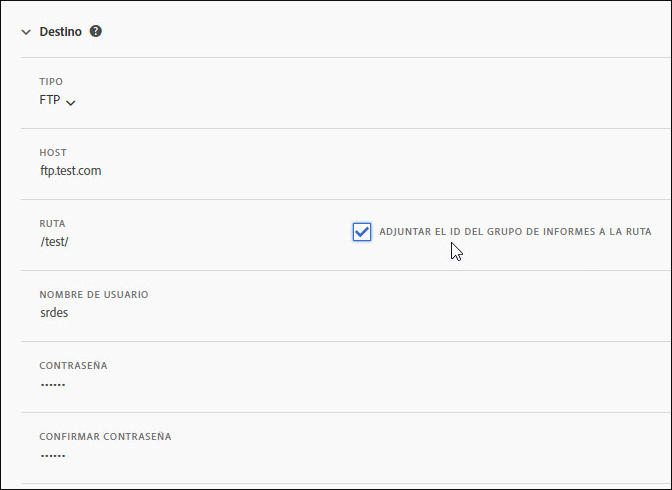
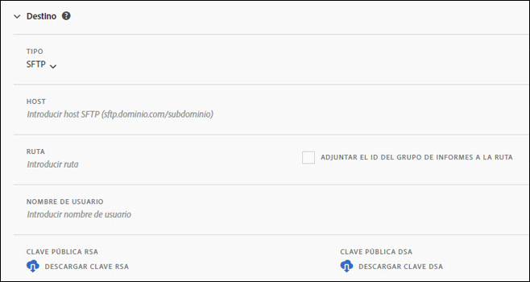
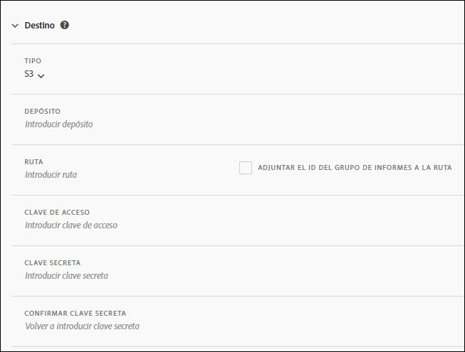
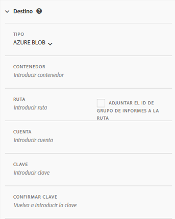

# Creación o edición de una fuente de datos

La creación de una fuente de datos permite a Adobe saber dónde enviar archivos de datos sin procesar y qué desea incluir en cada archivo. En esta página se muestra una lista de las opciones individuales que puede personalizar al crear una fuente de datos.

Antes de leer esta página se recomienda conocer las fuentes de datos de forma básica. Consulte [Información general sobre las fuentes de datos](data-feed-overview.md) para asegurarse de que cumple los requisitos para crear una fuente de datos.

## Campos de Información de fuente

* **Nombre**: nombre de la fuente de datos. Debe ser único dentro del grupo de informes seleccionado y puede tener hasta 255 caracteres de longitud.
* **Grupo de informes:** grupo de informes en el que se basa la fuente de datos. Si se crean varias fuentes de datos para el mismo grupo de informes, deben tener definiciones de columnas diferentes. Solo los grupos de informes de origen admiten fuentes de datos, no se admiten los grupos de informes virtuales.
* **Enviar un mensaje de correo electrónico cuando se complete**: la dirección de correo electrónico que se notificará cuando una fuente termine de procesarse. La dirección de correo electrónico debe tener el formato correcto.
* **Intervalo de fuente**: las fuentes por hora contienen datos de una sola hora. Las fuentes diarias contienen datos de un día completo; incluyen datos de la medianoche a la medianoche en el huso horario del grupo de informes.
* **Retrasar procesamiento**: espere un tiempo determinado antes de procesar un archivo de fuente de datos. Un retraso puede resultar útil para ofrecer a las implementaciones móviles la oportunidad de que los dispositivos sin conexión se conecten y envíen datos. También se puede utilizar para dar cabida a los procesos del lado del servidor de su organización en la administración de archivos procesados anteriormente. En la mayoría de los casos, no es necesario un retraso. Una fuente se puede retrasar hasta 120 minutos.
* **Fechas de inicio y finalización**: la fecha de inicio indica la primera fecha en la que desea una fuente de datos. Establezca esta fecha en el pasado para comenzar inmediatamente a procesar fuentes de datos para datos históricos. Las fuentes continúan procesando hasta que llegan a la fecha de finalización. Las fechas de inicio y finalización se basan en la zona horaria del grupo de informes.
* **Fuente continua**: esta casilla elimina la fecha de finalización, lo que permite que una fuente se ejecute indefinidamente. Cuando una fuente termina de procesar datos históricos, la fuente espera a que los datos terminen de recopilar durante una hora o un día determinados. Una vez finalizada la hora o el día actuales, el procesamiento comienza después del retraso especificado.

## Campos de destino

Los campos disponibles en los campos de destino dependen del tipo de destino.

### FTP

Los datos de las fuentes de datos se pueden entregar en una ubicación de Adobe o de FTP alojado por el cliente. Se necesita un host FTP, un nombre de usuario y una contraseña. Utilice el campo de ruta para colocar los archivos de fuente en una carpeta. Las carpetas ya deben existir, las fuentes generan un error si la ruta de acceso especificada no existe.



### SFTP

La compatibilidad con SFTP para fuentes de datos está disponible. Se necesita un host SFTP, un nombre de usuario y el sitio de destino para contener una clave pública RSA o DSA válida. Puede descargar la clave pública adecuada al crear la fuente.



### S3

Puede enviar fuentes directamente a los bloques de Amazon S3. Este tipo de destino requiere un nombre de bloque, un ID de clave de acceso y una clave secreta. Consulte los [requisitos de nomenclatura de bloque de Amazon S3](https://docs.aws.amazon.com/es_es/awscloudtrail/latest/userguide/cloudtrail-s3-bucket-naming-requirements.html) en los documentos de Amazon S3 para obtener más información.



El usuario que proporcione para cargar fuentes de datos debe tener los siguientes [permisos](https://docs.aws.amazon.com/AmazonS3/latest/API/API_Operations_Amazon_Simple_Storage_Service.html):

* s3:GetObject
* s3:PutObject
* s3:PutObjectAcl

   >[!NOTE]
   >
   >Para cada carga en un bloque de Amazon S3, [!DNL Analytics] agrega el propietario del bloque a la ACL BucketOwnerFullControl, independientemente de si el bloque tiene o no una directiva que la requiera. Para obtener más información, consulte &quot;[¿Cuál es la configuración de BucketOwnerFullControl para las fuentes de datos de Amazon S3?](df-faq.md#BucketOwnerFullControl)&quot;

Se admiten las 16 regiones de AWS estándar siguientes (utilizando el algoritmo de firma adecuado cuando sea necesario):

* us-east-2
* us-east-1
* us-west-1
* us-west-2
* ap-south-1
* ap-northeast-2
* ap-southeast-1
* ap-southeast-2
* ap-northeast-1
* ca-central-1
* eu-central-1
* eu-west-1
* eu-west-2
* eu-west-3
* eu-north-1
* sa-east-1

>[!NOTE]
>
>No se admite la región cn-north-1.

### Azure Blob

Las fuentes de datos admiten destinos de Azure Blob. Se necesita un contenedor, una cuenta y una clave. Amazon cifra automáticamente los datos en reposo. Cuando se descarguen los datos, estos se descifrarán automáticamente. Consulte [Creación de una cuenta de almacenamiento](https://docs.microsoft.com/es-es/azure/storage/common/storage-quickstart-create-account?tabs=azure-portal#view-and-copy-storage-access-keys) en los documentos de Microsoft Azure para obtener más información.



>[!NOTE]
>
>Debe implementar su propio proceso para administrar el espacio en disco en el destino de la fuente. Adobe no elimina ningún dato del servidor.

## Definiciones de columnas de datos

Todas las columnas están disponibles, independientemente de si tienen datos. Una fuente de datos debe incluir al menos una columna.

* **Eliminación de caracteres de escape**: al recopilar datos, algunos caracteres (como las líneas nuevas) pueden causar problemas. Marque esta casilla si desea eliminar estos caracteres de los archivos de fuente.
* **Formato de compresión**: tipo de compresión utilizado. Gzip genera archivos en formato `.tar.gz`. El código postal muestra los archivos en formato `.zip`.
* **Tipo de paquete**: un solo archivo genera el archivo `hit_data.tsv` en un único archivo potencialmente masivo. Varios archivos paginan los datos en fragmentos de 2 GB (sin comprimir). Si se seleccionan varios archivos y los datos sin comprimir de la ventana de informes ocupan menos de 2 GB, se envía un solo archivo. Adobe recomienda utilizar varios archivos para la mayoría de las fuentes de datos.
* **Manifiesto**: Si el Adobe debe entregar o no un archivo de  [manifiesto ](c-df-contents/datafeeds-contents.md#feed-manifest) al destino cuando no se recopilan datos para un intervalo de fuente. Si selecciona Archivo de manifiesto, recibirá un archivo de manifiesto similar al siguiente cuando no se recopilen datos:

```text
   Datafeed-Manifest-Version: 1.0
    Lookup-Files: 0
    Data-Files: 0
    Total-Records: 0
```

* **Plantillas de columna**: al crear muchas fuentes de datos, Adobe recomienda crear una plantilla de columna. La selección de una plantilla de columna incluye automáticamente las columnas especificadas en la plantilla. Adobe también proporciona varias plantillas de forma predeterminada.
* **Columnas disponibles**: todas las columnas de datos disponibles en Adobe Analytics. Haga clic en [!UICONTROL Agregar todo] para incluir todas las columnas en una fuente de datos.
* **Columnas incluidas**: columnas que se incluyen en una fuente de datos. Haga clic en [!UICONTROL Eliminar todo] para eliminar todas las columnas de una fuente de datos.
* **Descargar CSV**: descarga un archivo CSV que contiene todas las columnas incluidas.
