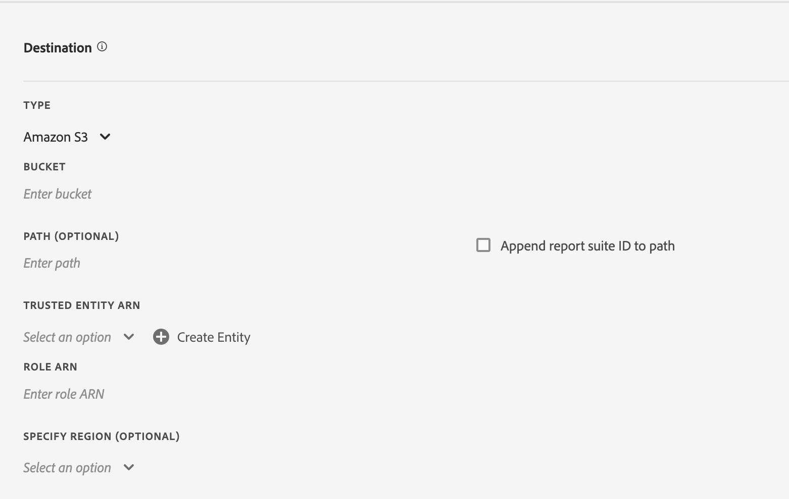
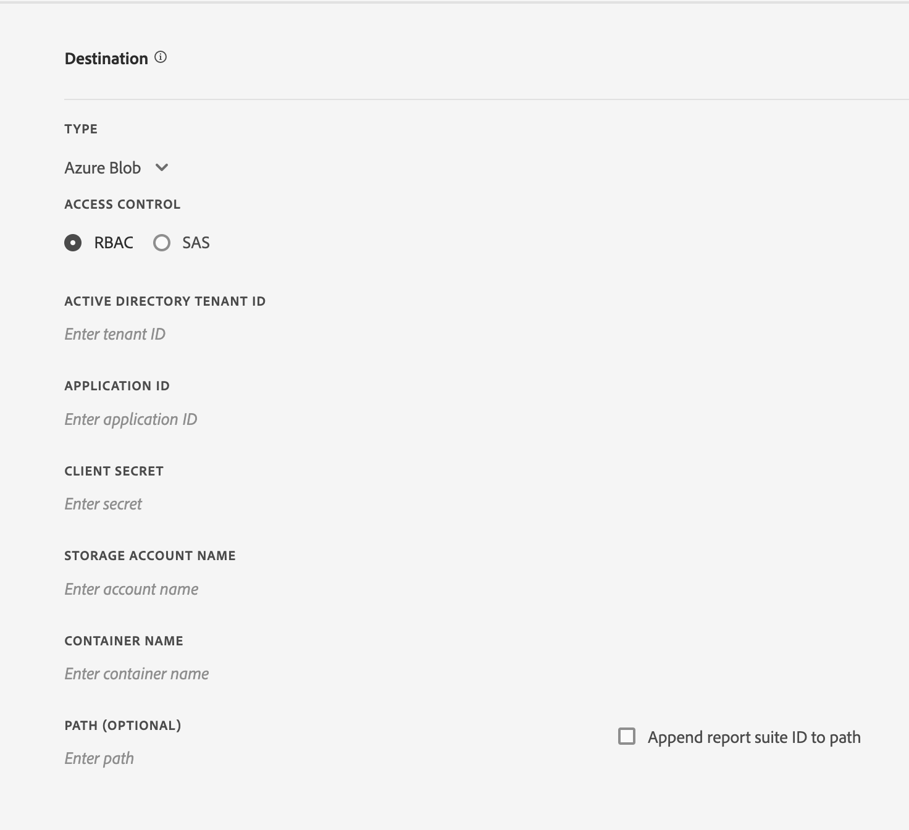

# Creación o edición de una fuente de datos

La creación de una fuente de datos permite a Adobe saber dónde enviar archivos de datos sin procesar y qué desea incluir en cada archivo. En esta página se muestra una lista de las opciones individuales que puede personalizar al crear una fuente de datos.

Antes de leer esta página se recomienda conocer las fuentes de datos de forma básica. Consulte [Información general sobre las fuentes de datos](data-feed-overview.md) para asegurarse de que cumple los requisitos para crear una fuente de datos.

## Campos de Información de fuente

* **Nombre**: nombre de la fuente de datos. Debe ser único dentro del grupo de informes seleccionado y puede tener hasta 255 caracteres de longitud.
* **Grupo de informes:** grupo de informes en el que se basa la fuente de datos. Si se crean varias fuentes de datos para el mismo grupo de informes, deben tener definiciones de columnas diferentes. Solo los grupos de informes de origen admiten fuentes de datos, no se admiten los grupos de informes virtuales.
* **Enviar un mensaje de correo electrónico cuando se complete**: la dirección de correo electrónico que se notificará cuando una fuente termine de procesarse. La dirección de correo electrónico debe tener el formato correcto.
* **Intervalo de fuente**: las fuentes por hora contienen datos de una sola hora. Las fuentes diarias contienen datos de un día completo, con datos de la medianoche a la medianoche en el huso horario del grupo de informes.
* **Retrasar procesamiento**: espere un tiempo determinado antes de procesar un archivo de fuente de datos. Un retraso puede resultar útil para ofrecer a las implementaciones móviles la oportunidad de que los dispositivos sin conexión se conecten y envíen datos. También se puede utilizar para dar cabida a los procesos del lado del servidor de su organización en la administración de archivos procesados anteriormente. En la mayoría de los casos, no es necesario un retraso. Una fuente se puede retrasar hasta 120 minutos.
* **Fechas de inicio y finalización**: la fecha de inicio indica la primera fecha en la que desea una fuente de datos. Establezca esta fecha en el pasado para comenzar inmediatamente a procesar fuentes de datos para datos históricos. Las fuentes continúan procesando hasta que llegan a la fecha de finalización. Las fechas de inicio y finalización se basan en el huso horario del grupo de informes.
* **Fuente continua**: esta casilla elimina la fecha de finalización, lo que permite que una fuente se ejecute indefinidamente. Cuando una fuente termina de procesar datos históricos, la fuente espera a que los datos terminen de recopilar durante una hora o un día determinados. Una vez finalizada la hora o el día actuales, el procesamiento comienza después del retraso especificado.

## Campo de destino

Los campos disponibles en los campos de destino dependen del tipo de destino.

### Google Cloud Platform

Acceda a los bloques de almacenamiento GCP como destino seguro

**Campos**
* *Tipo:* Tipo de destino de Google Cloud Platform
* *ID del proyecto:* ID del proyecto GCP donde existe el espacio de almacenamiento
* *Nombre del depósito de almacenamiento:* Los nombres de bloque sin puntos están limitados a entre 3 y 63 caracteres. Los nombres que contienen puntos pueden contener hasta 222 caracteres, pero cada componente separado por puntos no puede tener más de 63 caracteres.
* *Ruta (opcional):* &amp; *Anexar ID del grupo de informes a la ruta:* Ubicación de los recursos que se van a recuperar o almacenar


**Proceso de creación de cuentas de servicio**

Se requerirá que el usuario cree una cuenta de servicio para que el destino de Google Cloud Platform esté seleccionado.

Solo se permitirá una cuenta de servicio GCP por organización de análisis. Una vez creada la cuenta de servicio para la fuente de datos, todas las fuentes de datos adicionales dentro de la organización se rellenarán previamente con la cuenta de servicio.


### Amazon S3

Almacenamiento de bloques de Amazon S3 al que se accede mediante el rol de IAM dentro de una entidad de confianza.

**Campos**

* *Tipo:* Tipo de destino de Amazon S3
* *Cubo:* S3 bucket name
* *ARN de entidad de confianza:* ARN de entidad de AWS IAM `arn:aws:iam::<12 digit account number>:user/<username>`
* *ARN de funciones:* ARN de funciones de AWS IAM `arn:aws:iam::<12 digit account number>:role/<role name>`
* *Ruta (opcional):* &amp; *Anexar ID del grupo de informes a la ruta:* Ubicación de los recursos que se van a recuperar o almacenar
* *Especificar región (opcional):* Lista desplegable de todas las regiones de AWS disponibles, incluidas las regiones CN




**Creación y selección de una entidad de confianza**

El usuario puede seleccionar una entidad de confianza entre las opciones que se enumeran en la lista desplegable o crear y recuperar una nueva haciendo clic en el botón `Create Entity` botón.

Después de hacer clic en el botón `Create Entity` , el usuario se redirigirá a un proceso de autenticación. Una vez que el usuario se autentica, la entidad de confianza se crea y se agrega a las opciones de la lista desplegable.

La lista desplegable enumera todas las entidades de confianza que este usuario creó en la organización.


Puede enviar fuentes directamente a los bloques de Amazon S3 mediante el método heredado. Consulte los [requisitos de nomenclatura de contenedor de Amazon S3](https://docs.aws.amazon.com/es_es/awscloudtrail/latest/userguide/cloudtrail-s3-bucket-naming-requirements.html) en los documentos de Amazon S3 para obtener más información.

**Campos: obsoletos**

* *Tipo:* Tipo de destino del método S3 obsoleto
* *Cubo:* Amazon S3 Bucket name
* *Ruta (opcional):* &amp; *Anexar ID del grupo de informes a la ruta:* Ubicación de los recursos que se van a recuperar o almacenar
* *Clave de acceso:* Acceso al ID de clave del usuario de AWS
* *Clave secreta:* Clave secreta del usuario de AWS
* *Confirmar clave secreta:* Vuelva a introducir la clave secreta del usuario de AWS


El usuario que proporcione para cargar fuentes de datos debe tener los siguientes [permisos](https://docs.aws.amazon.com/es_es/AmazonS3/latest/API/API_Operations_Amazon_Simple_Storage_Service.html):

* s3:GetObject
* s3:PutObject
* s3:PutObjectAcl

Para cada carga en un contenedor de Amazon S3, [!DNL Analytics] añade el propietario del contenedor a la ACL BucketOwnerFullControl, independientemente de si el bloque tiene o no una directiva que la requiera. Para obtener más información, consulte “[¿Cuál es la configuración de BucketOwnerFullControl para las fuentes de datos de Amazon S3?](df-faq.md#BucketOwnerFullControl)”

**Regiones de AWS compatibles**:
* us-east-2
* us-east-1
* us-west-1
* us-west-2
* ap-south-1
* ap-northeast-2
* ap-southeast-1
* ap-southeast-2
* ap-northeast-1
* ca-central-1
* eu-central-1
* eu-west-1
* eu-west-2
* eu-west-3
* eu-north-1
* sa-east-1
* cn-north-1
* cn-northwest-1


### Azure Blob

Destino seguro de Azure Blob mediante Control de acceso basado en roles (RBAC) o Firma de acceso compartido (SAS). Al seleccionar el control de acceso, el contenido del panel se actualizará para reflejar los campos correspondientes.

**Campos: RBAC**
* *Tipo:* Tipo de destino de Azure Blob
* *Control de acceso:* Opción para usar RBAC o SAS
* *ID del inquilino de Active Directory:* ID de organización de la cuenta de Azure
* *ID de aplicación:* ID de aplicación del adaptador de Active Directory
* *Secreto del cliente:* Secreto del cliente de Azure
* *Nombre de la cuenta de almacenamiento:* Nombre de la cuenta que contiene objetos de datos
* *Nombre del contenedor:* Contenedor que pertenece a una cuenta de almacenamiento determinada.
* *Ruta (opcional):* &amp; *Anexar ID del grupo de informes a la ruta:* Ubicación de los recursos que se van a recuperar o almacenar



**Campos: SAS**
* *Tipo:* Tipo de destino de Azure Blob
* *Control de acceso:* Opción para usar RBAC o SAS
* *ID del inquilino de Active Directory:* ID de instancia de Azure Active Directory
* *ID de aplicación:* ID de aplicación del adaptador de Active Directory
* *Secreto del cliente:* Secreto del cliente de Azure
* *URI de almacén de claves:* Ubicación de Azure Key Vault
* *Nombre secreto de la caja fuerte de claves:* Nombre secreto para acceder a Key Vault seguro
* *Ruta (opcional):* &amp; *Anexar ID del grupo de informes a la ruta:* Ubicación de los recursos que se van a recuperar o almacenar


**Campos: obsoletos**
* *Tipo:* Tipo de destino de Azure Blob
* *Contenedor:* Nombre del contenedor de Azure
* *Ruta (opcional):* &amp; *Anexar ID del grupo de informes a la ruta:* Ubicación de los recursos que se van a recuperar o almacenar
* *Cuenta:* Secreto de cuenta de Azure
* *URI de almacén de claves:* Ubicación de Azure Key Vault
* *Nombre secreto de la caja fuerte de claves:* Nombre secreto para acceder a Key Vault seguro

Debe implementar su propio proceso para administrar el espacio en disco en el destino de la fuente. Adobe no elimina ningún dato del servidor.
Consulte [Creación de una cuenta de almacenamiento](https://docs.microsoft.com/es-es/azure/storage/common/storage-quickstart-create-account?tabs=azure-portal#view-and-copy-storage-access-keys) en los documentos de Microsoft Azure para obtener más información.


>[!NOTE]
>
>Debe implementar su propio proceso para administrar el espacio en disco en el destino de la fuente. Adobe no elimina ningún dato del servidor.

### FTP: obsoleto

**Campos**
* *Tipo:* Tipo de destino de FTP
* *Host:* Punto final para acceder al host
* *Ruta (opcional):* &amp; *Anexar ID del grupo de informes a la ruta:* Ubicación de los recursos que se van a recuperar o almacenar
* *Nombre de usuario:* Nombre de usuario del host
* *Contraseña:* Contraseña del host
* *Confirmar contraseña:* Vuelva a introducir y compruebe la contraseña del host


### SFTP - Obsoleto

La compatibilidad con SFTP para fuentes de datos está disponible. Se necesita un host SFTP, un nombre de usuario y el sitio de destino para contener una clave pública RSA o DSA válida. Puede descargar la clave pública adecuada al crear la fuente.

**Campos**
* *Tipo:* Tipo de destino de SFTP
* *Host:* Punto final para acceder al host
* *Ruta (opcional):* &amp; *Anexar ID del grupo de informes a la ruta:* Ubicación de los recursos que se van a recuperar o almacenar
* *Clave pública RSA:* o *Clave pública DSA:* Clave pública para acceder al host


## Definiciones de columnas de datos

Todas las columnas están disponibles, independientemente de si tienen datos. Una fuente de datos debe incluir al menos una columna.

* **Eliminación de caracteres de escape**: al recopilar datos, algunos caracteres (como las líneas nuevas) pueden causar problemas. Marque esta casilla si desea eliminar estos caracteres de los archivos de fuente.
* **Formato de compresión**: tipo de compresión utilizado. Gzip genera archivos en formato `.tar.gz`. El código postal muestra los archivos en formato `.zip`.
* **Tipo de paquete**: un solo archivo genera el archivo `hit_data.tsv` en un único archivo potencialmente masivo. Varios archivos paginan los datos en fragmentos de 2 GB (sin comprimir). Si se seleccionan varios archivos y los datos sin comprimir de la ventana de informes ocupan menos de 2 GB, se envía un solo archivo. Adobe recomienda utilizar varios archivos para la mayoría de las fuentes de datos.
* **Manifiesto**: Si Adobe debe entregar o no un archivo de [manifiesto](c-df-contents/datafeeds-contents.md#feed-manifest) al destino cuando no se recopilan datos para un intervalo de fuente. Si selecciona Archivo de manifiesto, recibirá un archivo de manifiesto similar al siguiente cuando no se recopilen datos:

```text
   Datafeed-Manifest-Version: 1.0
    Lookup-Files: 0
    Data-Files: 0
    Total-Records: 0
```

* **Plantillas de columna**: al crear muchas fuentes de datos, Adobe recomienda crear una plantilla de columna. La selección de una plantilla de columna incluye automáticamente las columnas especificadas en la plantilla. Adobe también proporciona varias plantillas de forma predeterminada.
* **Columnas disponibles**: todas las columnas de datos disponibles en Adobe Analytics. Haga clic en [!UICONTROL Agregar todo] para incluir todas las columnas en una fuente de datos.
* **Columnas incluidas**: columnas que se incluyen en una fuente de datos. Haga clic en [!UICONTROL Eliminar todo] para eliminar todas las columnas de una fuente de datos.
* **Descargar CSV**: descarga un archivo CSV que contiene todas las columnas incluidas.
