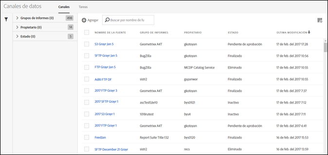
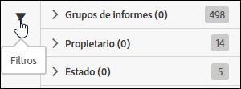
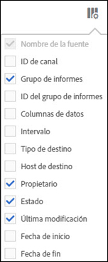

# Administración de fuentes de datos

El administrador de fuentes de datos le permite crear, editar y eliminar fuentes de datos para su organización. Si tiene permisos para acceder al administrador de fuentes de datos, puede administrar las fuentes de datos de todos los grupos de informes visibles para usted.

Para acceder a la administración de fuentes de datos, siga estos pasos:

1. Inicie sesión en [experiencecloud.adobe.com](https://experiencecloud.adobe.com).
2. Haga clic en el menú de 9 cuadrículas en la parte superior derecha y, a continuación, haga clic en [!UICONTROL Analytics].
3. En el menú superior, haga clic en [!UICONTROL Administración] > [!UICONTROL Fuentes de datos].

## Navegación por la interfaz

Al llegar a la página del administrador de fuentes de datos, la interfaz tiene un aspecto similar al siguiente:

Si no se han definido fuentes, la página mostrará el botón [!UICONTROL Crear nueva fuente de datos].

### Filtros y búsqueda

Utilice filtros y busque la fuente exacta que necesite.

En el extremo izquierdo, haga clic en el icono de filtro para mostrar u ocultar las opciones de filtrado. Los filtros están organizados por categoría. Haga clic en el botón de contenido adicional para contraer o expandir las categorías de filtrado. Haga clic en la casilla de verificación para aplicar el filtro.

Utilice la búsqueda para buscar una fuente por el nombre.

### Fuentes y trabajos

Haga clic en la pestaña Trabajos para ver los trabajos individuales que cada una de las fuentes crea. Consulte [Administración de trabajos de fuentes de datos](df-manage-jobs.md).

### Agregar

Cerca de las pestañas de fuentes y trabajos, haga clic en el botón + [!UICONTROL Agregar] para crear una nueva fuente. Consulte [Agregar una fuente](create-feed.md) para obtener más información.

### Columnas

Cada fuente creada muestra varias columnas que proporcionan información al respecto. Haga clic en el encabezado de una columna para ordenarla en orden ascendente. Vuelva a hacer clic en el encabezado de una columna para ordenarla en orden descendente. Si no puede ver una columna específica, haga clic en el icono de columna en la parte superior derecha.

* **Nombre de fuente**: columna requerida. Muestra el nombre de la fuente.
* **ID de fuente**: muestra el ID de fuente, un identificador único.
* **Grupo de informes**: grupo de informes desde el que la fuente hace referencia a los datos.
* **ID del grupo de informes**: el identificador único del grupo de informes.
* **Columnas de datos**: qué columnas de datos están activas para la fuente. En la mayoría de los casos, hay demasiadas columnas para mostrar en este formato.
* **Intervalo**: indicador de si la fuente es por hora o por día.
* **Tipo de destino**: el tipo de destino de la fuente. Por ejemplo: FTP, Amazon S3 o Azure.
* **Host de destino**: ubicación en la que se coloca el archivo. Por ejemplo: `ftp.example.com`.
* **Propietario**: cuenta de usuario que creó la fuente.
* **Estado**: el estado de la fuente.
   * Activa: la fuente se está ejecutando.
   * Aprobación pendiente: en algunas circunstancias, una fuente requiere la aprobación de Adobe para poder empezar a generar trabajos.
   * Eliminada: se elimina la fuente.
   * Completada: la fuente ha finalizado el procesamiento. Una fuente completada puede editarse, pausarse y cancelarse.
   * Pendiente: la fuente se crea pero aún no está activa. Las fuentes permanecen en este estado durante un corto periodo de transición.
   * Inactiva: equivalente a un estado “pausado” o “en espera”. Cuando se reactiva la fuente, se reanuda la entrega de trabajos desde el momento en que se detuvo.
* **Última modificación**: fecha en la que se modificó la fuente por última vez. La fecha y la hora se muestran en la zona horaria del grupo de informes con horario GMT.
* **Fecha de inicio**: la fecha del primer trabajo de esta fuente. La fecha y la hora se muestran en la zona horaria del grupo de informes con horario GMT.
* **Fecha de finalización**: la fecha del último trabajo de esta fuente. Las fuentes de datos en curso no tienen una fecha de finalización.

## Acciones de la fuente de datos

Haga clic en la casilla de verificación situada junto a una fuente de datos para mostrar las acciones disponibles.

* **Historial de trabajos**: muestra todos los trabajos relacionados con estas fuentes de datos. Conduce automáticamente a la [interfaz de administración de trabajos](df-manage-jobs.md).
* **Eliminar**: elimina la fuente de datos y establece su estado en [!UICONTROL Eliminada].
* **Copiar**: conduce a [crear una fuente nueva](create-feed.md) con todos los ajustes de la fuente actual. No puede copiar una fuente de datos si hay más de una seleccionada.
* **Pausar**: detiene el procesamiento de la fuente y establece su estado en [!UICONTROL Inactiva].
* **Activar**: solo disponible para fuentes inactivas. Recopila datos de procesamiento justo donde los dejó y completa las fechas si es necesario.
