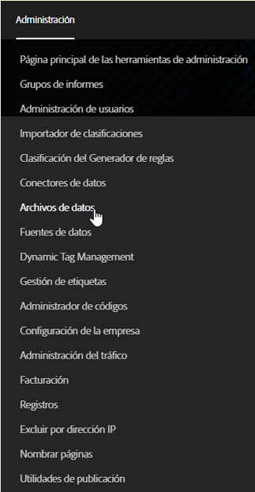
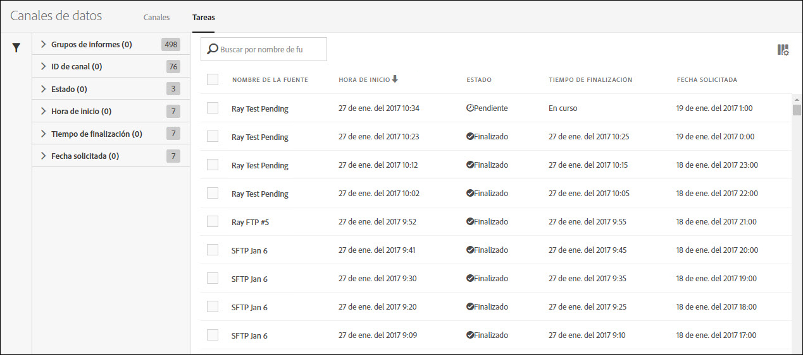
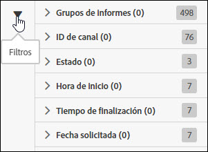
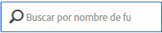
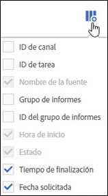

# Administración de trabajos de fuentes de datos

Los trabajos son tareas individuales que generan un archivo comprimido. Se crean y se rigen por fuentes.

Para acceder a la administración de trabajos de fuentes de datos, siga estos pasos:

1. Inicie sesión en [experiencecloud.adobe.com](https://experiencecloud.adobe.com).
2. Haga clic en el menú de 9 cuadrículas en la parte superior derecha y, a continuación, haga clic en [!UICONTROL Analytics].
3. En el menú superior, haga clic en [!UICONTROL Administración] > [!UICONTROL Fuentes de datos].
4. Haga clic en la pestaña Trabajos cerca de la parte superior.

## Navegación por la interfaz

Un trabajo de fuentes de datos es una instancia única en la que Adobe procesa y genera un archivo comprimido para una ventana de informes determinada. El administrador de trabajos proporciona una vista refinada para ver el estado de los trabajos individuales.

### Filtros y búsqueda

Utilice filtros y busque el trabajo exacto que necesite.

En el extremo izquierdo, haga clic en el icono de filtro para mostrar u ocultar las opciones de filtrado. Los filtros están organizados por categoría. Haga clic en el botón de contenido adicional para contraer o expandir las categorías de filtrado. Haga clic en la casilla de verificación para aplicar el filtro.

Utilice la búsqueda para encontrar un trabajo por su nombre.

### Fuentes y trabajos

Haga clic en la pestaña Fuentes para ver las fuentes globales que crean estos trabajos. Consulte [Administración de fuentes de datos](df-manage-feeds.md).

### Columnas

Cada trabajo muestra varias columnas que proporcionan información al respecto. Haga clic en el encabezado de una columna para ordenarla en orden ascendente. Vuelva a hacer clic en el encabezado de una columna para ordenarla en orden descendente. Si no puede ver una columna específica, haga clic en el icono de columna en la parte superior derecha.

* **ID de fuente**: muestra el ID de fuente, un identificador único. Los trabajos creados por la misma fuente tienen el mismo ID de fuente.
* **ID de trabajo**: identificador único del trabajo. Todos los trabajos tienen un ID de trabajo diferente.
* **Nombre de fuente**: columna requerida. Muestra el nombre de la fuente. Los trabajos creados por la misma fuente tienen el mismo nombre de fuente.
* **Grupo de informes**: grupo de informes desde el que el trabajo hace referencia a los datos.
* **ID del grupo de informes**: el identificador único del grupo de informes.
* **Hora de inicio**: hora a la que comenzó el trabajo. La fecha y la hora se muestran en la zona horaria del grupo de informes con horario GMT. Las fuentes diarias suelen comenzar cerca de la medianoche en el huso horario del grupo de informes.
* **Estado**: el estado de la fuente.
   * Esperando datos: el trabajo está en funcionamiento y se están recopilando datos para la ventana de informes.
   * Procesando: el trabajo está creando los archivos de datos y preparándolos para su envío.
   * Finalizado: el trabajo se completó sin problemas.
   * Error: el trabajo no se completó. Consulte [Solucionar problemas de trabajos](jobs-troubleshooting.md) para determinar la causa del error.
   * Esperando exportación: los datos de la ventana de informes aún no se han procesado por completo.
   * Sin datos: no hay datos en el grupo de informes para la ventana de informes solicitada.
* **Hora de finalización**: la hora en que finalizó el trabajo. La fecha y la hora se muestran en la zona horaria del grupo de informes con horario GMT.
* **Fecha solicitada**: ventana de informes del archivo. Las fuentes diarias suelen mostrar 00:00 - 23:59 con un horario GMT, lo que indica un día completo según la zona horaria del grupo de informes. Las fuentes por hora muestran la hora individual para la que se prepara el trabajo.
