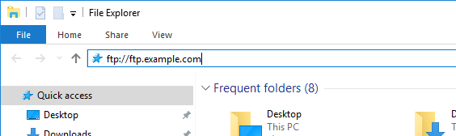

# Solución de problemas de los trabajos

Si tiene problemas para que una fuente de datos aparezca en el sitio FTP, utilice esta página para comprender por qué.

## Códigos de error

Si se produce un error, se notifica en la columna Estado del trabajo.

### Error de chdir de FTP

La fuente no puede desplazarse ni escribir en la carpeta especificada. Asegúrese de que la carpeta de destino existe en el sitio FTP y de que las credenciales proporcionadas tienen los permisos de lectura y escritura correctos en esa carpeta.

### Error de conexión al FTP

La fuente no se puede conectar al destino de FTP. Asegúrese de que el destino FTP sea correcto y válido.

### Error de FTP

Error genérico en el que la fuente no puede escribir el archivo en el sitio FTP. Este error podría deberse a que el disco del servidor FTP esté lleno o a que se haya superado la cuota. El error también se puede originar a partir de un error de red o de servidor de destino.

### Error de inicio de sesión en el FTP

La fuente no puede iniciar sesión con las credenciales proporcionadas. Asegúrese de que el nombre de usuario y la contraseña de FTP son correctos.

### Error Put de FTP

La fuente no puede escribir archivos en el sitio FTP. Asegúrese de que el inicio de sesión en FTP tiene los permisos correctos para leer y escribir datos en el sitio FTP. Este error también puede provenir de un disco completo o de una cuota de disco excedida en el servidor FTP.

## Pasos para solucionar problemas

Inicie sesión en el sitio FTP y cargue cualquier archivo en él. En la mayoría de los casos, puede determinar el punto de error mediante estos pasos.

1. Inicie sesión en el sitio FTP mediante el Explorador de archivos (Windows) o el Finder (Mac). Asegúrese de utilizar el protocolo FTP (`ftp://`). Si no puede acceder al sitio FTP, puede trabajar con el propietario del sitio FTP para determinar el destino correcto.

   

2. Aparece una ventana emergente que solicita un nombre de usuario y una contraseña. Introduzca sus credenciales de autenticación. Si se aceptan las credenciales, la ventana muestra el contenido actual en el sitio FTP. Si no se aceptan las credenciales, puede trabajar con el propietario del FTP para asegurarse de que el nombre de usuario y la contraseña son correctos.
3. Cargue un archivo en el sitio FTP arrastrándolo a la ventana autenticada. Cualquier imagen o documento de texto es adecuado. Si aparece un error al intentar colocar un archivo en el sitio FTP, trabaje con el propietario del FTP para comprobar que hay suficiente espacio en disco y que el nombre de usuario tiene permisos de escritura en el sitio FTP.
4. Una vez que haya confirmado que el archivo se encuentra en el sitio FTP, puede eliminar el archivo cargado en el paso anterior.
5. Si todos los pasos anteriores funcionan y sigue obteniendo un error de FTP, pida a un delegado de asistencia al cliente que se ponga en contacto con el Servicio de atención al cliente.
