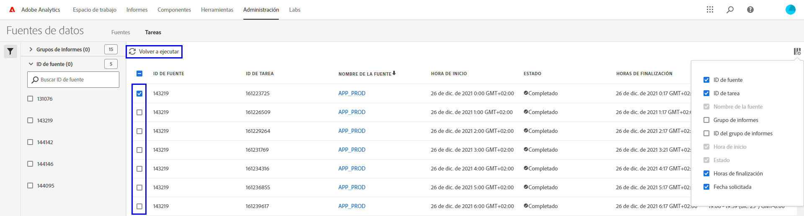

# Solución de problemas de las fuentes de datos

Determine los posibles motivos por los que un trabajo puede no procesarse o entregarse.

## Solución de problemas de una fuente de datos existente

Si tiene una fuente de datos que funcionaba correctamente cada hora o cada día, pero que falla desde hace poco, compruebe cada una de las siguientes opciones:

* Utilice la [herramienta Estado de Adobe](https://status.adobe.com/es/experience_cloud) para determinar si hay alguna ventana de mantenimiento programada o problemas de disponibilidad. Si hay un problema conocido en ese momento, Adobe procesa automáticamente las fuentes de datos programadas una vez restaurado el servicio.
* Asegúrese de que haya suficiente espacio disponible en el sitio FTP. Si el sitio FTP se queda sin espacio en disco, elimine algunos archivos del servidor para dejar espacio a los nuevos archivos.
* Si no hay problemas conocidos y el sitio FTP tiene suficiente espacio en disco, puede volver a enviar la fuente de datos.

   1. Inicie sesión en Adobe Analytics y vaya a **[!UICONTROL Administración]** > **[!UICONTROL Fuentes de datos]**.
   2. Busque las fuentes de datos que desee y, a continuación, haga clic en la casilla de verificación situada junto a cada una de las fuentes que desee volver a ejecutar.
   3. Haga clic en **[!UICONTROL Volver a ejecutar]**.

  

Si sigue sin recibir los archivos de fuente de datos después de volver a ejecutarlos, póngase en contacto con el Servicio de atención al cliente.

## Solución de problemas de una fuente de datos nueva

Si una fuente de datos nueva genera un error, solucione el problema cargando manualmente un archivo de prueba en el sitio FTP. En la mayoría de los casos, puede determinar el punto del error mediante estos pasos.

1. Inicie sesión en el sitio FTP mediante el Explorador de archivos (Windows) o el Finder (Mac). Asegúrese de utilizar el protocolo FTP (`ftp://`) y de permitir que las [direcciones IP de Adobe](/help/technotes/ip-addresses.md) pasen a través del cortafuegos de su organización. Si no puede acceder al sitio FTP, trabaje con el propietario del sitio FTP para determinar el destino correcto.

   

2. Aparece una ventana emergente que solicita un nombre de usuario y una contraseña. Introduzca sus credenciales de autenticación. Si se aceptan las credenciales, la ventana muestra el contenido actual en el sitio FTP. Si no se aceptan las credenciales, puede trabajar con el propietario del FTP para asegurarse de que el nombre de usuario y la contraseña sean correctos. Si utiliza SFTP, asegúrese de seguir cada paso de la sección [Guía de SFTP](../ftp-and-sftp/c-sftp/ftp-sftp.md). Tenga en cuenta que Adobe no es compatible con todos los casos de uso de SFTP.
3. Suba un archivo al sitio FTP arrastrándolo hasta la ventana autenticada. Cualquier imagen o documento de texto es adecuado. Si aparece un error al intentar colocar un archivo en el sitio FTP, trabaje con el propietario del FTP para comprobar que hay suficiente espacio en disco y que el nombre de usuario tiene permisos de escritura.
4. Una vez que haya confirmado que el archivo se encuentra en el sitio FTP, puede eliminar el archivo que ha subido en el paso anterior.

Si todos los pasos anteriores funcionan y sigue experimentando un error de FTP, contacte con el Servicio de atención al cliente.
