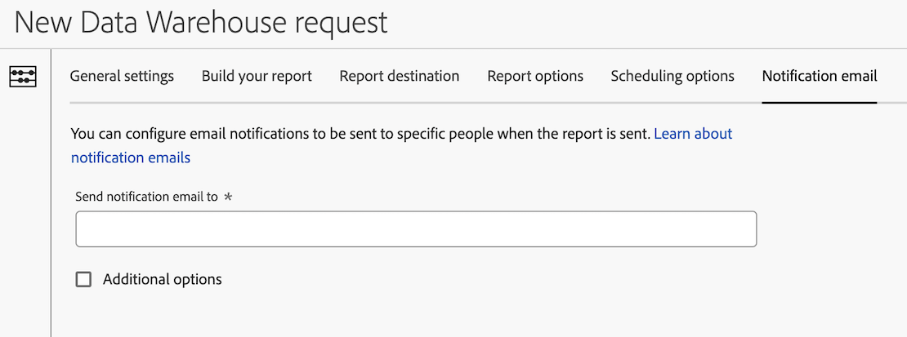

# Configuración de un correo electrónico de notificación para una solicitud de Data Warehouse

Hay varias opciones de configuración disponibles al crear una solicitud de Data Warehouse. La siguiente información describe cómo configurar un correo electrónico de notificación para la solicitud.

Para obtener información sobre cómo empezar a crear una solicitud, así como vínculos a otras opciones de configuración importantes, consulte [Crear una solicitud de Data Warehouse](/help/export/data-warehouse/create-request/t-dw-create-request.md).

Para configurar un mensaje de correo electrónico de notificación para una petición Data Warehouse:

1. Si aún no lo ha hecho, empiece a crear una solicitud en Adobe Analytics seleccionando **[!UICONTROL Herramientas]** > **[!UICONTROL Data Warehouse]** > [!UICONTROL **Añadir**].

   Para obtener más información, consulte [Crear una solicitud de Data Warehouse](/help/export/data-warehouse/create-request/t-dw-create-request.md).

1. En la página Nueva solicitud de Data Warehouse, seleccione la pestaña [!UICONTROL **Correo electrónico de notificación**].

   

1. Complete los campos siguientes:

   | Opción | Función |
   |---------|----------|
   | [!UICONTROL **Enviar correo electrónico de notificación a**] | Especifique las direcciones de correo electrónico de las personas que deben recibir notificaciones por correo electrónico cuando se envíe el informe. 
Puede especificar una sola dirección de correo electrónico o una lista de direcciones de correo electrónico separadas por coma.
 |
   | [!UICONTROL **Opciones avanzadas**] | Seleccione esta opción para incluir un asunto y notas para el correo electrónico cuando se envíe la notificación. |

   {style="table-layout:auto"}

1. Seleccione [!UICONTROL **Guardar solicitud**] para guardar la solicitud de informe de Data Warehouse.

   Ahora puede exportar datos a la cuenta y la ubicación configuradas.
