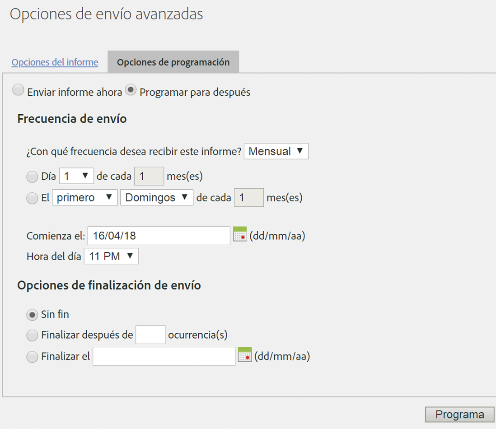

# Programar una solicitud recurrente

## Programar una solicitud recurrente {#topic_8C3CE0CE8A584F80946D24B377CB51BE}

Para programar solicitudes diarias, mensuales o anuales del Data Warehouse, asegúrese de que *Predeterminado* esté correctamente seleccionado.

1. En [!UICONTROL Fecha de informes], seleccione **[!UICONTROL Predeterminado]**.

1. En [!UICONTROL Programar envío], haga clic en **[!UICONTROL Opciones de envío avanzadas]**.

1. Vaya a la pestaña Opciones de programación y seleccione **[!UICONTROL Programar para después]**.
1. Seleccione el valor que desee para [!UICONTROL Frecuencia de envío] y [!UICONTROL Opciones de finalización de envío].

   

1. Haga clic en **[!UICONTROL Programación]**.

