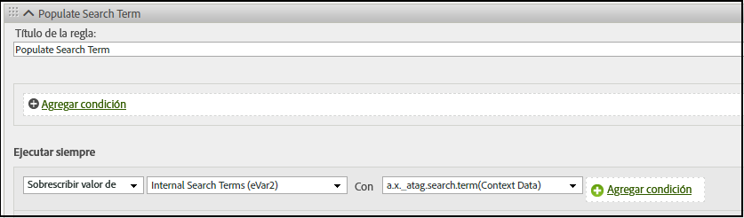

# Asignación de variables de Analytics en Adobe Experience Edge

La tabla siguiente muestra las variables que Adobe Experience Platform Edge Network asigna automáticamente a Adobe Analytics. Si utiliza estas rutas de campo XDM, no es necesaria ninguna configuración adicional para enviar datos a Adobe Analytics.

| Ruta de campo XDM | Dimensión y descripción de Analytics |
| --- | --- |
| `application.id` | Dimensión móvil [ID de la aplicación](https://experienceleague.adobe.com/docs/mobile-services/using/get-started-ug/mobile-metrics/metrics-reference.html#dimensions). |
| `application.isClose` | Ayuda a definir la métrica móvil [Bloqueos](https://experienceleague.adobe.com/docs/mobile-services/using/get-started-ug/mobile-metrics/metrics-reference.html#metrics). |
| `application.closeType` | Determina si un evento de cierre es un bloqueo o no. Los valores válidos incluyen `close` (finaliza la sesión del ciclo vital y se recibió un evento de pausa para la sesión anterior) y `unknown` (Una sesión de ciclo vital termina sin un evento de pausa). |
| `application.isInstall` | Métrica móvil [Instalaciones](https://experienceleague.adobe.com/docs/mobile-services/using/get-started-ug/mobile-metrics/metrics-reference.html#metrics). |
| `application.isLaunch` | Métrica móvil [Lanzamientos](https://experienceleague.adobe.com/docs/mobile-services/using/get-started-ug/mobile-metrics/metrics-reference.html#metrics). |
| `application.name` | Ayuda a establecer la dimensión móvil [ID de la aplicación](https://experienceleague.adobe.com/docs/mobile-services/using/get-started-ug/mobile-metrics/metrics-reference.html#dimensions). |
| `application.launches.value` | Métrica móvil [Lanzamientos](https://experienceleague.adobe.com/docs/mobile-services/using/get-started-ug/mobile-metrics/metrics-reference.html#metrics). |
| `application.isUpgrade` | Métrica móvil [Actualizaciones](https://experienceleague.adobe.com/docs/mobile-services/using/get-started-ug/mobile-metrics/metrics-reference.html#metrics). |
| `application.version` | Ayuda a establecer la dimensión móvil [ID de la aplicación](https://experienceleague.adobe.com/docs/mobile-services/using/get-started-ug/mobile-metrics/metrics-reference.html#dimensions). |
| `application.sessionLength` | Métrica móvil [Duración total de la sesión](https://experienceleague.adobe.com/docs/mobile-services/using/get-started-ug/mobile-metrics/metrics-reference.html#metrics). |
| `commerce.checkouts.id` | Aplica [serialización de eventos](../vars/page-vars/events/event-serialization.md) a [Cierres de compra](../../components/metrics/checkouts.md) métrica. |
| `commerce.checkouts.value` | Aumenta el valor de [Cierres de compra](../../components/metrics/checkouts.md) por la cantidad deseada. |
| `commerce.order.currencyCode` | Establece la variable [currencyCode](../vars/config-vars/currencycode.md) variable de configuración. |
| `commerce.order.purchaseID` | Establece la variable [purchaseID](../vars/page-vars/purchaseid.md) variable de página. |
| `commerce.productListAdds.id` | Aplica [serialización de eventos](../vars/page-vars/events/event-serialization.md) a [Adiciones al carro de compras](../../components/metrics/cart-additions.md) métrica. |
| `commerce.productListAdds.value` | Aumenta el valor de [Adiciones al carro de compras](../../components/metrics/cart-additions.md) por la cantidad deseada. |
| `commerce.productListOpens.id` | Aplica [serialización de eventos](../vars/page-vars/events/event-serialization.md) a [Carros de compras](../../components/metrics/carts.md) métrica. |
| `commerce.productListOpens.value` | Aumenta el valor de [Carros de compras](../../components/metrics/carts.md) por la cantidad deseada. |
| `commerce.productListRemovals.id` | Aplica [serialización de eventos](../vars/page-vars/events/event-serialization.md) a [Eliminaciones del carro de compras](../../components/metrics/cart-removals.md) métrica. |
| `commerce.productListRemovals.value` | Aumenta el valor de [Eliminaciones del carro de compras](../../components/metrics/cart-removals.md) por la cantidad deseada. |
| `commerce.productListViews.id` | Aplica [serialización de eventos](../vars/page-vars/events/event-serialization.md) a [Vistas del carro de compras](../../components/metrics/cart-views.md) métrica. |
| `commerce.productListViews.value` | Aumenta el valor de [Vistas del carro de compras](../../components/metrics/cart-views.md) por la cantidad deseada. |
| `commerce.productViews.id` | Aplica [serialización de eventos](../vars/page-vars/events/event-serialization.md) a [Vistas del producto](../../components/metrics/product-views.md) métrica. |
| `commerce.productViews.value` | Aumenta el valor de [Vistas del producto](../../components/metrics/product-views.md) por la cantidad deseada. |
| `commerce.purchases.value` | Aumenta el valor de [Pedidos](../../components/metrics/orders.md) por la cantidad deseada. |
| `device.manufacturer` | El fabricante del dispositivo móvil. |
| `device.model` | Dimensión móvil [Nombre del dispositivo](https://experienceleague.adobe.com/docs/mobile-services/using/get-started-ug/mobile-metrics/metrics-reference.html#dimensions). |
| `device.modelNumber` | El número de modelo del dispositivo móvil. |
| `device.colorDepth` | Ayuda a establecer la variable [Profundidad de color](../../components/dimensions/color-depth.md) dimensión. |
| `device.screenHeight` | Ayuda a establecer la variable [Resolución del monitor](../../components/dimensions/monitor-resolution.md) dimensión. Asegúrese de definir también el campo XDM `device.screenWidth`. |
| `device.screenWidth` | Ayuda a establecer la variable [Resolución del monitor](../../components/dimensions/monitor-resolution.md) dimensión. Asegúrese de definir también el campo XDM `device.screenHeight`. |
| `device.type` | Tipo de dispositivo móvil. |
| `environment.browserDetails.acceptLanguage` | Ayuda a establecer la variable [Idioma](../../components/dimensions/language.md) dimensión. |
| `environment.browserDetails.cookiesEnabled` | Establece la variable [Compatibilidad con cookies](../../components/dimensions/cookie-support.md) dimensión. Los valores válidos incluyen `Y` (el explorador acepta cookies) y `N` (el explorador rechaza las cookies). |
| `environment.browserDetails.javaEnabled` | Establece la variable [Habilitado para Java](../../components/dimensions/java-enabled.md) dimensión. Los valores válidos incluyen `Y` (Java está habilitado) y `N` (Java está deshabilitado). |
| `environment.browserDetails.userAgent` | Se utiliza como alternativa [visitante único](../../components/metrics/unique-visitors.md) método de identificación. Normalmente se rellena usando la variable `User-Agent` Encabezado de solicitud HTTP. Puede asignar este campo a un eVar si desea utilizarlo en los informes. |
| `environment.browserDetails.viewportHeight` | Establece la variable [Altura del explorador](../../components/dimensions/browser-height.md) dimensión. |
| `environment.browserDetails.viewportWidth` | Establece la variable [Anchura del explorador](../../components/dimensions/browser-width.md) dimensión. |
| `environment.carrier` | Dimensión móvil [Nombre del operador de telefonía móvil](https://experienceleague.adobe.com/docs/mobile-services/using/get-started-ug/mobile-metrics/metrics-reference.html#dimensions). |
| `environment.connectionType` | Ayuda a establecer la variable [Tipo de conexión](../../components/dimensions/connection-type.md) dimensión. |
| `environment.ipV4` | Se utiliza como alternativa [visitante único](../../components/metrics/unique-visitors.md) método de identificación. Normalmente se rellena usando la variable `X-Forwarded-For` Encabezado HTTP. |
| `environment.language` | La configuración regional de la dimensión móvil. |
| `environment.operatingSystem` | Dimensión móvil [Sistema operativo](https://experienceleague.adobe.com/docs/mobile-services/using/get-started-ug/mobile-metrics/metrics-reference.html#dimensions). |
| `environment.operatingSystemVersion` | Dimensión móvil [Versión del sistema operativo](https://experienceleague.adobe.com/docs/mobile-services/using/get-started-ug/mobile-metrics/metrics-reference.html#dimensions). |
| `environment.type` | Indica si el evento provino de un [Wearable](https://experienceleague.adobe.com/docs/mobile-services/android/wearables-android/c-android-wearables--additional-notes.html) dispositivo. Los valores válidos incluyen `Application` (el evento provino de la aplicación), `Extension` (el evento procede de la aplicación Wearable), o `Widget` (el evento provino de un widget móvil). |
| `_experience.analytics.customDimensions.eVars.eVar1` -<br/>`_experience.analytics.customDimensions.eVars.eVar250` | Establece los [eVar](../../components/dimensions/evar.md) dimensión. |
| `_experience.analytics.customDimensions.listProps.prop1.delimiter` -<br/>`_experience.analytics.customDimensions.listProps.prop75.delimiter` | El delimitador utilizado para un [Prop de lista](../vars/page-vars/prop.md#list-props). |
| `_experience.analytics.customDimensions.listProps.prop1.values` -<br/>`_experience.analytics.customDimensions.listProps.prop75.values` | Una matriz de cadenas que contiene el [Prop de lista](../vars/page-vars/prop.md#list-props) valores. |
| `_experience.analytics.customDimensions.lists.list1.list` -<br/>`_experience.analytics.customDimensions.lists.list3.list` | Establece los [Variable de lista](../vars/page-vars/list.md). |
| `_experience.analytics.customDimensions.props.prop1` -<br/>`_experience.analytics.customDimensions.props.prop75` | Establece los [Prop](../../components/dimensions/prop.md) dimensión. |
| `_experience.analytics.event1to100.event1.id` -<br/>`_experience.analytics.event901to1000.event1000.value` | Aplica [serialización de eventos](../vars/page-vars/events/event-serialization.md) a las [Eventos personalizados](../../components/metrics/custom-events.md) métrica. |
| `_experience.analytics.event1to100.event1.value` -<br/>`_experience.analytics.event901to1000.event1000.value` | Incrementa el [Eventos personalizados](../../components/metrics/custom-events.md) por la cantidad deseada. |
| `identityMap.ECID[0].id` | La variable [ID del servicio de identidad de Adobe Experience Cloud](https://experienceleague.adobe.com/docs/id-service/using/home.html?lang=es). |
| `marketing.trackingCode` | Establece la variable [Código de seguimiento](../../components/dimensions/tracking-code.md) dimensión. |
| `media.mediaTimed.completes.value` | La métrica de Media Analytics [Contenido finalizado](https://experienceleague.adobe.com/docs/media-analytics/using/metrics-and-metadata/audio-video-parameters.html#content-complete). |
| `media.mediaTimed.dropBeforeStart.value` | `c.a.media.view`, `c.a.media.timePlayed`, `c.a.media.play` |
| `media.mediaTimed.federated.value` | La métrica de Media Analytics [Datos federados](https://experienceleague.adobe.com/docs/media-analytics/using/metrics-and-metadata/audio-video-parameters.html#federated-data). |
| `media.mediaTimed.firstQuartiles.value` | La métrica de Media Analytics [Marcador de progreso del 25 %](https://experienceleague.adobe.com/docs/media-analytics/using/metrics-and-metadata/audio-video-parameters.html#twenty-five-progress-marker). |
| `media.mediaTimed.mediaSegmentView.value` | La métrica de Media Analytics [Vistas de segmentos de contenido](https://experienceleague.adobe.com/docs/media-analytics/using/metrics-and-metadata/audio-video-parameters.html#content-segment-views). |
| `media.mediaTimed.midpoints.value` | La métrica de Media Analytics [Marcador de progreso del 50 %](https://experienceleague.adobe.com/docs/media-analytics/using/metrics-and-metadata/audio-video-parameters.html#fifty-progress-marker). |
| `media.mediaTimed.pauseTime.value` | La métrica de Media Analytics [Duración total de la pausa](https://experienceleague.adobe.com/docs/media-analytics/using/metrics-and-metadata/audio-video-parameters.html#total-pause-duration). |
| `media.mediaTimed.pauses.value` | La métrica de Media Analytics [Pausar eventos](https://experienceleague.adobe.com/docs/media-analytics/using/metrics-and-metadata/audio-video-parameters.html#pause-events). |
| `media.mediaTimed.primaryAssetReference.`<br/>`@id` | Dimensión de Media Analytics [ID del recurso](https://experienceleague.adobe.com/docs/media-analytics/using/metrics-and-metadata/audio-video-parameters.html#asset-id). |
| `media.mediaTimed.primaryAssetReference.`<br/>`dc:title` | Dimensión de Media Analytics [Nombre del vídeo](https://experienceleague.adobe.com/docs/media-analytics/using/metrics-and-metadata/audio-video-parameters.html#video-name). |
| `media.mediaTimed.primaryAssetReference.`<br/>`iptc4xmpExt:Creator[N].iptc4xmpExt:Name` | Dimensión de Media Analytics [Creador](https://experienceleague.adobe.com/docs/media-analytics/using/metrics-and-metadata/audio-video-parameters.html#originator). |
| `media.mediaTimed.primaryAssetReference.`<br/>`iptc4xmpExt:Episode.iptc4xmpExt:Number` | Dimensión de Media Analytics [Episodio](https://experienceleague.adobe.com/docs/media-analytics/using/metrics-and-metadata/audio-video-parameters.html#episode). |
| `media.mediaTimed.primaryAssetReference.`<br/>`iptc4xmpExt:Genre` | Dimensión de Media Analytics [Género](https://experienceleague.adobe.com/docs/media-analytics/using/metrics-and-metadata/audio-video-parameters.html#genre). |
| `media.mediaTimed.primaryAssetReference.`<br/>`iptc4xmpExt:Rating[N].iptc4xmpExt:RatingValue` | Dimensión de Media Analytics [Clasificación del contenido](https://experienceleague.adobe.com/docs/media-analytics/using/metrics-and-metadata/audio-video-parameters.html#content-rating). |
| `media.mediaTimed.primaryAssetReference.`<br/>`iptc4xmpExt:Season.iptc4xmpExt:Number` | Dimensión de Media Analytics [Temporada](https://experienceleague.adobe.com/docs/media-analytics/using/metrics-and-metadata/audio-video-parameters.html#season). |
| `media.mediaTimed.primaryAssetReference.`<br/>`iptc4xmpExt:Series.iptc4xmpExt:Identifier` | Dimensión de Media Analytics [ID de contenido](https://experienceleague.adobe.com/docs/media-analytics/using/metrics-and-metadata/audio-video-parameters.html#content-id). |
| `media.mediaTimed.primaryAssetReference.`<br/>`iptc4xmpExt:Series.iptc4xmpExt:Name` | Dimensión de Media Analytics [Show](https://experienceleague.adobe.com/docs/media-analytics/using/metrics-and-metadata/audio-video-parameters.html#show). |
| `media.mediaTimed.primaryAssetReference.`<br/>`showType` | Dimensión de Media Analytics [Tipo de programa](https://experienceleague.adobe.com/docs/media-analytics/using/metrics-and-metadata/audio-video-parameters.html#show-type). |
| `media.mediaTimed.primaryAssetReference.`<br/>`xmpDM:duration` | Dimensión de Media Analytics [Duración del vídeo](https://experienceleague.adobe.com/docs/media-analytics/using/metrics-and-metadata/audio-video-parameters.html#video-length). |
| `media.mediaTimed.primaryAssetViewDetails.`<br/>`@id` | Dimensión de Media Analytics [ID de sesión de medio](https://experienceleague.adobe.com/docs/media-analytics/using/metrics-and-metadata/audio-video-parameters.html#media-session-id). |
| `media.mediaTimed.primaryAssetViewDetails.`<br/>`broadcastChannel` | Dimensión de Media Analytics [Canal de contenido](https://experienceleague.adobe.com/docs/media-analytics/using/metrics-and-metadata/audio-video-parameters.html#content-channel). |
| `media.mediaTimed.primaryAssetViewDetails.`<br/>`broadcastContentType` | Dimensión de Media Analytics [Tipo de contenido](https://experienceleague.adobe.com/docs/media-analytics/using/metrics-and-metadata/audio-video-parameters.html#content-type). |
| `media.mediaTimed.primaryAssetViewDetails.`<br/>`broadcastNetwork` | Dimensión de Media Analytics [Red](https://experienceleague.adobe.com/docs/media-analytics/using/metrics-and-metadata/audio-video-parameters.html#network). |
| `media.mediaTimed.primaryAssetViewDetails.`<br/>`mediaSegmentView.value` | Dimensión de Media Analytics [Segmento de contenido](https://experienceleague.adobe.com/docs/media-analytics/using/metrics-and-metadata/audio-video-parameters.html#content-segment). |
| `media.mediaTimed.primaryAssetViewDetails.`<br/>`playerName` | Dimensión de Media Analytics [Nombre del reproductor de contenido](https://experienceleague.adobe.com/docs/media-analytics/using/metrics-and-metadata/audio-video-parameters.html#content-player-name). |
| `media.mediaTimed.primaryAssetViewDetails.`<br/>`playerSDKVersion.version` | Dimensión de Media Analytics [Versión del SDK](https://experienceleague.adobe.com/docs/media-analytics/using/metrics-and-metadata/audio-video-parameters.html#sdk-version). |
| `media.mediaTimed.primaryAssetViewDetails.`<br/>`sourceFeed` | Dimensión de Media Analytics [Tipo de fuente de medios](https://experienceleague.adobe.com/docs/media-analytics/using/metrics-and-metadata/audio-video-parameters.html#media-feed-type). |
| `media.mediaTimed.primaryAssetViewDetails.`<br/>`streamFormat` | Dimensión de Media Analytics [Formato de la emisión](https://experienceleague.adobe.com/docs/media-analytics/using/metrics-and-metadata/audio-video-parameters.html#stream-format). |
| `media.mediaTimed.progress10.value` | La métrica de Media Analytics [Marcador de progreso del 10 %](https://experienceleague.adobe.com/docs/media-analytics/using/metrics-and-metadata/audio-video-parameters.html#ten-progress-marker). |
| `media.mediaTimed.progress95.value` | La métrica de Media Analytics [Marcador de progreso del 95 %](https://experienceleague.adobe.com/docs/media-analytics/using/metrics-and-metadata/audio-video-parameters.html#ninety-five-progress-marker). |
| `media.mediaTimed.resumes.value` | La métrica de Media Analytics [Reanudación de contenido](https://experienceleague.adobe.com/docs/media-analytics/using/metrics-and-metadata/audio-video-parameters.html#content-resumes). |
| `media.mediaTimed.starts.value` | La métrica de Media Analytics [Inicio de contenidos](https://experienceleague.adobe.com/docs/media-analytics/using/metrics-and-metadata/audio-video-parameters.html#media-starts). |
| `media.mediaTimed.thirdQuartiles.value` | La métrica de Media Analytics [Marcador de progreso del 75 %](https://experienceleague.adobe.com/docs/media-analytics/using/metrics-and-metadata/audio-video-parameters.html#seventy-five-progress-marker). |
| `media.mediaTimed.timePlayed.value` | La métrica de Media Analytics [Tiempo invertido en contenido](https://experienceleague.adobe.com/docs/media-analytics/using/metrics-and-metadata/audio-video-parameters.html#content-time-spent). |
| `media.mediaTimed.totalTimePlayed.value` | La métrica de Media Analytics [Tiempo invertido en contenido](https://experienceleague.adobe.com/docs/media-analytics/using/metrics-and-metadata/audio-video-parameters.html#media-time-spent). |
| `placeContext.geo.latitude` | La dimensión móvil Latitud. |
| `placeContext.geo.longitude` | Longitud de la dimensión Móvil. |
| `placeContext.geo.postalCode` | La variable [Código postal](../../components/dimensions/zip-code.md) dimensión. |
| `placeContext.geo.stateProvince` | La variable [Estados Unidos](../../components/dimensions/us-states.md) dimensión. |
| `productListItems[].lineItemId` | La variable [Categoría](../../components/dimensions/category.md) dimensión. |
| `productListItems[].name` | La variable [Product](../../components/dimensions/product.md) dimensión. |
| `productListItems[].priceTotal` | Ayuda a determinar la variable [Ingresos](../../components/metrics/revenue.md) métrica. |
| `productListItems[].quantity` | Ayuda a determinar la variable [Unidades](../../components/metrics/units.md) métrica. |
| `web.webInteraction.URL` | La variable [linkURL](../vars/config-vars/linkurl.md) variable de implementación. |
| `web.webInteraction.name` | La variable [Vínculo personalizado](../../components/dimensions/custom-link.md), [Vínculo de descarga](../../components/dimensions/download-link.md)o [Vínculo de salida](../../components/dimensions/exit-link.md) , según el valor de `web.webInteraction.type` |
| `web.webInteraction.type` | Determina el tipo de vínculo en el que se hizo clic. Los valores válidos incluyen `other` (Vínculos personalizados), `download` (Vínculos de descarga) y `exit` (Vínculos de salida). |
| `web.webPageDetails.URL` | La variable [Dirección URL de la página](../../components/dimensions/page-url.md) dimensión. |
| `web.webPageDetails.errorPage` | Indicador que ayuda a determinar las &quot;Páginas no encontradas&quot; [dimensión](../../components/dimensions/pages-not-found.md) y [métrica](../../components/metrics/pages-not-found.md). |
| `web.webPageDetails.name` | La variable [Página](../../components/dimensions/page.md) dimensión. |
| `web.webPageDetails.server` | La variable [Servidor](../../components/dimensions/server.md) dimensión. |
| `web.webPageDetails.siteSection` | La variable [Sección del sitio](../../components/dimensions/site-section.md) dimensión. |
| `web.webReferrer.URL` | La variable [Referente](../../components/dimensions/referrer.md) dimensión. |

{style=&quot;table-layout:auto&quot;}

<!-- `environment.browserDetails.javaScriptVersion` and `web.webPageDetails.homePage` were included in the original table, but they no longer exist in Analytics. | -->

## Asignación de otros campos XDM a variables de Analytics

Si desea agregar dimensiones o métricas a Adobe Analytics, puede hacerlo mediante [Variables de datos de contexto](../vars/page-vars/contextdata.md). Todos los elementos de campo XDM se envían a Adobe Analytics como datos de contexto con el prefijo `a.x`. A continuación, puede asignar esta variable de datos de contexto a la variable de Analytics deseada mediante [Reglas de procesamiento](../../admin/admin/c-processing-rules/processing-rules.md). Por ejemplo, si envía el siguiente evento:

```js
alloy("event",{
    "xdm":{
        "_atag":{
            "search":{
                "term":"Example search term"
            }
        }
    }
})
```

El SDK web envía esos datos a Adobe Analytics como variable de datos de contexto `a.x._atag.search.term`. A continuación, puede utilizar una regla de procesamiento para asignar el valor de la variable de datos de contexto a la variable de Analytics que desee, como un eVar:


