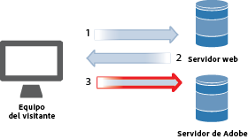
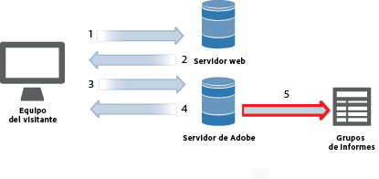

# Recopilación de datos

Conozca cómo las visitas al sitio web se convierten en un informe en Adobe Analytics.

La recopilación de datos de Analytics se consigue realizando una solicitud de imagen especial a los servidores de recopilación de datos de Adobe. En la mayoría de las implementaciones, se coloca código JavaScript en las páginas web de las que se realiza un seguimiento. Cuando una página web etiquetada se carga en el navegador de un visitante, dicho navegador ejecuta nuestro código JavaScript, lo que ejecuta la lógica para capturar la información del visitante y rellenar las etiquetas correctamente. El último paso del procesamiento de JavaScript es una solicitud de imagen a un servidor de datos de Analytics que recopila los datos que se envían y devuelve una pequeña imagen transparente al navegador del visitante.

Puesto que el típico cuello de botella en el procesamiento de navegadores es el tiempo que se tarda en descargar elementos de una página (imágenes, etc.) de servidores web, el tiempo que necesita el navegador para ejecutar el código JavaScript es insignificante. Si embargo, el último paso en el que el navegador del visitante solicita una imagen del servidor de recopilación de datos de Adobe sí que se suma al tiempo total de descarga de la página. El efecto global sobre el tiempo de descarga de la página depende de la proximidad del visitante del sitio web (generalmente en saltos de Internet, no en distancia geográfica) a los servidores de recopilación de datos de Adobe.

Adobe ha creado varios métodos para enviar datos a Analytics. Entre estos métodos está el seguimiento de información en tiempo real desde:

* Aplicaciones capaces de acceder a Internet
* Campañas
* Aplicaciones cliente-servidor
* Correos electrónicos
* Dispositivos móviles
* Quioscos basados en la web
* Sitios web

<!-- 

Need to reconcile with Data Collection topics in the user guide, in this guide, and in reference. 

 -->

1. Cuando un visitante llega a su sitio, se realiza una solicitud al servidor web.

   

1. El servidor web del sitio envía la información de código de página, y se muestra la página en el explorador.

   

1. Se carga la página, y se ejecuta el código JavaScript de Analytics.

   

   El código JavaScript envía una solicitud de imagen al servidor de Adobe donde se pasan las variables, las métricas y los datos de página que se han definido en la implementación.

   **Código JavaScript de ejemplo:** El código JavaScript se coloca dentro de las etiquetas body de una página web:

   

   **Solicitud de imagen de ejemplo:** Un fragmento de una solicitud de imagen con el nombre de página como se indica:

   

   >[!NOTE]
   >
   >Each image request contains a random number string to prevent browser caching and ensure that subsequent image requests are made by the browser.

1. Adobe devuelve una imagen en píxeles transparente.

   

   El código recopila automáticamente detalles adicionales (como sistema operativo, tipo de explorador, altura y anchura del explorador, dirección IP e idioma del explorador).

1. Los servidores de Adobe almacenan datos de análisis web en *`report suites`* (su repositorio de datos).

   

   Los [grupos de informes](https://marketing.adobe.com/resources/help/en_US/reference/report_suites_admin.html) definen los informes completos e independientes de un sitio web concreto, de un conjunto de sitios web o de un subconjunto de páginas web.

1. Los datos de grupos de informes rellenan los informes a los que se puede tener acceso en un explorador web.

   

   **Informe de ejemplo:**

   

   La ejecución de código JavaScript ocurre rápidamente y no afecta visiblemente a los tiempos de carga de una página. Este método permite contabilizar páginas que se mostraron cuando un visitante hizo clic en **[!UICONTROL Recarga]** o **Atrás]para alcanzar una página, porque el JavaScript se ejecuta incluso cuando se recupera la página de la memoria caché.[!UICONTROL **

Para obtener más información, consulte:

* [Recopilación de datos](../../implement/js-implementation/data-collection/query-parameters.md)
* [Crear un elemento de datos](../../implement/c-implement-with-dtm/t-data-element.md#task_962EF08CE2AE49B3B739295F6E4792C2)
* [Data Warehouse](https://marketing.adobe.com/resources/help/en_US/reference/data_warehouse.html)
* [Ad Hoc Analysis ](https://marketing.adobe.com/resources/help/en_US/dsc/c_getting_started.html)
* [Fuentes de datos](https://marketing.adobe.com/resources/help/en_US/whitepapers/ftp/ftp_datasources.html)
* [Data Connectors](https://marketing.adobe.com/resources/help/en_US/whitepapers/ftp/ftp_genesis.html)
* [Fuente de datos de Analytics](/help/export/analytics-data-feed/c-getstarted/data-feed-overview.md)

>[!MORE_LIKE_THIS]
>       
>* [Experience Cloud Debugger](/help/implement/impl-testing/debugger.md)

