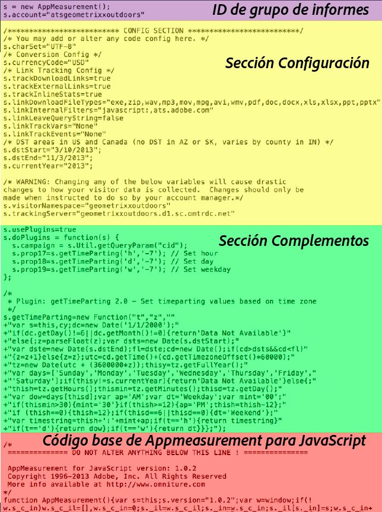

# Código de Analytics

Los datos se envían a un grupo de informes para que se muestren a la hora de generar informes. El modo más sencillo y habitual de enviar datos a Analytics es mediante la implementación de DTM. También puede introducir el código con la implementación con JavaScript.

For information about using [!UICONTROL Dynamic Tag Management] to create the header and footer code for you, see [Add Header and Footer Code](../../implement/c-implement-with-dtm/c-headers-footers/t-header-footer-code.md#task_43C8DD699A514638B0620775C06423E5).

Here is an example of [!DNL AppMeasurement] JavaScript file, showing the code parts:

