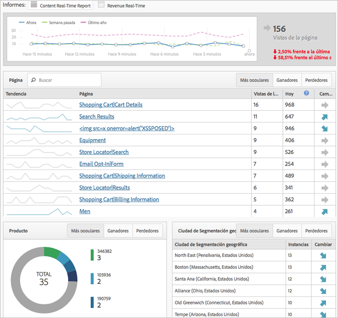

# Modal simplificado de implementación

Obtenga información sobre la experiencia de los usuarios que compran sus productos por primera vez a la hora de poner en marcha la implementación de Adobe Analytics.

<!-- 

https://activation.adobedtm.com/index.php?redirected=1 

 -->

New users can quickly create your first [!DNL Analytics] report suite (data repository) using this *`Getting Started with Adobe Analytics`* setup modal. Then, you can deploy [!DNL Analytics] code using [!DNL Dynamic Tag Management].

[!DNL Dynamic Tag Management] le permite gestionar su implementación de Adobe Analytics sin necesidad de realizar cambios en el sitio cada vez. Si está implementando una aplicación móvil, podrá obtener el SDK que necesite para empezar a recopilar datos de valor desde sus aplicaciones.

Este procedimiento le permite:

* Crear rápidamente su primer [grupo de informes](https://marketing.adobe.com/resources/help/en_US/analytics/getting-started/report-suites.html).
* Deploy [!DNL Analytics] and the [Identity Service](https://marketing.adobe.com/resources/help/en_US/mcvid/).

* Ejecutar informes sobre datos básicos en el nivel de página.

>[!NOTE]
>
>Before you begin, verify that Analytics is [enabled in the Adobe Experience Cloud](https://marketing.adobe.com/resources/help/en_US/mcloud/core_services.html) (the solution provisioning process). Si ha recibido un mensaje de correo electrónico en el que se le invita a iniciar sesión en Analytics en el tablero de empresa, habrá cumplido con este requisito previo.

**Para ejecutar el modo de implementación simplificada**

1. Log in to the [!DNL Adobe Experience Cloud] ( [experiencecloud.adobe.com](https://experiencecloud.adobe.com)).

   Una vez acceda a [!DNL Analytics], el sistema determinará si dispone de un grupo de informes. Si no, aparecerá la página [!UICONTROL Introducción a Adobe Analytics].

   

   Alternatively, you can run this setup in [!DNL Analytics] by clicking **[!UICONTROL Help]** &gt; **[!UICONTROL Welcome to Adobe Analytics]**.

1. Especifique la siguiente información básica sobre su empresa:

   <table id="table_1741878A1B284CB78D297D531DC703D6"> 
     <thead> 
      <tr> 
       <th colname="col1" class="entry"> Elemento </th> 
       <th colname="col2" class="entry"> Descripción </th> 
      </tr> 
     </thead>
     <tbody> 
      <tr> 
       <td colname="col1"> 
Tipo de propiedad 
 </td> 
       <td colname="col2"> 
¿Se trata de una implementación web, móvil, o ambas? 
 </td> 
      </tr> 
      <tr> 
       <td colname="col1"> 
Sectores 
 </td> 
       <td colname="col2"> 
Especifique cómo ingresa dinero su empresa (mediante productos, servicios al cliente, detección de posibles clientes, reconocimiento de marcas o anuncios). 
 </td> 
      </tr> 
      <tr> 
       <td colname="col1"> 
Capa de datos 
 </td> 
       <td colname="col2"> 
(Recomendado) Una matriz de JavaScript utilizada para almacenar información. Si aplica una configuración automática mediante Dynamic Tag Management, utilizará una capa de datos. 
 
For a blog on data layers, see <a href="https://blogs.adobe.com/digitalmarketing/analytics/data-layers-buzzword-best-practice/" format="http" scope="external"> Data Layer: From Buzzword to Best Practice</a>. 
 </td> 
      </tr> 
      <tr> 
       <td colname="col1"> 
Repositorio de datos (grupo de informes) 
 </td> 
       <td colname="col2"> 
 Un <a href="https://marketing.adobe.com/resources/help/en_US/analytics/getting-started/report-suites.html" format="html" scope="external">grupo de informes</a> es un conjunto de datos discretos que por lo general corresponden a una sola propiedad (sitio o aplicación) o marca. Cada grupo de informes tiene su propio conjunto de informes y métricas. 
 </td> 
      </tr> 
      <tr> 
       <td colname="col1"> 
Zona horaria 
 </td> 
       <td colname="col2"> 
Su zona horaria local. (Se detecta automáticamente). 
 </td> 
      </tr> 
      <tr> 
       <td colname="col1"> 
Vistas de la página estimadas 
 </td> 
       <td colname="col2"> 
El número de visualizaciones de página aproximado que registra el sitio al día. 
 </td> 
      </tr> 
      <tr> 
       <td colname="col1"> 
Moneda base 
 </td> 
       <td colname="col2"> 
La moneda en la que realiza sus transacciones comerciales. 
 </td> 
      </tr> 
     </tbody> 
    </table>

1. Click **[!UICONTROL Next]**.

   El sistema crea un grupo de informes.

1. To begin deployment, click **[!UICONTROL Next]**, then click one of the following options:

   <table id="table_71C7F7B9677346CD8D5130519D32464B"> 
     <thead> 
      <tr> 
       <th colname="col1" class="entry"> Elemento </th> 
       <th colname="col2" class="entry"> Descripción </th> 
      </tr> 
     </thead>
     <tbody> 
      <tr> 
       <td colname="col1"> 
Implementar 
 </td> 
       <td colname="col2"> 
 Ejecuta Dynamic Tag Management, donde podrá iniciar sesión e implementar Analytics. This process automatically implements the  AppMeasurement.js file and the Identity Service ( VisitorAPI.js). 
 
 
Importante: Se muestra en una nueva pestaña del explorador una página de ayuda que explica la implementación de Adobe Analytics mediante Dynamic Tag Management. 
 
 </td> 
      </tr> 
      <tr> 
       <td colname="col1"> 
Descargar 
 </td> 
       <td colname="col2"> 
 Descarga el archivo de instalación, llamado INSTALL-ME &lt;nombre del grupo de informes&gt;.js. Esta opción es adecuada para usuarios con experiencia que comprenden el proceso de <a href="https://marketing.adobe.com/resources/help/en_US/sc/implement/js_implementation.html" format="html" scope="external">implementación de JavaScript</a>. 
 
 
Importante: La descarga del código no conlleva la implementación de Analytics. Se trata de una implementación manual en las páginas del sitio, o bien, a través los servicios de consultoría de Adobe. 
 
 </td> 
      </tr> 
     </tbody> 
    </table>

1. Ejecutar un informe.

   Tras implementar la herramienta Analytics, podrá ejecutar un informe en Reports &amp; Analytics para confirmar la llegada de datos a su sitio (consulte [Iniciar sesión y navegar](https://marketing.adobe.com/resources/help/en_US/analytics/getting-started/analytics-navigation.html) para familiarizarse con la interfaz de Analytics).

   For example, a **[!UICONTROL Site Metrics]** &gt; **[!UICONTROL Real-Time]** lets you see immediate data.

   >[!NOTE]
   >
   >The [!UICONTROL Real-Time] report requires some configuration prior to running. Consulte [Configuración de informes en tiempo real](https://marketing.adobe.com/resources/help/en_US/reference/t_realtime_admin.html).

**Ejemplo de informe en tiempo real**

