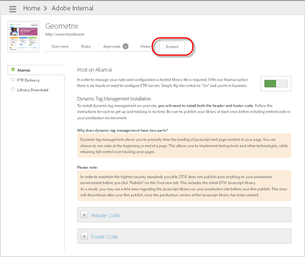

# Adición de código de Encabezado y de Pie de página

Utilice Dynamic Tag Management para agregar código de encabezado y pie de página que determine la carga de JavaScript y contenido de la página en su sitio. Debe instalar el código de Encabezado y Pie de página en cada una de las páginas del sitio, independientemente de la opción de alojamiento que utilice.

Debido a que Dynamic Tag Management incluye un fragmento de código tanto en el Encabezado como en el Pie de página, puede ejecutar reglas al inicio y al final de una página. Esta capacidad le permite implementar herramientas de prueba y otras tecnologías al mismo tiempo que mantiene el control de seguimiento de sus páginas.

Dynamic Tag Management crea códigos incrustados de ensayo y producción que puede utilizar para probar sus cambios en el entorno de ensayo antes de aplicarlos en el entorno de producción.

>[!IMPORTANT]
>
>Para una implementación correcta, es fundamental que siga estas instrucciones tal como aparecen en la Ayuda de Adobe. Specifically, you must place the header code in the `<head>` section of your document templates. Also, you must place the footer code just before the closing `</body>` tag. La colocación de cualquiera de estos códigos incrustados en cualquier posición del marcado y el uso de métodos asincrónicos para la adición de códigos incrustados *no* se admiten como implementación de Dynamic Tag Management. Los códigos incrustados se deben implementar exactamente como se reciben.
>
>Una implementación no admitida dará lugar a resultados inesperados e impedirá que los equipos del Servicio de atención al cliente e ingeniería puedan ayudarle con la implementación.

1. En la interfaz de Dynamic Tag Management, abra la ficha [!UICONTROL Insertar] y seleccione una opción de alojamiento (como Akamai). A continuación, cambie el conmutador a “Activado”. 

   Resultado 1. Copie el código de encabezado de producción que se proporciona en la ficha Insertar de Dynamic Tag Management y colóquelo dentro de la sección [!DNL HEAD] del HTML de su página.

   

   Place the code as close to the [!DNL <head><meta http-equiv="Content-Type" content="text/html; charset=UTF-8">] inicial como sea posible. Este fragmento de código debería colocarse en todas las páginas del sitio de producción activo.

   >[!NOTE]
   >
   >Production embed code reflects only the published items in that [property](../../../implement/c-implement-with-dtm/t-create-web-property.md#task_960467FBB7A54499AC228CB3AA3C4123). Sin embargo, el código incrustado para ensayo refleja todos los elementos en la propiedad asociada, con independencia de su estado de publicación. Para probar los elementos no publicados en el sitio de producción, active de forma local la realización de ensayos en la consola. Para ello, siga las instrucciones que se indican en la sección [Probar reglas no publicadas para el alojamiento de Akamai](../../../implement/c-implement-with-dtm/c-rules/t-test-rules-akamai.md#task_B397167F9E9B4487957AD6CE2AD47259).

1. Copie el código del pie de página de producción y colóquelo en la sección [!DNL BODY] del sitio HTML.

   Place the code as close to the [!DNL </body>] inicial como sea posible.
1. Copie el código de Encabezado y de Pie de página de ensayo y, a continuación, repita los pasos anteriores en el sitio de ensayo.

   >[!NOTE]
   >
   >The difference between production and staging code snippets is the addition of [!DNL -staging] to the filename in the staging version. El código de Pie de página es el mismo en los entornos de ensayo y producción.

