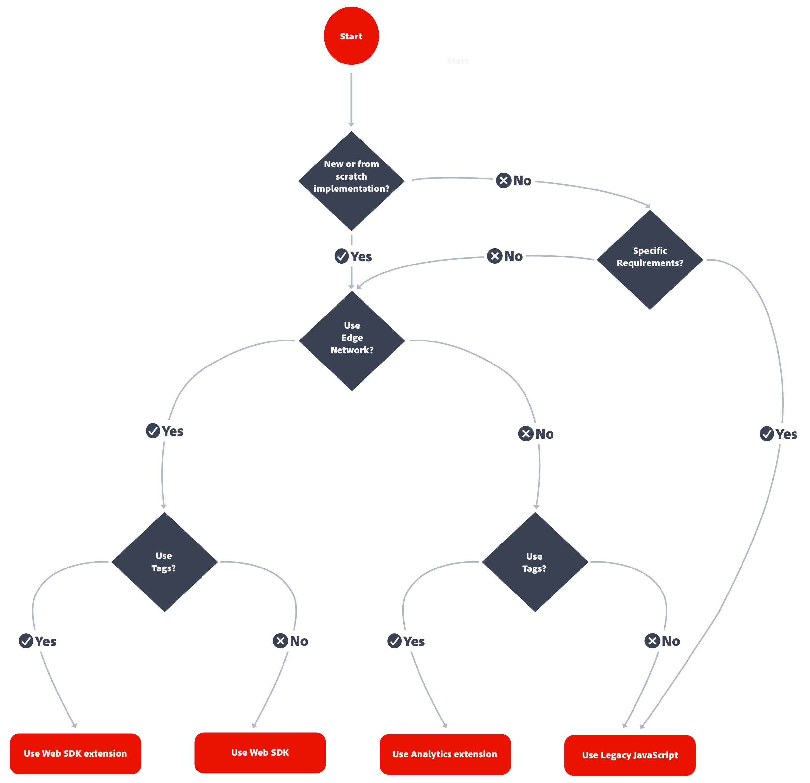

# Implementación de Adobe Analytics

Adobe Analytics requiere código en el sitio web, la aplicación móvil u otra aplicación para enviar datos a los servidores de recopilación de datos. Hay varios métodos para implementar este código, según la plataforma y las necesidades de la organización.

## Métodos de implementación de sitios web

Para su **sitio web**, están disponibles los siguientes métodos de implementación:

### Lado del cliente

* **Extensión del SDK web**: método estandarizado y recomendado de implementación de Adobe Analytics para nuevos clientes. Añada la **extensión de SDK web de Adobe Experience Platform** en las **Etiquetas** de la recopilación de datos de Adobe Experience Platform, y después coloque una etiqueta de carga en cada página. La etiqueta envía datos a la **red Edge** de Adobe Experience Platform, que reenvía esos datos a Adobe Analytics.
  Extensión de 
Consulte [Cómo implementar Adobe Analytics con la extensión Adobe Experience Platform Web SDK.](./aep-edge/overview.md) para más información.

* **SDK web**: puede cargar manualmente las bibliotecas del SDK web en su sitio si no desea utilizar la recopilación de datos de Adobe Experience Platform. Haga referencia a la biblioteca del SDK web (`alloy.js`) en cada página y envíe las llamadas de seguimiento deseadas a la **red Edge** de Adobe Experience Platform en un formato conveniente para su organización. La red Edge reenvía esos datos a Adobe Analytics.
  
Consulte [Cómo implementar Adobe Analytics mediante Adobe Experience Platform Web SDK](./aep-edge/overview.md) para obtener más información.

* **Extensión de Analytics**: añada la **Extensión de Adobe Analytics** en las **Etiquetas** de recopilación de datos de Adobe Experience Platform, y después coloque una etiqueta de carga en cada página. La etiqueta envía datos directamente a Adobe Analytics. Utilice este método de implementación si desea aprovechar la comodidad de las etiquetas, pero no quiere recurrir a la infraestructura de la red Edge.
  Extensión 
Consulte [Cómo implementar Adobe Analytics con la extensión de Analytics](launch/overview.md) para obtener más información.

* **JavaScript heredado:** método manual histórico para implementar Adobe Analytics. Haga referencia a la biblioteca AppMeasurement (`AppMeasurement.js`) en cada página y, a continuación, establezca las variables y la configuración utilizadas en JavaScript.
  
Este método de implementación puede ser útil para implementaciones que usan código personalizado y es ideal para tipos de implementación que no se ofrecen en ninguna otra parte, como por ejemplo [páginas AMP](other/amp.md).

El siguiente flujo de decisión puede ayudarle a seleccionar un método de implementación del lado del cliente:

>[!TIP]
>
>Póngase en contacto con su equipo de cuentas de Adobe para obtener asesoramiento y prácticas recomendadas sobre qué implementación elegir en función de su situación actual.

### Del lado del servidor

Para implementar Adobe Analytics del lado del servidor, tiene las siguientes opciones:

* **API de Edge Network**: el código se implementa en el servidor que utiliza la API de Edge Network de Adobe Experience Platform para comunicarse con Adobe Analytics a través de una secuencia de datos.
  
Consulte [Implementar Adobe Analytics mediante la API de Adobe Experience Platform Edge Network](/help/implement/aep-edge/api/overview.md) para obtener más información.

* **API de inserción de datos (lote)**: las API de inserción de datos de Adobe Analytics (lote) se utilizan para recopilar datos del lado del servidor directamente en Adobe Analytics.
  
Consulte [API de inserción de datos](../import/c-data-insertion-api/c-data-insertion-api.md) para obtener más información.

## Métodos de implementación de aplicaciones móviles

Para su **aplicación móvil**, están disponibles los siguientes métodos de implementación:

* **Extensión del SDK móvil**: método estandarizado y recomendado para implementar Adobe Analytics en su aplicación móvil. Use bibliotecas específicas para enviar fácilmente datos a Adobe desde su aplicación móvil. Añada la **Extensión de SDK móvil de Adobe Experience Platform** en las **Etiquetas** de la recopilación de datos de Adobe Experience Platform. A continuación, implemente la biblioteca del SDK móvil en la aplicación. Puede utilizar el SDK para importar bibliotecas, registrar extensiones y cargar la configuración de etiquetas. Envío de datos a la **Red Edge** de Adobe Experience Platform; a continuación, Edge reenvía esos datos a Adobe Analytics.
  

  Consulte [Implementar Adobe Analytics usando el SDK de Adobe Experience Platform Mobile](../implement/aep-edge/mobile-sdk/overview.md) para obtener más información.

* **Extensión de Analytics**: añada la **Extensión de Adobe Analytics** en las **Etiquetas** de la recopilación de datos de Adobe Experience Platform, e implemente la biblioteca del SDK móvil en la aplicación. Puede utilizar el SDK para importar bibliotecas, registrar extensiones y cargar la configuración de etiquetas. Este método de implementación envía datos directamente a Adobe Analytics. Se recomienda si desea la comodidad de la recopilación de datos de Adobe Experience Platform, pero no desea utilizar la infraestructura de red Edge de Experience Platform de Adobe.
  

  Consulte [Implementar Adobe Analytics usando la extensión de Analytics](../implement/aep-edge/mobile-sdk/overview.md) para obtener más información.

>[!CAUTION]
>
>Consulte los [Anuncios de fin de compatibilidad de SDK](https://developer.adobe.com/client-sdks/resources/sdks-end-of-support/) para obtener compatibilidad con versiones anteriores de los SDK móviles de Adobe.

## Artículos de implementación de Analytics clave

* [Ocuparse de una implementación de Adobe Analytics existente](/help/implement/prepare/existing-implementation.md)
* [Adobe Debugger](validate/debugger.md)
* [Creación de una propiedad de etiquetas en Experience Platform](launch/create-analytics-property.md)
* [Actualizaciones de AppMeasurement](appmeasurement-updates.md)
* [Tutorial sobre la configuración de Adobe Analytics con Platform Web SDK](https://experienceleague.adobe.com/docs/platform-learn/implement-web-sdk/applications-setup/setup-analytics.html?lang=es)
* [Tutorial de implementación de Adobe Experience Cloud en aplicaciones móviles](https://experienceleague.adobe.com/docs/platform-learn/implement-mobile-sdk/overview.html?lang=es)

## Recursos clave de Analytics

* [Póngase en contacto con el Servicio de atención al cliente](https://experienceleague.adobe.com/?support-solution=Analytics?lang=es#support)
* [Comunidad de Adobe Analytics en Experience League](https://experienceleaguecommunities.adobe.com/t5/adobe-analytics/ct-p/adobe-analytics-community?profile.language=es)
* [Recursos de Adobe Analytics](https://experienceleaguecommunities.adobe.com/t5/adobe-analytics-discussions/adobe-analytics-resources/m-p/276666?profile.language=es)
* [Últimas notas de la versión](../release-notes/latest.md)
