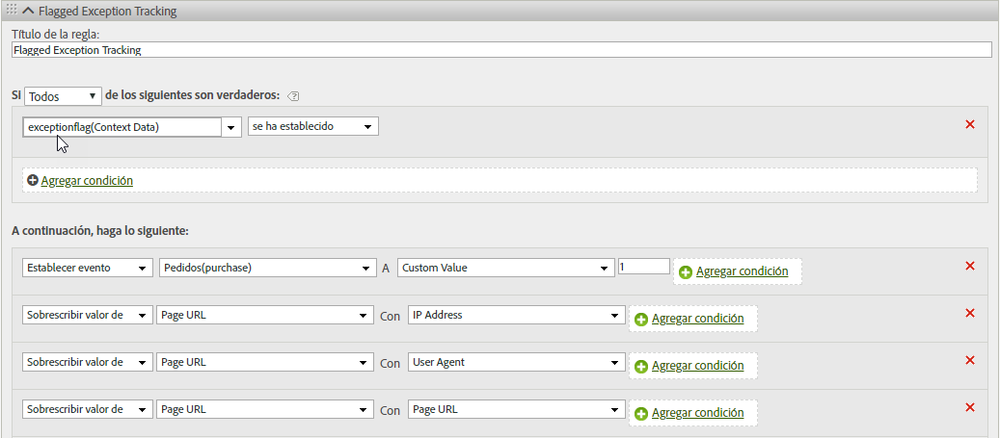

# hitGovernor

El complemento s.hitGovernor realiza un seguimiento del número total de solicitudes de imagen de Analytics que se envían durante un tiempo consecutivo predefinido y puede realizar lógica adicional si este total supera un determinado límite.

## hitGovernor {#topic_56B636A42A624B38A0A446C607ACD700}

El complemento s.hitGovernor realiza un seguimiento del número total de solicitudes de imagen de Analytics que se envían durante un tiempo consecutivo predefinido y puede realizar lógica adicional si este total supera un determinado límite.

Aunque el tráfico de bots, spiders, agentes de usuario específicos y listas específicas de direcciones IP puede identificarse como tráfico de bots o excluirse de los informes, es posible que sus informes incluyan un tráfico que no deba contarse. Por ejemplo, un número elevado de clics o de visitas de página durante un tiempo no razonable (aproximadamente, una solicitud por segundo) podría ser tráfico engañoso.

Este complemento permite bloquear automáticamente ese tráfico durante el resto de la vida del visitante, además de identificar dicho tráfico de forma dinámica dentro de los informes.

## Cómo funciona el complemento Hit Governor {#section_541BC639E31442D09B1C85A2FFCDC02C}

El complemento incrementa un valor de cookie cada vez que se envía una solicitud de imagen a sus servidores de seguimiento, y realiza un seguimiento de este comportamiento a lo largo de un periodo de tiempo consecutivo. El periodo de tiempo predeterminado es de un minuto, aunque es posible ignorar este valor (consulte [Implementación](../../../implement/js-implementation/plugins/hitgovernor.md#task_D4BDB524AA294C139AFCAE2B61FEA3F2) más adelante). If the total number of hits during that time frame exceeds the default hit threshold (60), a final custom link image request is sent to set the *`exceptionFlag`* context data variable. También es posible ignorar el límite de visitas predeterminado.

Si lo desea, es posible impedir que a partir de ese punto se recopile tráfico para ese visitante específico durante un periodo predeterminado de sesenta días. El bloqueo del tráfico requiere una línea de código adicional en su función doPlugins, como se describe más adelante. También es posible ajustar el periodo de tiempo. The logic allows time to either include that visitor's IP address, User Agent, or [!DNL Experience Cloud] Visitor ID in the proper permanent exception logic, or to reset the timeout period after the sixty days have elapsed. Si el complemento identifica este tráfico como fraudulento pasados sesenta días, el tráfico vuelve a marcarse como excepción y no se recopilará durante sesenta días más.

## Creación de informes {#section_E742F19B528041808454744DB2C7007C}

No es necesario configurar ninguna variable o evento predeterminado. No obstante, se recomienda encarecidamente configurar una lógica de reglas de procesamiento para establecer como corresponda las variables y eventos. Entre estas variables y eventos personalizados pueden estar los siguientes:

* [!DNL Experience Cloud] ID de visitante
* Dirección IP
* Agente de usuario
* Evento de excepción marcado

Crear segmentos para esas variables le permitiría a su vez crear segmentos y grupos de informes virtuales para comprobar el impacto global en el sitio de esas visitas ambiguas.

Se recomienda utilizar los valores obtenidos en la realización de informes para actualizar las reglas de bots, las reglas de DB VISTA o las exclusiones IP de la empresa.

## Implementación {#task_D4BDB524AA294C139AFCAE2B61FEA3F2}

Para implementar el complemento hitGovernor:

1. Modifique la biblioteca de AppMeasurement.

   Para inicializar el complemento, incluya esta línea de código (en negrita) dentro de la función `registerPostTrackCallback`, en el código de la biblioteca de AppMeasurement.

   >[!NOTE]
   >
   >Although the `registerPostTrackCallback` functionality is included in AppMeasurement libraries 1.8.0+, it is not included in any custom code configuration by default. Se incluye posteriormente a la función doPlugins y *fuera* de ella.

   ```
    s.registerPostTrackCallback(function(){ 
    s.governor();
   }); 
   ```

   Bajo la sección doPlugins del archivo de AppMeasurement, incluya el código del complemento contenido en el [código fuente del complemento](../../../implement/js-implementation/plugins/hitgovernor.md#reference_76423C81A7A342B2AC4BE41490B27DE0), a continuación.

   Es posible omitir el umbral límite de visitas, el umbral de tiempo de visitas y los plazos de exclusión de tráfico estableciendo las siguientes variables, fuera del complemento mismo y preferiblemente con sus demás variables de configuración:

<table id="table_9959A40F5F0B40B39DB86E21D03E25FD"> 
 <thead> 
  <tr> 
   <th colname="col1" class="entry"> Variable </th> 
   <th colname="col2" class="entry"> Sintaxis </th> 
   <th colname="col3" class="entry"> Descripción </th> 
  </tr> 
 </thead>
 <tbody> 
  <tr> 
   <td colname="col1"> <p>Umbral límite de visitas </p> </td> 
   <td colname="col2"> <p> <code> s.hl = 60; </code> </p> </td> 
   <td colname="col3"> <p>El número total de visitas que no se debe exceder durante un periodo dado. </p> </td> 
  </tr> 
  <tr> 
   <td colname="col1"> <p>Umbral de tiempo de visitas </p> </td> 
   <td colname="col2"> <p> <code> s.ht = 10; </code> </p> </td> 
   <td colname="col3"> <p>El intervalo en segundos durante el que se registran las visitas. Este número se divide entre seis para determinar los periodos de tiempo consecutivo. </p> </td> 
  </tr> 
  <tr> 
   <td colname="col1"> <p>Umbral de exclusión </p> </td> 
   <td colname="col2"> <p> <code> s.he = 60; </code> </p> </td> 
   <td colname="col3"> <p>Número de días durante los que se establece la cookie de exclusión para ese visitante. </p> </td> 
  </tr> 
 </tbody> 
</table>

>[!NOTE]
>
>Su implementación podría utilizar un nombre de objeto distinto al objeto "s" predeterminado de análisis. De ser así, actualice en consonancia el nombre del objeto.

1. Configure las reglas de procesamiento.

   Este complemento registra las excepciones marcadas como datos de contexto en una solicitud de imagen de seguimiento de vínculo. Como tales, deben configurarse reglas de procesamiento para asignar las excepciones marcadas a variables apropiadas, como las que se indican a continuación.

   

1. (Opcional) Incluya el código de bloqueo de tráfico en doPlugins.

   Una vez que el tráfico se ha identificado como excepción, cualquier visita posterior de ese visitante puede bloquearse por completo incluyendo este código dentro de la función `doPlugins`:

   ```
   //Check for hit governor flag 
         if(s.Util.cookieRead('s_hg')==9)s.abort=true;
   ```

   Si no se incluye este código, el tráfico del visitante se marcará, pero no se bloqueará.

## Código fuente del complemento {#reference_76423C81A7A342B2AC4BE41490B27DE0}

Este código debe añadirse bajo la sección doPlugins de su biblioteca de AppMeasurement.

```
//Hit Governor (Version 0.1 BETA, 11-13-17) 
s.governor=new Function("","" 
+"var s=this;if(typeof s.hl=='undefined'){s.hl=60;}if(typeof s.ht=='u" 
+"ndefined'){s.ht=60;}if(typeof s.he=='undefined'){s.he=60;}if(s.Util" 
+".cookieRead('s_hg')==8){var i=new Date(),y=i.getFullYear(),m=i.getM" 
+"onth(),d=i.getDate(),i=new Date(y,m,d+s.he);s.Util.cookieWrite('s_h" 
+"g',9,i);return;}var f=s.Util.cookieRead('s_hc'),g=Number(s.Util.coo" 
+"kieRead('s_ht')),h=Math.floor((new Date()).getTime()),ha=f!=''?f.sp" 
+"lit('|').map(Number):[0,0,0,0,0],i=ha.reduce(function(ha,b){return " 
+"ha+b;},0),j=g==0?0:Math.floor(((h-g)/(s.ht/6))/1000);if(g==0)s.Util" 
+".cookieWrite('s_ht',h);if(i<s.hl){if(j>=1){if(j>=6){ha=[0,0,0,0,0];" 
+"}else{for(var k=0;k<j;k++){ha.unshift(0);ha.pop();}}s.Util.cookieWr" 
+"ite('s_ht',h);}}else{s.Util.cookieWrite('s_hg',8);s.linkTrackVars+=" 
+"',contextData.exceptionFlag';s.contextData['exceptionFlag']='true';" 
+"s.tl(this,'o','exceptionFlag');}ha[0]++;s.Util.cookieWrite('s_hc',h" 
+"a.join('|'));"); 
```

