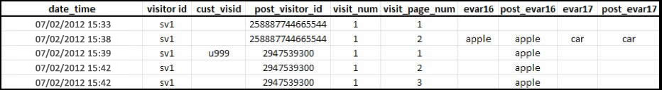
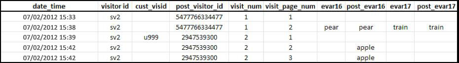

# Atribución y persistencia

>[!IMPORTANT]
>
>Ya no se recomienda este método de identificación de visitantes entre dispositivos. Consulte la documentación [de cooperación entre dispositivos de](https://marketing.adobe.com/resources/help/en_US/mcdc/)Adobe Experience Cloud.

Cuando los perfiles de los visitantes se combinan después de asociarse a la misma variable de ID de visitante, la atribución no cambia en el conjunto de datos históricos.

* Cuando la variable `s.visitorID` se configura y envía en una visita, el sistema comprueba si hay algún otro perfil del visitante con el mismo ID de visitante.
* Si existe un perfil, a partir de ese momento se utilizará el perfil del visitante que ya está almacenado en el sistema, mientras que el perfil anterior dejará de usarse.
* Si no se encuentra ningún ID de visitante coincidente, se crea un nuevo perfil.

Cuando un cliente no autenticado llega a su sitio, Adobe Analytics asigna a ese cliente un perfil del visitante. Como se muestra en [Recuentos de visitas y visitantes únicos](/help/implement/js-implementation/xdevice-visid/xdevice-connecting.md#section_70330AB6724C4E419A4BD0BDD54641AC), al autenticarse se crea un nuevo perfil. Al crearse el perfil nuevo, finaliza una visita y se inicia otra visita.

**Durante la primera conexión de datos**

El ejemplo siguiente es una representación de cómo se envían los datos a Adobe Analytics cuando un cliente se autentica por primera vez, en el primer dispositivo:

* `eVar16` tiene una caducidad de 1 día, y `evar17` caduca en la visita.

* La columna `post_visitor_id` representa el perfil que mantiene Adobe Analytics.
* Las columnas `post_evar16` y `post_evar17` muestran la persistencia de las eVars.

* `cust_visid` representa un valor configurado en `s.visitorID`.

* Cada fila es una "visita", una sola solicitud enviada a los servidores de recopilación de datos de Adobe Analytics.

En la primera conexión de datos que contenga un valor `s.visitorID` anteriormente no reconocido (`u999` anteriormente), se crea el nuevo perfil. Los valores persistentes del perfil anterior se transfieren al nuevo perfil.

* Las eVars configuradas para caducar en la visita no se copian en el perfil autenticado. Observe que el valor `car` anterior no se mantiene.
* Las eVars configuradas para caducar con otras medidas se copiarán en el perfil autenticado. Observe que el valor `apple` se mantiene.
* Para las eVars que se mantienen, no se registra ninguna métrica Instancia. Esto significa que, al usar la identificación de visitantes entre dispositivos, pueden aparecer informes donde la métrica Visitas únicas de un valor eVar sea más grande que la métrica Instancia.

**En las posteriores conexiones de datos**

El ejemplo siguiente es una representación de cómo se envían los datos a Adobe Analytics cuando un cliente se autentica en un dispositivo nuevo, después de haberse autenticado previamente en otro dispositivo:

Cuando el cliente se autentica, su ID se contrasta con el perfil "autenticado" anterior: `2947539300`. El perfil usado al principio de esta visita (`5477766334477`) ya no se usa y no se mantienen datos del archivo.

* Los datos de segmentación geográfica se registran en función de la primera visita y no cambian para una única visita, independientemente del dispositivo que se use. Esto significa que, en las posteriores conexiones de datos en un dispositivo nuevo, los datos de segmentación geográfica no se suelen incluir.
* Las columnas de tecnología, como explorador, sistema operativo y profundidad de color, se registran en la primera visita. Como sucede con los valores de segmentación geográfica, no se copiarán en el perfil identificado.
* Un canal de marketing, como el directo o el interno, que se suele configurar para no sobrescribir otro canal, sobrescribirá otros canales en las posteriores conexiones de datos que contengan una primera autenticación para dicho dispositivo, como la primera autenticación mostrada en [Recuentos de visitas y visitantes únicos](/help/implement/js-implementation/xdevice-visid/xdevice-connecting.md#section_70330AB6724C4E419A4BD0BDD54641AC).

**Casos especiales**

En algunos otros casos, los datos del perfil no autenticado no se mantienen en el perfil autenticado.

* Si un usuario es nuevo en el sitio (nunca antes lo ha visitado en este dispositivo) y se autentica en un plazo aproximado de 3 minutos tras su llegada, no se mantendrá ningún valor en el perfil autenticado.

